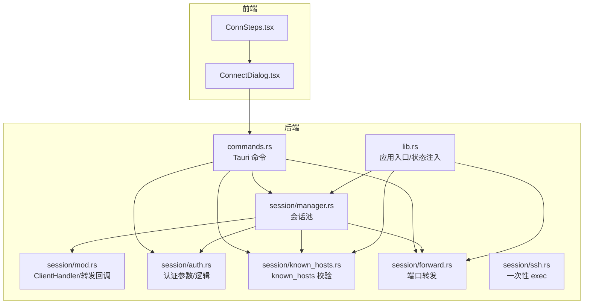
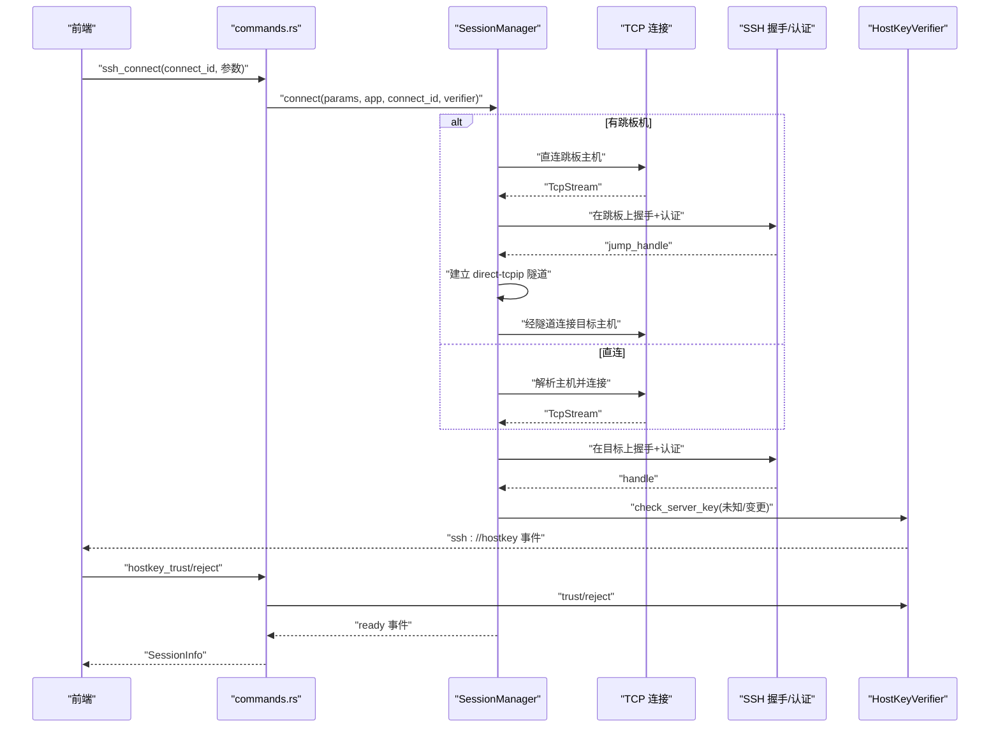
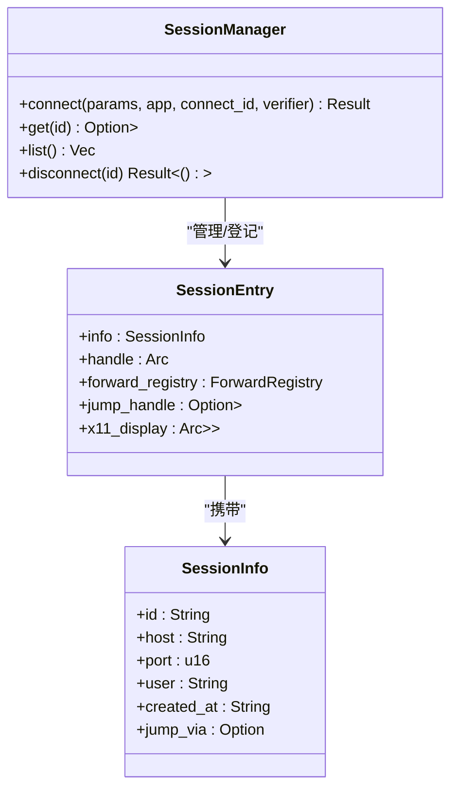
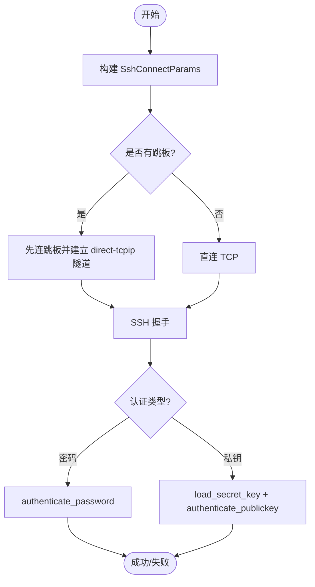
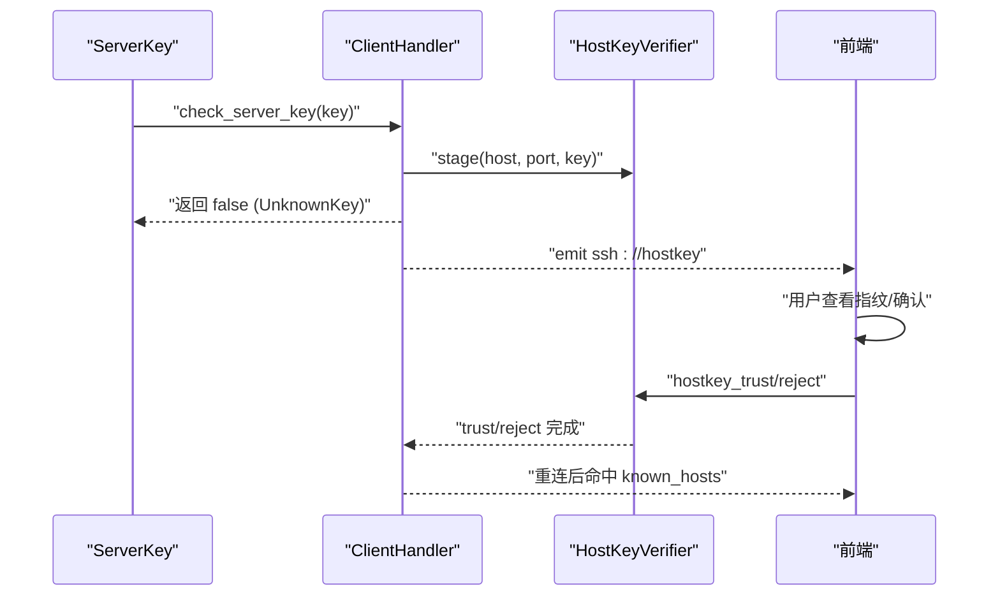
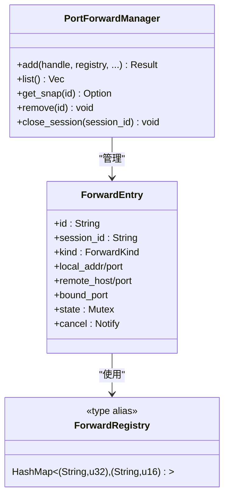
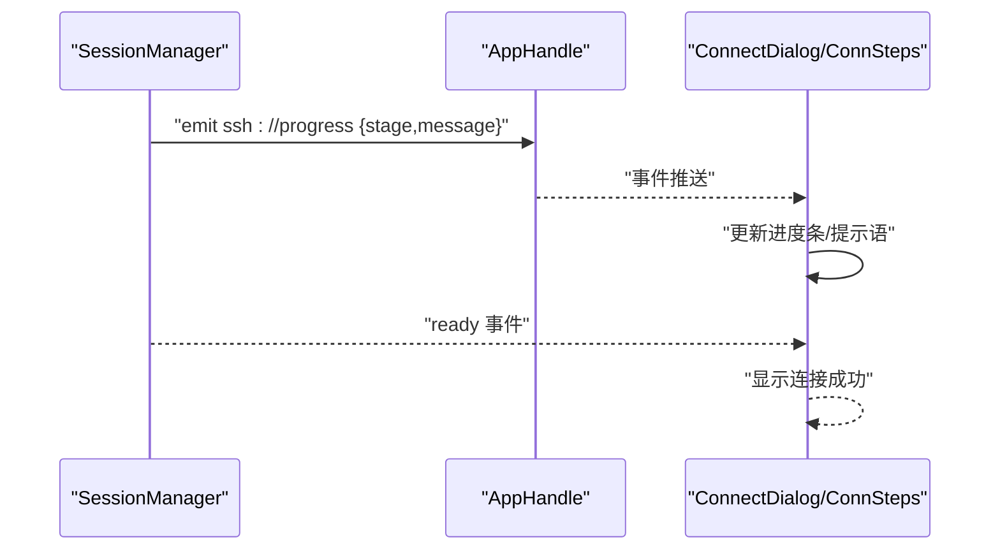
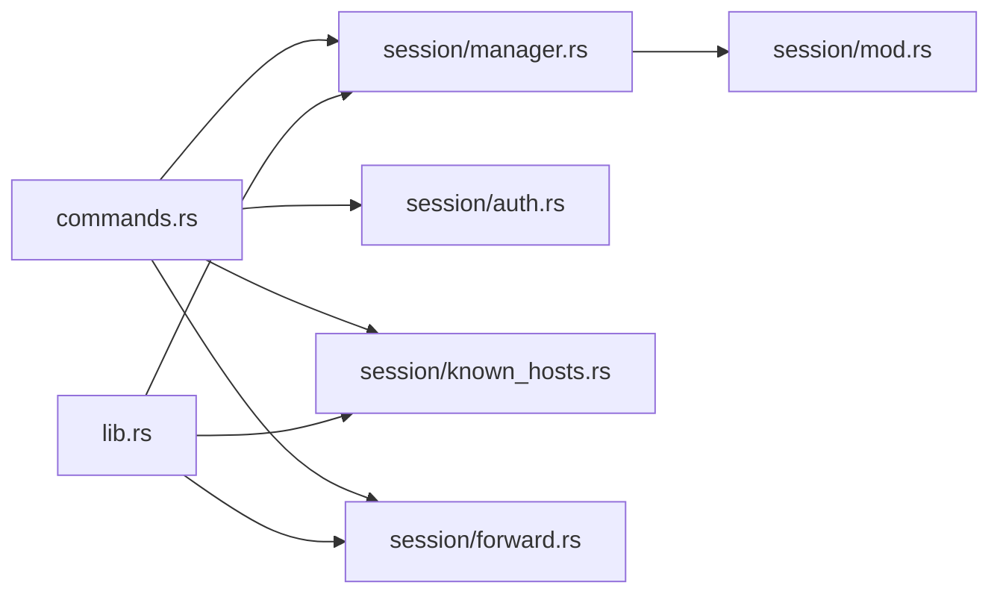

# 连接管理

<cite>
**本文引用的文件**
- [src-tauri/src/session/manager.rs](file://src-tauri/src/session/manager.rs)
- [src-tauri/src/session/mod.rs](file://src-tauri/src/session/mod.rs)
- [src-tauri/src/session/auth.rs](file://src-tauri/src/session/auth.rs)
- [src-tauri/src/session/known_hosts.rs](file://src-tauri/src/session/known_hosts.rs)
- [src-tauri/src/session/forward.rs](file://src-tauri/src/session/forward.rs)
- [src-tauri/src/session/ssh.rs](file://src-tauri/src/session/ssh.rs)
- [src-tauri/src/lib.rs](file://src-tauri/src/lib.rs)
- [src-tauri/src/commands.rs](file://src-tauri/src/commands.rs)
- [src/components/ConnectDialog.tsx](file://src/components/ConnectDialog.tsx)
- [src/components/ConnSteps.tsx](file://src/components/ConnSteps.tsx)
- [src/settings/types.ts](file://src/settings/types.ts)
- [src-tauri/Cargo.toml](file://src-tauri/Cargo.toml)
</cite>

## 目录
1. [简介](#简介)
2. [项目结构](#项目结构)
3. [核心组件](#核心组件)
4. [架构总览](#架构总览)
5. [详细组件分析](#详细组件分析)
6. [依赖关系分析](#依赖关系分析)
7. [性能考量](#性能考量)
8. [故障排查指南](#故障排查指南)
9. [结论](#结论)
10. [附录](#附录)

## 简介
本文件系统性阐述连接管理功能，重点围绕会话池（SessionManager）的设计与实现，覆盖连接生命周期、持久连接复用策略、连接建立全流程（TCP/DNS/SSH 握手/认证）、认证方式与配置、连接进度反馈、错误处理与断线重连、以及最佳实践与安全建议。读者无需深入底层即可理解如何在应用中稳定地建立与复用 SSH 连接。

## 项目结构
后端采用 Tauri + Rust，会话管理位于 src-tauri/src/session 下，前端通过 Tauri 命令与后端交互，实时接收连接进度与主机公钥事件。

**图示来源**
- [src-tauri/src/lib.rs:14-92](file://src-tauri/src/lib.rs#L14-L92)
- [src-tauri/src/commands.rs:44-72](file://src-tauri/src/commands.rs#L44-L72)
- [src-tauri/src/session/manager.rs:82-145](file://src-tauri/src/session/manager.rs#L82-L145)
- [src-tauri/src/session/mod.rs:59-225](file://src-tauri/src/session/mod.rs#L59-L225)
- [src-tauri/src/session/auth.rs:44-81](file://src-tauri/src/session/auth.rs#L44-L81)
- [src-tauri/src/session/known_hosts.rs:68-84](file://src-tauri/src/session/known_hosts.rs#L68-L84)
- [src-tauri/src/session/forward.rs:117-229](file://src-tauri/src/session/forward.rs#L117-L229)
- [src-tauri/src/session/ssh.rs:14-64](file://src-tauri/src/session/ssh.rs#L14-L64)

**章节来源**
- [src-tauri/src/lib.rs:14-92](file://src-tauri/src/lib.rs#L14-L92)
- [src-tauri/src/commands.rs:44-72](file://src-tauri/src/commands.rs#L44-L72)

## 核心组件
- 会话池（SessionManager）：全局状态，维护持久连接集合，负责建立连接、认证、登记会话、断开与清理。
- 客户端处理器（ClientHandler）：russh 客户端回调实现，负责主机公钥校验、-R 远程转发回调、X11 转发桥接。
- 认证模块（auth.rs）：定义 SshAuth 与 SshConnectParams，提供密码与私钥认证逻辑及超时控制。
- 主机公钥校验（known_hosts.rs）：基于 ~/.ssh/known_hosts 的校验与交互式确认流程。
- 端口转发（forward.rs）：本地/L/R 动态转发、SOCKS5 握手、-R 注册表与桥接循环。
- 一次性 exec（ssh.rs）：演示用的连接-认证-执行-断开流程。
- 前端对话框（ConnectDialog.tsx/ConnSteps.tsx）：收集连接参数、监听进度与主机公钥事件、触发信任/拒绝。

**章节来源**
- [src-tauri/src/session/manager.rs:76-145](file://src-tauri/src/session/manager.rs#L76-L145)
- [src-tauri/src/session/mod.rs:59-225](file://src-tauri/src/session/mod.rs#L59-L225)
- [src-tauri/src/session/auth.rs:10-81](file://src-tauri/src/session/auth.rs#L10-L81)
- [src-tauri/src/session/known_hosts.rs:68-135](file://src-tauri/src/session/known_hosts.rs#L68-L135)
- [src-tauri/src/session/forward.rs:117-229](file://src-tauri/src/session/forward.rs#L117-L229)
- [src-tauri/src/session/ssh.rs:14-64](file://src-tauri/src/session/ssh.rs#L14-L64)
- [src/components/ConnectDialog.tsx:75-98](file://src/components/ConnectDialog.tsx#L75-L98)
- [src/components/ConnSteps.tsx:12-37](file://src/components/ConnSteps.tsx#L12-L37)

## 架构总览
会话池统一管理连接生命周期，终端、SFTP、端口转发均复用同一个 russh Handle。认证完成后，SessionEntry 被登记到全局映射，供各子系统共享。ClientHandler 在握手阶段进行主机公钥校验，未知或变更时通过 HostKeyVerifier 与前端交互，确认后再落盘。

**图示来源**
- [src-tauri/src/commands.rs:44-72](file://src-tauri/src/commands.rs#L44-L72)
- [src-tauri/src/session/manager.rs:96-145](file://src-tauri/src/session/manager.rs#L96-L145)
- [src-tauri/src/session/manager.rs:256-273](file://src-tauri/src/session/manager.rs#L256-L273)
- [src-tauri/src/session/manager.rs:277-316](file://src-tauri/src/session/manager.rs#L277-L316)
- [src-tauri/src/session/mod.rs:118-160](file://src-tauri/src/session/mod.rs#L118-L160)
- [src-tauri/src/session/known_hosts.rs:97-135](file://src-tauri/src/session/known_hosts.rs#L97-L135)

## 详细组件分析

### 会话池（SessionManager）与连接生命周期
- 连接建立
  - 直连：解析主机并建立 TCP 连接，设置 TCP_NODELAY，超时控制。
  - 跳板：先连接跳板主机，建立 direct-tcpip 隧道，再在隧道上完成握手与认证。
- 认证
  - 支持密码与私钥两种方式，分别调用 russh 的认证函数并设置超时。
- 会话登记
  - 成功后生成 SessionEntry，包含会话信息、共享 Handle、转发注册表、可选跳板 Handle、X11 显示目标。
- 生命周期管理
  - 提供 get/list/disconnect，断开时同时关闭跳板 Handle（如存在）。
- 进度反馈
  - 通过 emit_progress 推送 ssh://progress 事件，前端 ConnSteps 展示阶段。

**图示来源**
- [src-tauri/src/session/manager.rs:76-145](file://src-tauri/src/session/manager.rs#L76-L145)
- [src-tauri/src/session/manager.rs:50-74](file://src-tauri/src/session/manager.rs#L50-L74)

**章节来源**
- [src-tauri/src/session/manager.rs:82-145](file://src-tauri/src/session/manager.rs#L82-L145)
- [src-tauri/src/session/manager.rs:256-316](file://src-tauri/src/session/manager.rs#L256-L316)

### 认证方式与配置
- 认证参数
  - SshAuth：密码或私钥（含可选口令）。
  - SshConnectParams：主机、端口、用户、认证方式、可选跳板。
- 认证流程
  - 密码：authenticate_password，超时控制。
  - 私钥：加载私钥与最佳支持的哈希算法，authenticate_publickey，超时控制。
- 配置构建
  - 前端通过 ssh_connect 命令传入 auth_method/password/private_key_path/passphrase/jump_profile_id，commands.rs 解析为 SshConnectParams 并调用 SessionManager.connect。

**图示来源**
- [src-tauri/src/commands.rs:698-722](file://src-tauri/src/commands.rs#L698-L722)
- [src-tauri/src/session/auth.rs:44-81](file://src-tauri/src/session/auth.rs#L44-L81)
- [src-tauri/src/session/manager.rs:96-145](file://src-tauri/src/session/manager.rs#L96-L145)

**章节来源**
- [src-tauri/src/session/auth.rs:10-81](file://src-tauri/src/session/auth.rs#L10-L81)
- [src-tauri/src/commands.rs:698-722](file://src-tauri/src/commands.rs#L698-L722)

### 主机公钥校验与交互确认
- 校验三态：Trusted/Unknown/Changed。
- 探测与确认：check_server_key 在非 Trusted 时暂存公钥并返回 false，触发 UnknownKey，前端弹窗确认。
- 落盘与清理：trust 将新公钥写入 ~/.ssh/known_hosts，同时剔除同算法冲突项；reject 清空暂存；remove_host 删除全部记录。

**图示来源**
- [src-tauri/src/session/mod.rs:118-160](file://src-tauri/src/session/mod.rs#L118-L160)
- [src-tauri/src/session/known_hosts.rs:97-135](file://src-tauri/src/session/known_hosts.rs#L97-L135)
- [src/components/ConnectDialog.tsx:201-232](file://src/components/ConnectDialog.tsx#L201-L232)

**章节来源**
- [src-tauri/src/session/known_hosts.rs:68-135](file://src-tauri/src/session/known_hosts.rs#L68-L135)
- [src-tauri/src/session/mod.rs:118-160](file://src-tauri/src/session/mod.rs#L118-L160)
- [src/components/ConnectDialog.tsx:201-232](file://src/components/ConnectDialog.tsx#L201-L232)

### 端口转发与持久连接复用
- 复用策略：SessionEntry 持有共享 Handle，终端/SFTP/转发在同一 Handle 上开独立 channel，互不影响。
- 转发类型：-L 本地转发、-R 远程转发、-D 动态 SOCKS5。
- 注册表：-R 的远端绑定与本地目标通过 ForwardRegistry 映射，在回调中桥接。
- 生命周期：PortForwardManager 管理转发条目，支持启动/停止/查询/批量关闭。

**图示来源**
- [src-tauri/src/session/forward.rs:117-229](file://src-tauri/src/session/forward.rs#L117-L229)
- [src-tauri/src/session/forward.rs:70-85](file://src-tauri/src/session/forward.rs#L70-L85)

**章节来源**
- [src-tauri/src/session/forward.rs:117-229](file://src-tauri/src/session/forward.rs#L117-L229)
- [src-tauri/src/session/manager.rs:50-74](file://src-tauri/src/session/manager.rs#L50-L74)

### 连接进度反馈与前端集成
- 进度事件：resolve/handshake/auth/jump/ready。
- 前端监听：ConnectDialog 订阅 ssh://progress 与 ssh://hostkey，ConnSteps 展示当前阶段。
- 行为：当 stage=ready 时，前端收到 SessionInfo，表示连接成功。

**图示来源**
- [src-tauri/src/session/manager.rs:31-48](file://src-tauri/src/session/manager.rs#L31-L48)
- [src-tauri/src/session/manager.rs:125](file://src-tauri/src/session/manager.rs#L125)
- [src/components/ConnectDialog.tsx:75-98](file://src/components/ConnectDialog.tsx#L75-L98)
- [src/components/ConnSteps.tsx:12-37](file://src/components/ConnSteps.tsx#L12-L37)

**章节来源**
- [src-tauri/src/session/manager.rs:31-48](file://src-tauri/src/session/manager.rs#L31-L48)
- [src/components/ConnectDialog.tsx:75-98](file://src/components/ConnectDialog.tsx#L75-L98)
- [src/components/ConnSteps.tsx:12-37](file://src/components/ConnSteps.tsx#L12-L37)

### 断线重连与错误处理
- 断线：SessionManager.disconnect 主动发送 ByApplication 断开，同时尝试关闭跳板 Handle。
- 错误处理：各阶段设置超时（TCP/HANDSHAKE/AUTH），认证失败主动断开；known_hosts 校验失败通过前端确认后重连。
- 前端设置：应用设置包含“断线后自动重连”“最大重连次数”，可用于引导用户行为（具体实现可在前端侧结合事件与状态管理）。

**章节来源**
- [src-tauri/src/session/manager.rs:234-252](file://src-tauri/src/session/manager.rs#L234-L252)
- [src-tauri/src/session/auth.rs:50-81](file://src-tauri/src/session/auth.rs#L50-L81)
- [src-tauri/src/session/known_hosts.rs:97-135](file://src-tauri/src/session/known_hosts.rs#L97-L135)
- [src/settings/types.ts:16-24](file://src/settings/types.ts#L16-L24)

## 依赖关系分析
- 外部库
  - russh：SSH 协议栈与客户端。
  - russh-sftp：SFTP 支持（复用会话连接）。
  - tokio：异步运行时。
  - serde/tauri：序列化与跨端通信。
- 内部模块耦合
  - commands.rs 依赖 session/* 模块，暴露 Tauri 命令。
  - session/manager.rs 依赖 auth/known_hosts/forward/mod。
  - lib.rs 注入全局状态（SessionManager/HostKeyVerifier/PortForwardManager 等）。

**图示来源**
- [src-tauri/src/commands.rs:16-21](file://src-tauri/src/commands.rs#L16-L21)
- [src-tauri/src/lib.rs:25-33](file://src-tauri/src/lib.rs#L25-L33)

**章节来源**
- [src-tauri/Cargo.toml:22-49](file://src-tauri/Cargo.toml#L22-L49)
- [src-tauri/src/lib.rs:25-33](file://src-tauri/src/lib.rs#L25-L33)

## 性能考量
- TCP 层
  - 建连超时与 NAGLE 关闭（TCP_NODELAY）有助于快速失败与低延迟。
- 握手与认证
  - 分阶段超时避免长时间阻塞；合理设置 HANDSHAKE/AUTH TTL。
- 复用与并发
  - 通过 Arc<Handle> 共享连接，减少重复握手成本；转发与终端各自独立 channel，避免相互影响。
- I/O 桥接
  - 转发桥接使用固定缓冲区与 select! 并发读写，注意背压与 EOF 处理。

**章节来源**
- [src-tauri/src/session/manager.rs:24-29](file://src-tauri/src/session/manager.rs#L24-L29)
- [src-tauri/src/session/manager.rs:256-273](file://src-tauri/src/session/manager.rs#L256-L273)
- [src-tauri/src/session/forward.rs:28-50](file://src-tauri/src/session/forward.rs#L28-L50)

## 故障排查指南
- 连接超时
  - TCP 超时：检查网络连通性与防火墙；确认 DNS 解析可用。
  - 握手/认证超时：检查服务器负载与算法支持；适当增大超时。
- 主机公钥问题
  - 未知：首次连接属正常，确认指纹后信任并重连。
  - 变更：可能遭遇中间人攻击，确认后替换 known_hosts 对应条目。
- 认证失败
  - 密码/私钥错误或权限不足；检查凭据与服务器策略。
- 跳板机隧道失败
  - 跳板主机连通性与认证；确保未嵌套跳板。
- 断线与重连
  - 使用断开命令清理资源；根据设置决定是否自动重连。

**章节来源**
- [src-tauri/src/session/manager.rs:256-316](file://src-tauri/src/session/manager.rs#L256-L316)
- [src-tauri/src/session/known_hosts.rs:68-84](file://src-tauri/src/session/known_hosts.rs#L68-L84)
- [src-tauri/src/commands.rs:724-766](file://src-tauri/src/commands.rs#L724-L766)

## 结论
该连接管理方案以会话池为核心，通过统一的 Handle 共享实现终端/SFTP/转发的高效复用；借助阶段化进度反馈与交互式主机公钥确认，兼顾易用性与安全性。建议在生产环境中配合合理的超时与重试策略、严格的凭据存储与最小权限原则，持续优化网络与算法配置以获得更佳体验。

## 附录
- 前端连接对话框与进度展示
  - ConnectDialog：收集参数、监听进度与主机公钥事件、触发信任/拒绝。
  - ConnSteps：按阶段渲染连接进度。
- 应用设置（断线重连等）
  - 默认启用自动重连与最大重连次数，便于用户在异常场景下恢复连接。

**章节来源**
- [src/components/ConnectDialog.tsx:75-98](file://src/components/ConnectDialog.tsx#L75-L98)
- [src/components/ConnSteps.tsx:12-37](file://src/components/ConnSteps.tsx#L12-L37)
- [src/settings/types.ts:16-38](file://src/settings/types.ts#L16-L38)