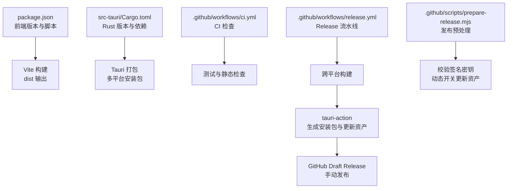
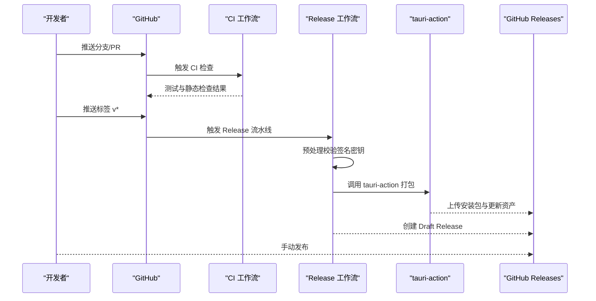
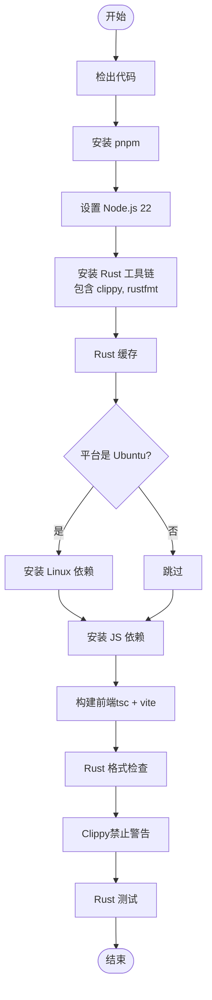
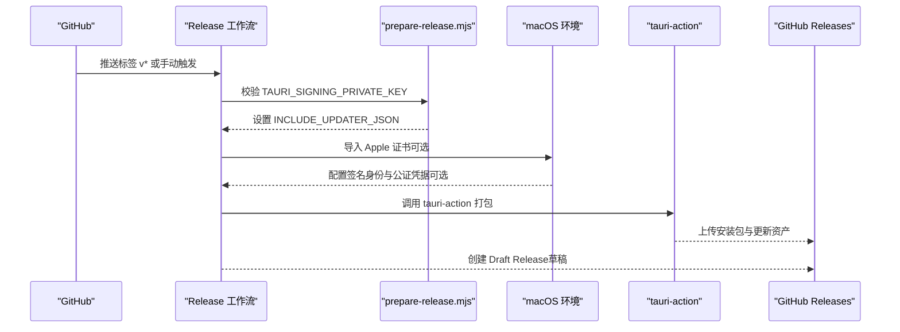
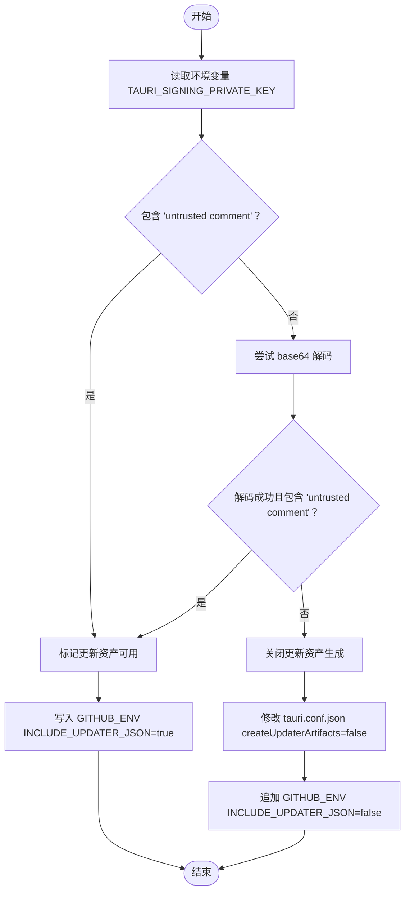
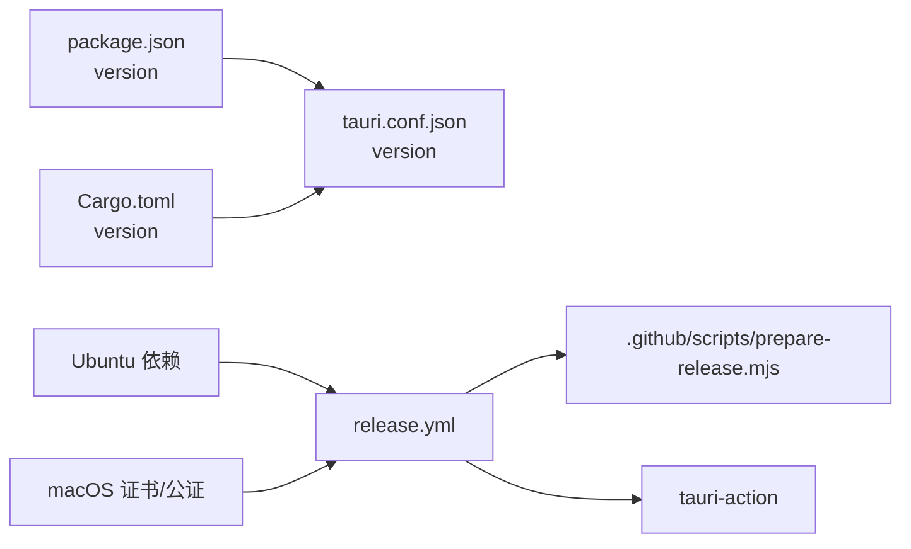

# 发布流程

<cite>
**本文引用的文件**
- [.github/workflows/ci.yml](file://.github/workflows/ci.yml)
- [.github/workflows/release.yml](file://.github/workflows/release.yml)
- [.github/scripts/prepare-release.mjs](file://.github/scripts/prepare-release.mjs)
- [package.json](file://package.json)
- [src-tauri/Cargo.toml](file://src-tauri/Cargo.toml)
- [src-tauri/tauri.conf.json](file://src-tauri/tauri.conf.json)
- [README.md](file://README.md)
- [CONTRIBUTING.md](file://CONTRIBUTING.md)
- [CHANGELOG.md](file://CHANGELOG.md)
</cite>

## 目录
1. [简介](#简介)
2. [项目结构](#项目结构)
3. [核心组件](#核心组件)
4. [架构总览](#架构总览)
5. [详细组件分析](#详细组件分析)
6. [依赖关系分析](#依赖关系分析)
7. [性能考量](#性能考量)
8. [故障排查指南](#故障排查指南)
9. [结论](#结论)
10. [附录](#附录)

## 简介
本指南面向维护者与贡献者，系统讲解本项目的自动化发布流程，包括：
- GitHub Actions 工作流的配置与执行机制
- 版本管理策略、标签创建与发布资产生成
- 发布前检查清单、质量保证步骤与回滚策略
- 持续集成与持续部署的配置与最佳实践
- 发布过程中的错误处理与异常应对

## 项目结构
本项目采用前端（React + Vite）+ Rust（Tauri）的混合架构，并通过 GitHub Actions 实现跨平台打包与发布。关键位置如下：
- 前端与构建：package.json 定义版本与脚本，Vite 构建产物输出到 dist
- 后端与打包：Cargo.toml 定义 Rust 依赖与版本；tauri.conf.json 配置应用元数据与打包参数
- 发布流水线：.github/workflows 下的 ci.yml 与 release.yml；release 预处理脚本 prepare-release.mjs

图表来源
- [.github/workflows/ci.yml:1-56](file://.github/workflows/ci.yml#L1-L56)
- [.github/workflows/release.yml:1-161](file://.github/workflows/release.yml#L1-L161)
- [.github/scripts/prepare-release.mjs:1-37](file://.github/scripts/prepare-release.mjs#L1-L37)
- [package.json:1-53](file://package.json#L1-L53)
- [src-tauri/Cargo.toml:1-50](file://src-tauri/Cargo.toml#L1-L50)
- [src-tauri/tauri.conf.json:1-54](file://src-tauri/tauri.conf.json#L1-L54)

章节来源
- [.github/workflows/ci.yml:1-56](file://.github/workflows/ci.yml#L1-L56)
- [.github/workflows/release.yml:1-161](file://.github/workflows/release.yml#L1-L161)
- [package.json:1-53](file://package.json#L1-L53)
- [src-tauri/Cargo.toml:1-50](file://src-tauri/Cargo.toml#L1-L50)
- [src-tauri/tauri.conf.json:1-54](file://src-tauri/tauri.conf.json#L1-L54)

## 核心组件
- 版本与元数据
  - 前端版本：package.json 中 version 字段
  - 后端版本：src-tauri/Cargo.toml 中 package.version
  - 应用版本：src-tauri/tauri.conf.json 中 version 与 productName
- 发布触发
  - release.yml 通过 push: tags: v* 触发，或手动 workflow_dispatch
- 跨平台构建矩阵
  - macOS（aarch64/x86_64）、Ubuntu、Windows
- 发布预处理
  - prepare-release.mjs 校验 TAURI_SIGNING_PRIVATE_KEY，决定是否生成更新资产
- 发布产物
  - Tauri 安装包（DMG/EXE/MSI/AppImage/DEB）与可选的更新 JSON

章节来源
- [package.json:4](file://package.json#L4)
- [src-tauri/Cargo.toml:3](file://src-tauri/Cargo.toml#L3)
- [src-tauri/tauri.conf.json:4](file://src-tauri/tauri.conf.json#L4)
- [.github/workflows/release.yml:5-8](file://.github/workflows/release.yml#L5-L8)
- [.github/workflows/release.yml:16-28](file://.github/workflows/release.yml#L16-L28)
- [.github/scripts/prepare-release.mjs:1-37](file://.github/scripts/prepare-release.mjs#L1-L37)

## 架构总览
发布流水线由两条 GitHub Actions 工作流协同完成：
- CI 工作流：在主分支与拉取请求上运行，进行前端构建、Rust 格式与静态检查、Clippy、测试
- Release 工作流：在打标签（v*）时或手动触发，跨平台构建安装包，汇总到 GitHub Draft Release，待人工审核后发布

图表来源
- [.github/workflows/ci.yml:1-56](file://.github/workflows/ci.yml#L1-L56)
- [.github/workflows/release.yml:1-161](file://.github/workflows/release.yml#L1-L161)

## 详细组件分析

### CI 工作流（ci.yml）
职责与流程
- 安装 pnpm、Node.js 22、Rust 工具链与 clippy/rustfmt
- Ubuntu 场景安装 Linux 依赖
- 安装 JS 依赖并构建前端
- Rust 格式检查与 Clippy（禁止警告）
- 运行 Rust 测试

图表来源
- [.github/workflows/ci.yml:1-56](file://.github/workflows/ci.yml#L1-L56)

章节来源
- [.github/workflows/ci.yml:1-56](file://.github/workflows/ci.yml#L1-L56)

### Release 工作流（release.yml）
职责与流程
- 触发条件：push: tags: v* 或手动 workflow_dispatch
- 平台矩阵：macOS（aarch64/x86_64）、Ubuntu、Windows
- 预处理：prepare-release.mjs 校验签名密钥，动态决定是否生成更新资产
- macOS 证书与公证：导入 Developer ID 证书到临时钥匙串，配置签名身份与可选的 Apple API/ID 公证
- 调用 tauri-action：传入 tagName、releaseName、releaseBody、args 等参数，创建 Draft Release

图表来源
- [.github/workflows/release.yml:1-161](file://.github/workflows/release.yml#L1-L161)
- [.github/scripts/prepare-release.mjs:1-37](file://.github/scripts/prepare-release.mjs#L1-L37)

章节来源
- [.github/workflows/release.yml:1-161](file://.github/workflows/release.yml#L1-L161)
- [.github/scripts/prepare-release.mjs:1-37](file://.github/scripts/prepare-release.mjs#L1-L37)

### 发布预处理脚本（prepare-release.mjs）
作用
- 校验 TAURI_SIGNING_PRIVATE_KEY 是否为有效格式（支持明文与 base64）
- 若无效，则关闭 tauri.conf.json 中 createUpdaterArtifacts，并在 GITHUB_ENV 中设置 INCLUDE_UPDATER_JSON=false，避免打包失败
- 若有效，则设置 INCLUDE_UPDATER_JSON=true

图表来源
- [.github/scripts/prepare-release.mjs:1-37](file://.github/scripts/prepare-release.mjs#L1-L37)
- [src-tauri/tauri.conf.json:26](file://src-tauri/tauri.conf.json#L26)

章节来源
- [.github/scripts/prepare-release.mjs:1-37](file://.github/scripts/prepare-release.mjs#L1-L37)
- [src-tauri/tauri.conf.json:26](file://src-tauri/tauri.conf.json#L26)

### 版本管理与标签策略
- 版本来源
  - 前端版本：package.json version
  - 后端版本：Cargo.toml version
  - 应用版本：tauri.conf.json version
- 标签规范
  - 通过推送 v* 标签触发 Release 工作流
- 版本一致性建议
  - 建议在打标签前统一更新三处版本，确保发布产物与版本一致
- 变更记录
  - CHANGELOG.md 采用 Keep a Changelog 格式，遵循语义化版本

章节来源
- [package.json:4](file://package.json#L4)
- [src-tauri/Cargo.toml:3](file://src-tauri/Cargo.toml#L3)
- [src-tauri/tauri.conf.json:4](file://src-tauri/tauri.conf.json#L4)
- [.github/workflows/release.yml:5-8](file://.github/workflows/release.yml#L5-L8)
- [CHANGELOG.md:1-145](file://CHANGELOG.md#L1-L145)

### 发布资产与更新机制
- 安装包
  - macOS：DMG（Apple Silicon 与 Intel 双目标）
  - Windows：-setup.exe 或 .msi
  - Linux：.AppImage 或 .deb
- 更新资产
  - 当启用更新时，会生成更新 JSON 与签名文件，供应用自更新插件使用
  - 通过 prepare-release.mjs 动态控制是否生成

章节来源
- [.github/workflows/release.yml:156-159](file://.github/workflows/release.yml#L156-L159)
- [.github/scripts/prepare-release.mjs:27-36](file://.github/scripts/prepare-release.mjs#L27-L36)
- [src-tauri/tauri.conf.json:26](file://src-tauri/tauri.conf.json#L26)

### 质量保证与回滚策略
- 质量保证
  - CI 工作流：前端构建、Rust 格式检查、Clippy（禁止警告）、测试
  - 发布前建议：本地再次执行构建与测试，确保与 CI 一致
- 回滚策略
  - 通过 GitHub Releases 的草稿状态，可在发现问题时撤销发布
  - 若已发布，可创建新标签并发布新版本，同时在变更说明中明确回滚指引

章节来源
- [.github/workflows/ci.yml:48-55](file://.github/workflows/ci.yml#L48-L55)
- [.github/workflows/release.yml:158](file://.github/workflows/release.yml#L158)
- [README.md:58-75](file://README.md#L58-L75)

## 依赖关系分析
- 版本依赖
  - package.json 与 Cargo.toml 的 version 字段共同决定应用版本
  - tauri.conf.json 的 version 与 productName 用于打包与标识
- 工作流依赖
  - release.yml 依赖 prepare-release.mjs 进行预处理
  - tauri-action 依赖 GitHub Token 与可选的 Apple 公证凭据
- 平台依赖
  - Ubuntu 需要特定系统依赖以支持 Tauri 打包
  - macOS 需要 Developer ID 证书与可选的 Apple 公证凭据

图表来源
- [package.json:4](file://package.json#L4)
- [src-tauri/Cargo.toml:3](file://src-tauri/Cargo.toml#L3)
- [src-tauri/tauri.conf.json:4](file://src-tauri/tauri.conf.json#L4)
- [.github/workflows/release.yml:1-161](file://.github/workflows/release.yml#L1-L161)
- [.github/scripts/prepare-release.mjs:1-37](file://.github/scripts/prepare-release.mjs#L1-L37)

章节来源
- [package.json:4](file://package.json#L4)
- [src-tauri/Cargo.toml:3](file://src-tauri/Cargo.toml#L3)
- [src-tauri/tauri.conf.json:4](file://src-tauri/tauri.conf.json#L4)
- [.github/workflows/release.yml:1-161](file://.github/workflows/release.yml#L1-L161)
- [.github/scripts/prepare-release.mjs:1-37](file://.github/scripts/prepare-release.mjs#L1-L37)

## 性能考量
- 缓存优化
  - Rust 缓存（swatinem/rust-cache）减少重复编译时间
  - pnpm 缓存提升 JS 依赖安装速度
- 并行构建
  - 平台矩阵并行执行，缩短整体构建时间
- 产物体积
  - Tauri 使用系统 WebView，避免打包 Chromium，安装包体积较小

章节来源
- [.github/workflows/ci.yml:31-34](file://.github/workflows/ci.yml#L31-L34)
- [.github/workflows/release.yml:46-49](file://.github/workflows/release.yml#L46-L49)

## 故障排查指南
常见问题与处理
- 未配置 Apple 证书导致 macOS 未签名 DMG
  - 现象：未配置 Secrets 时产出未签名 .dmg，可能被 Gatekeeper 拦截
  - 处理：README 提供 xattr 清理隔离属性的兜底方案
- Apple 公证凭据缺失或格式错误
  - 现象：未配置 APPLE_API_PRIVATE_KEY 时尝试 Apple ID 方式；若凭据不完整则公证失败
  - 处理：补齐凭据或使用 Apple API Key 方式
- 更新资产生成失败
  - 现象：TAURI_SIGNING_PRIVATE_KEY 无效时，prepare-release.mjs 会关闭 createUpdaterArtifacts
  - 处理：提供有效的 base64 编码私钥或禁用更新功能
- Linux 依赖缺失
  - 现象：Ubuntu 打包失败
  - 处理：安装 README 中列出的系统依赖

章节来源
- [.github/workflows/release.yml:67-94](file://.github/workflows/release.yml#L67-L94)
- [.github/workflows/release.yml:95-132](file://.github/workflows/release.yml#L95-L132)
- [.github/scripts/prepare-release.mjs:10-36](file://.github/scripts/prepare-release.mjs#L10-L36)
- [.github/workflows/ci.yml:36-40](file://.github/workflows/ci.yml#L36-L40)
- [README.md:58-75](file://README.md#L58-L75)

## 结论
本项目的发布流程通过 CI 与 Release 两条工作流实现了高质量、跨平台的自动化交付。通过版本统一管理、预处理脚本保障更新资产生成的稳定性、以及草稿发布的人工审核机制，能够在保证质量的同时快速迭代。建议在每次发布前统一版本、完善变更说明，并在出现问题时利用草稿回滚与新标签发布进行快速修复。

## 附录
- 发布前检查清单
  - 统一更新 package.json、Cargo.toml、tauri.conf.json 的版本
  - 本地执行构建与测试，确保与 CI 一致
  - 准备好 Apple 证书与公证凭据（如需）
  - 准备好 TAURI_SIGNING_PRIVATE_KEY（如需）
- 持续集成与持续部署
  - CI 工作流负责质量门禁
  - Release 工作流负责跨平台打包与草稿发布
- 错误与异常处理
  - 未配置签名密钥时自动降级为不生成更新资产
  - macOS 未配置证书时仍产出未签名包，提供 xattr 处理方案
  - Linux 依赖缺失时在 CI 中提前暴露问题

章节来源
- [CONTRIBUTING.md:17-26](file://CONTRIBUTING.md#L17-L26)
- [.github/workflows/ci.yml:48-55](file://.github/workflows/ci.yml#L48-L55)
- [.github/workflows/release.yml:67-94](file://.github/workflows/release.yml#L67-L94)
- [.github/scripts/prepare-release.mjs:27-36](file://.github/scripts/prepare-release.mjs#L27-L36)
- [README.md:58-75](file://README.md#L58-L75)