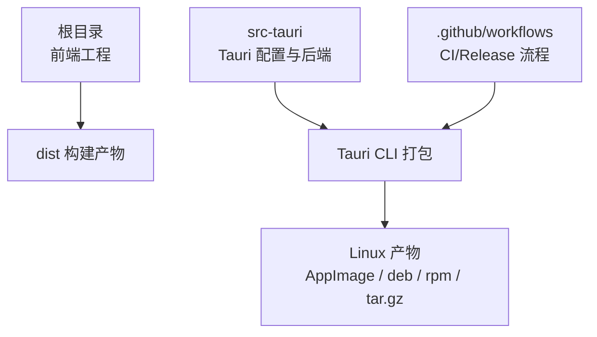
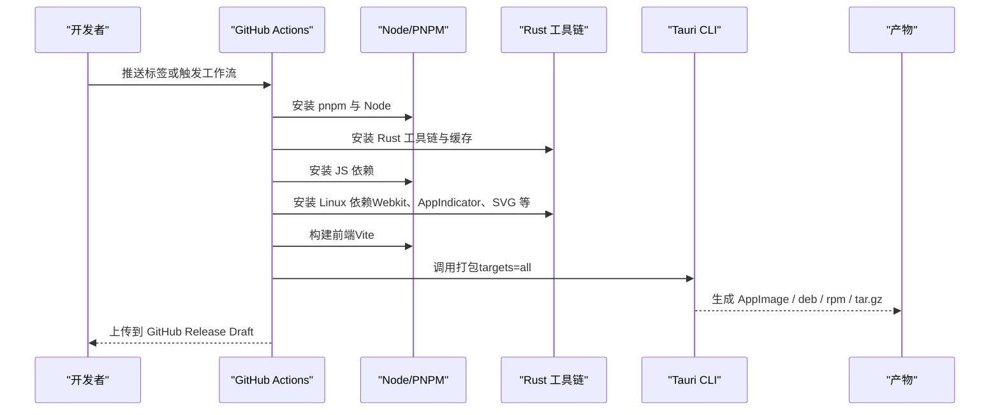
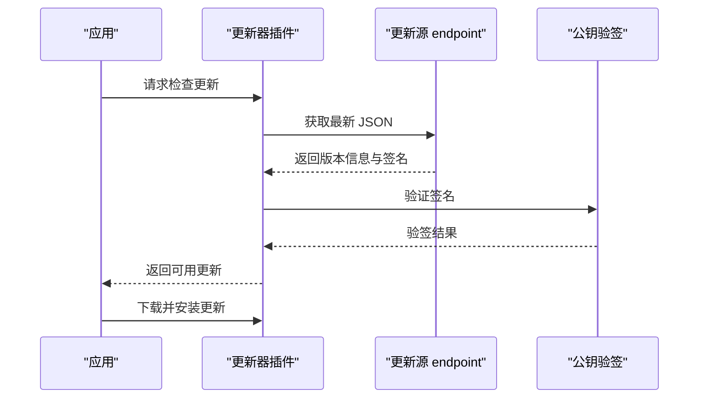
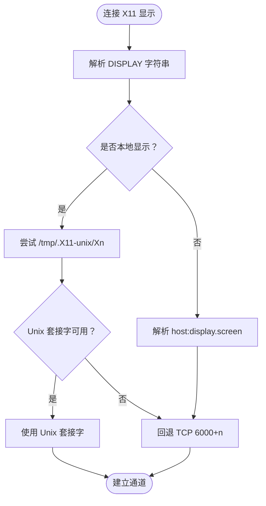
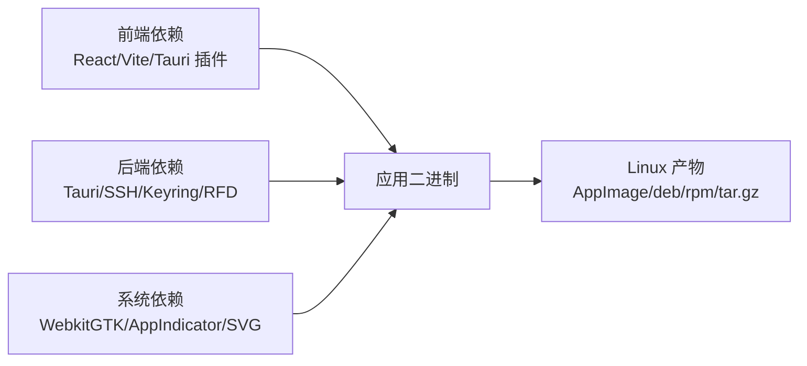

# Linux 打包

<cite>
**本文引用的文件**
- [tauri.conf.json](file://src-tauri/tauri.conf.json)
- [Cargo.toml](file://src-tauri/Cargo.toml)
- [lib.rs](file://src-tauri/src/lib.rs)
- [main.rs](file://src-tauri/src/main.rs)
- [release.yml](file://.github/workflows/release.yml)
- [ci.yml](file://.github/workflows/ci.yml)
- [package.json](file://package.json)
- [x11.rs](file://src-tauri/src/session/x11.rs)
- [default.json](file://src-tauri/capabilities/default.json)
</cite>

## 目录
1. [简介](#简介)
2. [项目结构](#项目结构)
3. [核心组件](#核心组件)
4. [架构总览](#架构总览)
5. [详细组件分析](#详细组件分析)
6. [依赖关系分析](#依赖关系分析)
7. [性能考量](#性能考量)
8. [故障排查指南](#故障排查指南)
9. [结论](#结论)
10. [附录](#附录)

## 简介
本指南面向 Linux 平台的打包与发布，结合当前仓库中基于 Tauri 的应用配置，系统阐述以下内容：
- 多种 Linux 发行版打包格式：AppImage、deb、rpm、tar.gz 的生成与使用建议
- Flatpak 与 Snap 的配置与发布流程（概念性说明）
- Linux 权限配置与桌面集成：.desktop 文件、图标主题、菜单集成
- 不同发行版的兼容性测试与依赖管理
- 包管理器集成与自动更新机制配置
- Wayland 与 X11 兼容性注意事项

本指南以仓库现有配置为基础，辅以概念性扩展，帮助你在 Linux 上完成稳定、可维护的打包与发布。

## 项目结构
该仓库采用前端 + Tauri 后端的混合架构，Linux 打包由 GitHub Actions 驱动，Tauri CLI 负责多目标产物生成。关键位置如下：
- 前端工程位于根目录，通过 Vite 构建，产物输出至 dist
- Tauri 配置位于 src-tauri，包含应用元数据、打包配置、插件启用与能力声明
- GitHub Actions 工作流负责跨平台构建与发布

**章节来源**
- [package.json:1-53](file://package.json#L1-L53)
- [tauri.conf.json:1-54](file://src-tauri/tauri.conf.json#L1-L54)
- [release.yml:1-161](file://.github/workflows/release.yml#L1-L161)

## 核心组件
- 应用配置与打包开关
  - tauri.conf.json 中的 bundle.targets 设置为 all，确保同时生成 AppImage、deb、rpm、tar.gz 等 Linux 产物
  - 启用 createUpdaterArtifacts，配合 tauri-plugin-updater 实现自动更新
- 插件与能力
  - 后端启用 opener、dialog、process、updater 插件，满足 Linux 下打开外部资源、对话框、进程与更新需求
  - 能力配置 default.json 声明主窗口权限集合
- 构建与运行入口
  - main.rs 作为后端入口，lib.rs 初始化插件与命令注册

**章节来源**
- [tauri.conf.json:24-52](file://src-tauri/tauri.conf.json#L24-L52)
- [lib.rs:14-92](file://src-tauri/src/lib.rs#L14-L92)
- [main.rs:1-7](file://src-tauri/src/main.rs#L1-L7)
- [default.json:1-13](file://src-tauri/capabilities/default.json#L1-L13)

## 架构总览
下图展示 Linux 打包与发布的整体流程，从源码到最终产物的关键步骤。

**图表来源**
- [release.yml:134-161](file://.github/workflows/release.yml#L134-L161)
- [ci.yml:36-41](file://.github/workflows/ci.yml#L36-L41)
- [package.json:22-27](file://package.json#L22-L27)

**章节来源**
- [release.yml:1-161](file://.github/workflows/release.yml#L1-161)
- [ci.yml:1-56](file://.github/workflows/ci.yml#L1-L56)

## 详细组件分析

### Linux 打包格式与使用建议
- AppImage
  - 优点：便携、无需安装、自包含；适合个人分发与快速试用
  - 注意：需在打包时正确设置图标、.desktop 文件与权限；部分发行版需要额外配置以启用剪贴板、托盘等
- deb
  - 优点：与 Debian/Ubuntu 生态无缝集成；可写入系统菜单与图标主题
  - 注意：需提供正确的控制信息、依赖声明与权限配置；建议配合 lintian 检查
- rpm
  - 优点：适用于 Red Hat/Fedora/SUSE 系；可利用软件中心与 dnf/zypper
  - 注意：需遵循 RPM 规范，提供 %files、%changelog、%description 等段落
- tar.gz
  - 优点：通用性强，便于手工部署与归档
  - 注意：需包含启动脚本、图标路径与权限修正；建议提供安装/卸载脚本

以上格式均由 tauri.conf.json 中的 targets=all 自动生成，具体参数可在 CI 中按需调整。

**章节来源**
- [tauri.conf.json:24-28](file://src-tauri/tauri.conf.json#L24-L28)
- [release.yml:134-161](file://.github/workflows/release.yml#L134-L161)

### Flatpak 与 Snap 配置与发布（概念性说明）
- Flatpak
  - 使用方式：编写 io.{domain}.{app}.yaml 清单，声明模块、依赖、权限与运行时；通过 flatpak-builder 构建
  - 优势：沙箱化、依赖隔离、自动更新；适合桌面应用生态
  - 发布：可通过 Flathub 或自建镜像站；需准备审核材料与持续维护
- Snap
  - 使用方式：编写 snapcraft.yaml，定义构建步骤、依赖与接口；通过 snapcraft 构建与发布
  - 优势：自动更新、接口契约、广泛支持；适合 Ubuntu 生态
  - 发布：通过 Snap Store 审核；需关注接口权限与安全策略

上述为通用实践，不绑定仓库现有配置，可按需引入。

### Linux 权限配置与桌面集成
- .desktop 文件
  - 内容要点：名称、类型、可执行路径、图标、分类、启动方式、快捷键等
  - 建议：与打包阶段一同生成，随 deb/rpm/tar.gz 分发；图标路径与主题保持一致
- 图标主题支持
  - 建议提供多尺寸图标（16x16、24x24、32x32、48x48、64x64、128x128、256x256、512x512 等）
  - 将图标安装至标准路径，如 /usr/share/icons/hicolor/{size}x{size}/apps/ 或 ~/.local/share/icons/hicolor/{size}x{size}/apps/
- 菜单与启动项
  - deb：通过菜单 XML 或打包脚本写入 /usr/share/applications
  - rpm：通过 %install/%desktop/%files 段落处理
  - tar.gz：随包提供 .desktop 文件并在安装脚本中复制

这些步骤属于常规桌面集成实践，不绑定仓库现有文件。

### 自动更新机制配置
- 更新器插件
  - 后端启用 tauri-plugin-updater，前端通过 @tauri-apps/plugin-updater 使用
  - 配置公钥与更新源 endpoint，确保签名验证与更新 JSON 正确
- 更新 JSON 结构
  - 包含版本号、发布说明、平台匹配、下载地址与签名字段
  - 仓库已配置 endpoint 指向 GitHub Releases 的最新 JSON
- 签名与安全
  - 使用 tauri.conf.json 中的公钥进行验签；发布前确保私钥环境变量正确注入

**图表来源**
- [tauri.conf.json:46-51](file://src-tauri/tauri.conf.json#L46-L51)
- [lib.rs:24](file://src-tauri/src/lib.rs#L24)

**章节来源**
- [tauri.conf.json:46-51](file://src-tauri/tauri.conf.json#L46-L51)
- [lib.rs:24](file://src-tauri/src/lib.rs#L24)

### Wayland 与 X11 兼容性考虑
- 显示后端与窗口系统
  - 代码中存在对 Wayland 与 X11 的依赖与条件编译逻辑，表明应用具备跨显示系统的兼容性基础
- X11 桥接
  - 代码包含 X11 连接桥接逻辑，支持通过 Unix 域套接字或 TCP 6000+n 端口访问本地 X 服务器
- 实践建议
  - 在 Wayland 环境下优先使用原生协议；如需 X11 功能，确保 DISPLAY 正确且具备相应权限
  - 对于远程 X11 场景，注意防火墙与认证配置

**图表来源**
- [x11.rs:62-125](file://src-tauri/src/session/x11.rs#L62-L125)

**章节来源**
- [x11.rs:38-150](file://src-tauri/src/session/x11.rs#L38-L150)

### 包管理器集成指南（概念性说明）
- Debian/Ubuntu（apt）
  - 使用 .deb 包，提供依赖声明与权限；通过软件中心或命令行安装
- Red Hat/Fedora（dnf/zypper）
  - 使用 .rpm 包，声明依赖与权限；通过软件中心或命令行安装
- Arch/Manjaro（pacman）
  - 可通过 AUR 或自建仓库；建议提供 PKGBUILD
- 手工安装
  - tar.gz 包含启动脚本与图标；提供安装/卸载脚本提升用户体验

以上为通用实践，不绑定仓库现有文件。

## 依赖关系分析
- 前端依赖
  - React、Vite、@tauri-apps/* 插件等，用于构建与运行时交互
- 后端依赖
  - Tauri 核心、russh/russh-sftp、keyring、rfd 等；rfd 依赖 wayland-backend、wayland-client 等，体现对 Wayland 的支持
- 构建依赖
  - tauri-build、libappindicator（用于系统托盘）、WebkitGTK 等

**图表来源**
- [package.json:28-51](file://package.json#L28-L51)
- [Cargo.toml:22-49](file://src-tauri/Cargo.toml#L22-L49)
- [ci.yml:36-41](file://.github/workflows/ci.yml#L36-L41)

**章节来源**
- [package.json:28-51](file://package.json#L28-L51)
- [Cargo.toml:22-49](file://src-tauri/Cargo.toml#L22-L49)
- [ci.yml:36-41](file://.github/workflows/ci.yml#L36-L41)

## 性能考量
- 构建缓存
  - 使用 Rust 缓存与 PNPM 缓存减少重复构建时间
- 产物体积
  - AppImage 可通过打包工具裁剪多余文件；deb/rpm 可剥离调试符号
- 运行时性能
  - 合理使用异步与线程池；避免阻塞 UI 线程
- 更新体验
  - 控制更新包大小，提供增量更新策略（如适用）

## 故障排查指南
- Linux 依赖缺失
  - 现有 CI 已安装 WebkitGTK、AppIndicator、SVG 等依赖；如本地构建失败，请确认系统依赖齐全
- 更新失败
  - 检查公钥配置与 endpoint 是否可达；确认网络代理与证书链
- 桌面集成问题
  - .desktop 文件路径与图标路径需与安装路径一致；权限不足会导致菜单项不可见
- X11/Wayland 问题
  - Wayland 环境下如需 X11 功能，确保 DISPLAY 正确且具备相应权限；必要时启用 X11 转发

**章节来源**
- [ci.yml:36-41](file://.github/workflows/ci.yml#L36-L41)
- [tauri.conf.json:46-51](file://src-tauri/tauri.conf.json#L46-L51)
- [x11.rs:62-125](file://src-tauri/src/session/x11.rs#L62-L125)

## 结论
本指南基于仓库现有 Tauri 配置与 CI 工作流，总结了 Linux 平台打包与发布的最佳实践。通过启用 all 目标与自动更新插件，可快速生成多种格式的安装包；结合 .desktop 与图标主题，实现良好的桌面集成；针对 Wayland 与 X11 的兼容性设计，确保在现代桌面环境中的稳定性。建议在实际发布前补充 Flatpak/Snap 清单与包管理器规范，完善自动化测试与发布流程。

## 附录
- 关键配置清单
  - tauri.conf.json：产品元数据、打包目标、更新器 endpoint 与公钥
  - lib.rs：插件初始化与命令注册
  - release.yml：Linux 依赖安装与打包调用
  - package.json：前端构建脚本与依赖
  - x11.rs：X11 连接桥接逻辑

**章节来源**
- [tauri.conf.json:1-54](file://src-tauri/tauri.conf.json#L1-L54)
- [lib.rs:14-92](file://src-tauri/src/lib.rs#L14-L92)
- [release.yml:51-57](file://.github/workflows/release.yml#L51-L57)
- [package.json:22-27](file://package.json#L22-L27)
- [x11.rs:38-150](file://src-tauri/src/session/x11.rs#L38-L150)