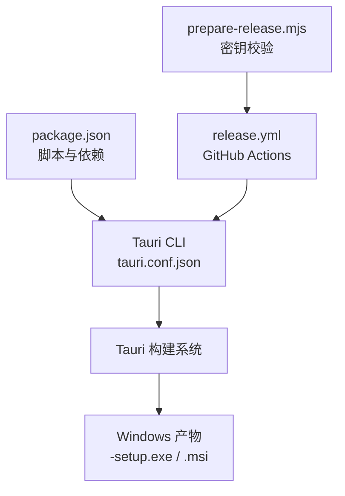
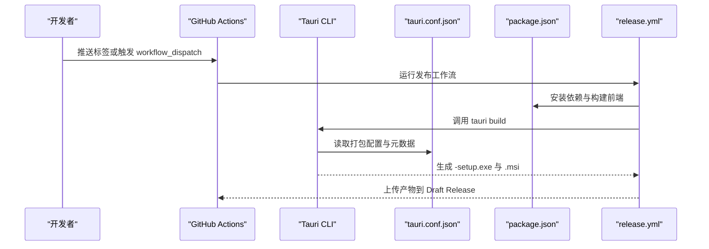
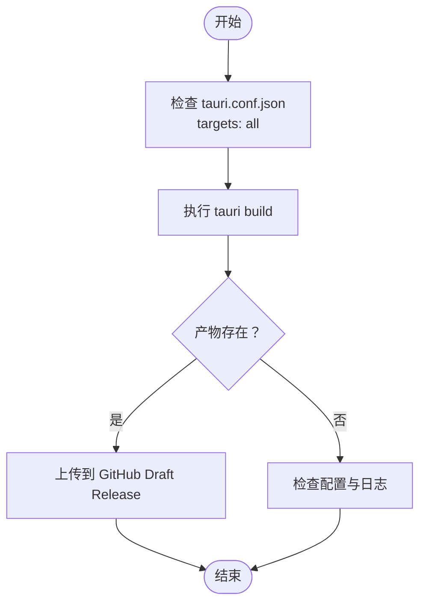
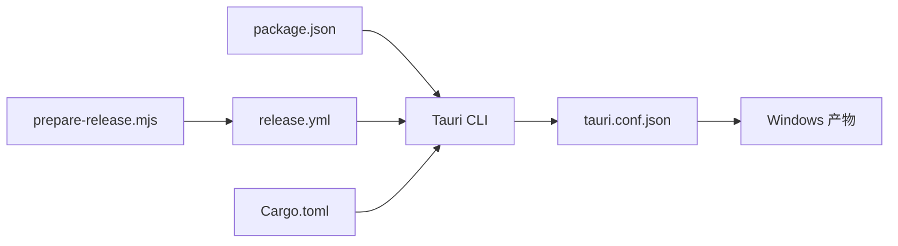

# Windows 打包

<cite>
**本文引用的文件**
- [tauri.conf.json](file://src-tauri/tauri.conf.json)
- [Cargo.toml](file://src-tauri/Cargo.toml)
- [package.json](file://package.json)
- [release.yml](file://.github/workflows/release.yml)
- [prepare-release.mjs](file://.github/scripts/prepare-release.mjs)
- [README.md](file://README.md)
</cite>

## 目录
1. [简介](#简介)
2. [项目结构](#项目结构)
3. [核心组件](#核心组件)
4. [架构总览](#架构总览)
5. [详细组件分析](#详细组件分析)
6. [依赖分析](#依赖分析)
7. [性能考虑](#性能考虑)
8. [故障排除指南](#故障排除指南)
9. [结论](#结论)
10. [附录](#附录)

## 简介
本指南面向在 Windows 平台上使用 Tauri 2 构建与打包桌面应用的团队与个人开发者，结合本仓库现有配置，系统讲解 Windows 安装包生成流程、签名与时间戳策略、权限与 UAC 处理建议、Windows 10/11 现代应用商店与侧载方案，以及常见打包与兼容性问题的排查方法。  
说明：本仓库当前的打包配置由 Tauri CLI 与 GitHub Actions 驱动，Windows 安装包产物类型为“-setup.exe”与“.msi”。仓库未包含 NSIS/WiX 的自定义脚本，因此本文以现有配置为基础，给出可落地的实践步骤与注意事项。

## 项目结构
围绕 Windows 打包的相关文件与职责如下：
- 应用与打包配置
  - 应用清单与打包参数：src-tauri/tauri.conf.json
  - Rust 依赖与插件：src-tauri/Cargo.toml
  - 前端与 CLI 脚本：package.json
- 自动化发布
  - GitHub Actions 发布工作流：.github/workflows/release.yml
  - 发布前密钥校验脚本：.github/scripts/prepare-release.mjs
- 使用与说明
  - README 中包含下载与安装信息，以及 macOS 签名与公证经验，可作为 Windows 打包的参考

**图表来源**
- [package.json:22-27](file://package.json#L22-L27)
- [tauri.conf.json:24-44](file://src-tauri/tauri.conf.json#L24-L44)
- [release.yml:134-161](file://.github/workflows/release.yml#L134-L161)
- [prepare-release.mjs:1-37](file://.github/scripts/prepare-release.mjs#L1-L37)

**章节来源**
- [package.json:1-53](file://package.json#L1-L53)
- [tauri.conf.json:1-54](file://src-tauri/tauri.conf.json#L1-L54)
- [release.yml:1-161](file://.github/workflows/release.yml#L1-L161)
- [prepare-release.mjs:1-37](file://.github/scripts/prepare-release.mjs#L1-L37)
- [README.md:47-76](file://README.md#L47-L76)

## 核心组件
- Tauri 打包配置（Windows 产物）
  - 产物类型：all（包含 Windows 安装包）
  - 更新器开关：开启（createUpdaterArtifacts）
  - 发布元数据：publisher、category、shortDescription、longDescription、copyright、图标等
- 自动化发布（Windows）
  - 使用 tauri-action 在 windows-latest runner 上构建
  - 产物汇总至 GitHub Draft Release
- 更新器签名
  - 通过环境变量 TAURI_SIGNING_PRIVATE_KEY 注入私钥
  - prepare-release.mjs 会在密钥无效时禁用更新器产物

**章节来源**
- [tauri.conf.json:24-52](file://src-tauri/tauri.conf.json#L24-L52)
- [release.yml:134-161](file://.github/workflows/release.yml#L134-L161)
- [prepare-release.mjs:1-37](file://.github/scripts/prepare-release.mjs#L1-L37)

## 架构总览
Windows 打包的整体流程由前端构建、Tauri CLI、Tauri 打包与 GitHub Actions 组成，最终生成 -setup.exe 与 .msi 并上传到 GitHub Draft Release。

**图表来源**
- [release.yml:134-161](file://.github/workflows/release.yml#L134-L161)
- [package.json:22-27](file://package.json#L22-L27)
- [tauri.conf.json:24-44](file://src-tauri/tauri.conf.json#L24-L44)

## 详细组件分析

### Windows 安装包生成流程
- 产物类型
  - tauri.conf.json 中 targets 设置为 all，将生成 Windows 安装包（-setup.exe 与 .msi）
- 构建入口
  - package.json 中的 tauri 脚本用于调用 Tauri CLI
- 自动化
  - release.yml 在 windows-latest runner 上执行 tauri-action，完成打包与产物上传

**图表来源**
- [tauri.conf.json:24-28](file://src-tauri/tauri.conf.json#L24-L28)
- [release.yml:134-161](file://.github/workflows/release.yml#L134-L161)

**章节来源**
- [tauri.conf.json:24-28](file://src-tauri/tauri.conf.json#L24-L28)
- [release.yml:134-161](file://.github/workflows/release.yml#L134-L161)

### 数字签名与时间戳（代码签名与公证）
- 现状
  - 本仓库未包含 Windows 代码签名与时间戳配置（例如在 tauri.conf.json 中的 signer 或 Windows 签名相关字段）
  - release.yml 未配置 Windows 证书与时间戳服务
- 建议
  - 代码签名
    - 在 CI 中导入 PFX/P12 证书（通过 secrets 注入），并在 tauri-action 中启用签名
    - 证书应具备“代码签名”用途
  - 时间戳服务器
    - 使用受信的时间戳服务器（如 DigiCert、GlobalSign、Microsoft 等）以保证签名长期有效
  - 注意
    - 未签名的安装包在部分安全策略较严的环境中可能被阻止或提示风险
    - 建议在企业内网或侧载场景中配合企业 CA 与时间戳服务

**章节来源**
- [release.yml:134-161](file://.github/workflows/release.yml#L134-L161)
- [tauri.conf.json:24-44](file://src-tauri/tauri.conf.json#L24-L44)

### Windows 权限与 UAC 处理
- 现状
  - 本仓库未在 tauri.conf.json 中配置 Windows 特定权限（如防火墙例外、COM 接口、命名管道等）
- 建议
  - UAC 提示
    - 默认情况下，安装器会以管理员权限运行以写入 Program Files 等受保护位置
    - 若应用需要访问网络端口或系统资源，可在安装阶段引导用户接受更高权限
  - 防火墙例外
    - 若应用需要监听或主动连接网络端口，建议在安装器或首次启动时引导用户添加防火墙例外
  - 进程与系统集成
    - 如需与系统服务或计划任务协作，应在安装阶段进行注册，并在卸载阶段清理

**章节来源**
- [tauri.conf.json:12-23](file://src-tauri/tauri.conf.json#L12-L23)

### Windows 10/11 现代应用商店与侧载
- 现状
  - 本仓库未配置 Microsoft Store 发布流程或侧载清单
- 建议
  - Microsoft Store
    - 通过 Partner Center 提交应用，遵循商店审核规范
    - 使用 MSIX 包格式（可通过 Tauri 的 msix 目标或外部工具生成）
  - 侧载（Sideloading）
    - 使用企业或教育环境的设备管理工具推送 MSIX 包
    - 通过组策略或 Intune 部署，减少用户交互
  - 通用建议
    - 无论商店还是侧载，均建议提供清晰的隐私政策与许可协议链接

**章节来源**
- [tauri.conf.json:24-44](file://src-tauri/tauri.conf.json#L24-L44)

### 更新器与签名密钥
- 现状
  - tauri.conf.json 中启用 createUpdaterArtifacts，并配置了公钥
  - release.yml 通过环境变量注入 TAURI_SIGNING_PRIVATE_KEY
  - prepare-release.mjs 会在密钥无效时禁用更新器产物
- 建议
  - 密钥格式
    - 确保私钥为有效的 Tauri 更新器私钥（包含特定注释标记），否则会被视为无效
  - CI 配置
    - 将私钥以 secrets 形式注入，避免硬编码
  - 产物验证
    - 发布前检查 GitHub Release 是否包含更新器所需的 JSON 与签名文件

**章节来源**
- [tauri.conf.json:46-51](file://src-tauri/tauri.conf.json#L46-L51)
- [release.yml:134-161](file://.github/workflows/release.yml#L134-L161)
- [prepare-release.mjs:1-37](file://.github/scripts/prepare-release.mjs#L1-L37)

## 依赖分析
- 前端与 CLI
  - package.json 提供 tauri 脚本与依赖，驱动 Tauri CLI
- Rust 与插件
  - Cargo.toml 引入 Tauri 2 与相关插件（如 updater、process、dialog 等）
- 打包与发布
  - tauri.conf.json 定义打包目标、图标、元数据与更新器开关
  - release.yml 驱动跨平台打包与产物上传
  - prepare-release.mjs 在 CI 中校验更新器密钥有效性

**图表来源**
- [package.json:22-27](file://package.json#L22-L27)
- [tauri.conf.json:24-44](file://src-tauri/tauri.conf.json#L24-L44)
- [release.yml:134-161](file://.github/workflows/release.yml#L134-L161)
- [prepare-release.mjs:1-37](file://.github/scripts/prepare-release.mjs#L1-L37)
- [Cargo.toml:1-50](file://src-tauri/Cargo.toml#L1-L50)

**章节来源**
- [package.json:1-53](file://package.json#L1-L53)
- [Cargo.toml:1-50](file://src-tauri/Cargo.toml#L1-L50)
- [tauri.conf.json:1-54](file://src-tauri/tauri.conf.json#L1-L54)
- [release.yml:1-161](file://.github/workflows/release.yml#L1-L161)
- [prepare-release.mjs:1-37](file://.github/scripts/prepare-release.mjs#L1-L37)

## 性能考虑
- 安装包体积
  - 本应用目标为轻量，安装包体积较小，有利于快速分发与侧载部署
- 构建速度
  - 使用 Rust 缓存与 pnpm 缓存可显著缩短 CI 构建时间
- 更新体验
  - 启用更新器可减少用户手动下载安装包的成本

**章节来源**
- [README.md:24](file://README.md#L24)
- [release.yml:31-49](file://.github/workflows/release.yml#L31-L49)

## 故障排除指南
- 未生成 Windows 产物
  - 检查 tauri.conf.json 的 targets 是否为 all
  - 确认 release.yml 的 windows-latest runner 是否执行
- 更新器产物缺失
  - 检查 TAURI_SIGNING_PRIVATE_KEY 是否有效（prepare-release.mjs 会禁用更新器）
  - 确认 includeUpdaterJson 是否为 true
- 安装包被安全软件拦截
  - 未签名或签名不被信任可能导致拦截，建议在企业内部署或侧载场景中提供时间戳与受信 CA
- UAC 提示频繁
  - 安装器默认以管理员权限运行，若应用需要额外权限，建议在安装阶段明确告知用户
- 侧载部署失败
  - 确认设备允许来自未知发行商的侧载应用，并正确推送 MSIX 包

**章节来源**
- [tauri.conf.json:24-28](file://src-tauri/tauri.conf.json#L24-L28)
- [release.yml:134-161](file://.github/workflows/release.yml#L134-L161)
- [prepare-release.mjs:1-37](file://.github/scripts/prepare-release.mjs#L1-L37)
- [README.md:47-76](file://README.md#L47-L76)

## 结论
本仓库已具备跨平台自动化打包的基础能力，Windows 安装包（-setup.exe 与 .msi）由 Tauri CLI 与 tauri-action 自动生成。为进一步提升安全性与合规性，建议补充 Windows 代码签名与时间戳配置，并在企业侧载或商店发布场景中完善权限与隐私声明。同时，保持更新器密钥的有效性与 CI 流程的稳定性，有助于提供更好的用户体验与运维效率。

## 附录
- 关键配置参考路径
  - [tauri.conf.json](file://src-tauri/tauri.conf.json)
  - [Cargo.toml](file://src-tauri/Cargo.toml)
  - [package.json](file://package.json)
  - [.github/workflows/release.yml](file://.github/workflows/release.yml)
  - [.github/scripts/prepare-release.mjs](file://.github/scripts/prepare-release.mjs)
  - [README.md](file://README.md)