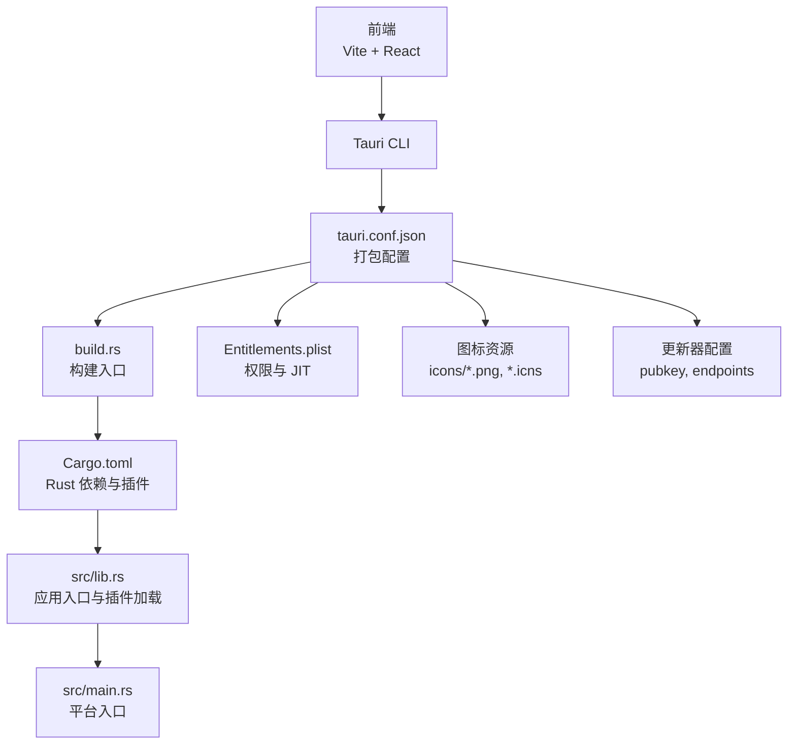
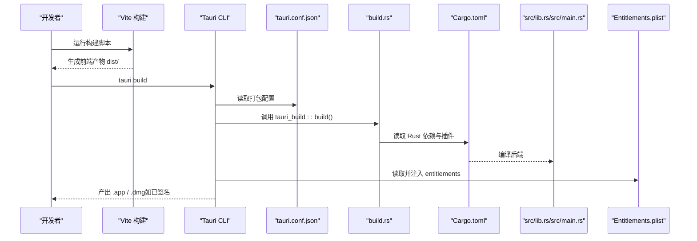
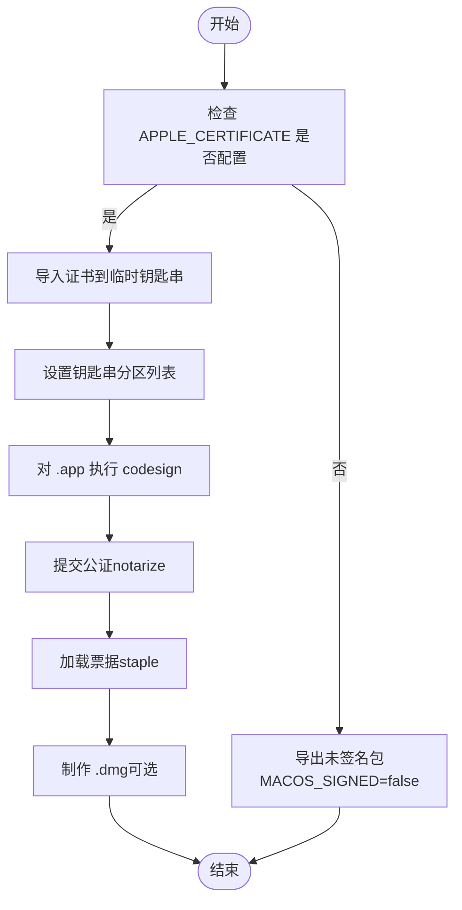
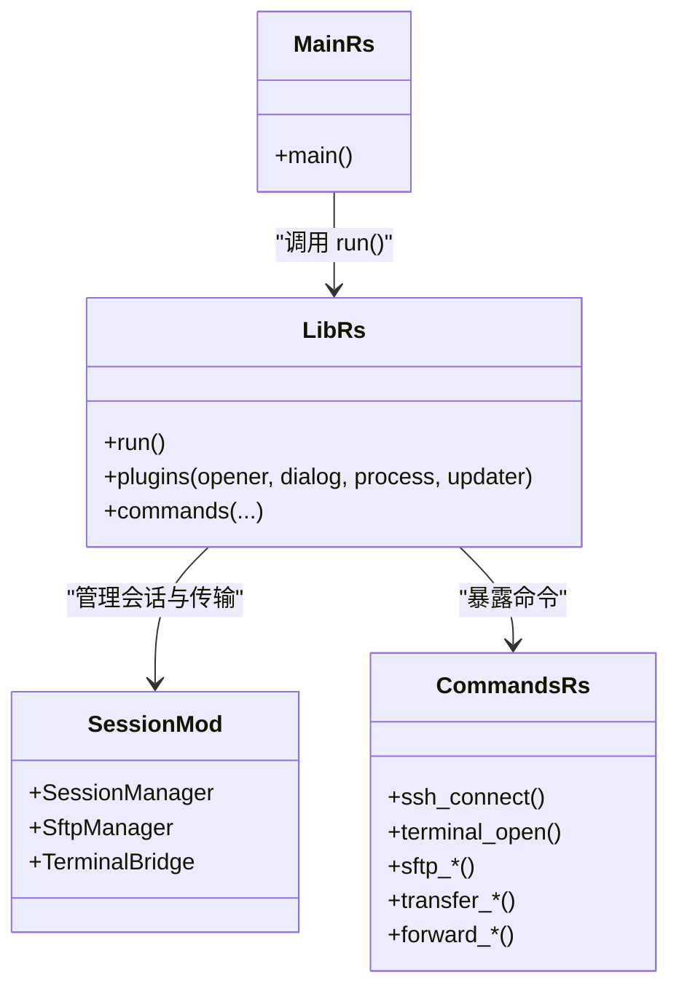
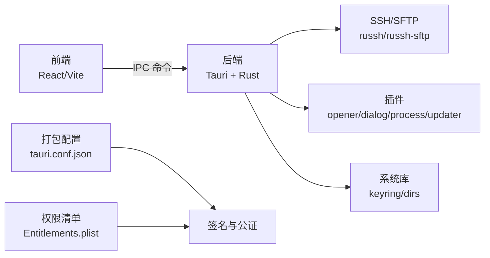

# macOS 打包

<cite>
**本文引用的文件**
- [tauri.conf.json](file://src-tauri/tauri.conf.json)
- [Cargo.toml](file://src-tauri/Cargo.toml)
- [Entitlements.plist](file://src-tauri/Entitlements.plist)
- [build.rs](file://src-tauri/build.rs)
- [package.json](file://package.json)
- [vite.config.ts](file://vite.config.ts)
- [src/main.tsx](file://src/main.tsx)
- [src/App.tsx](file://src/App.tsx)
- [src-tauri/src/lib.rs](file://src-tauri/src/lib.rs)
- [src-tauri/src/main.rs](file://src-tauri/src/main.rs)
- [src-tauri/src/session/mod.rs](file://src-tauri/src/session/mod.rs)
- [src-tauri/src/session/ssh.rs](file://src-tauri/src/session/ssh.rs)
- [src-tauri/src/session/sftp.rs](file://src-tauri/src/session/sftp.rs)
- [src-tauri/src/commands.rs](file://src-tauri/src/commands.rs)
- [.github/workflows/release.yml](file://.github/workflows/release.yml)
</cite>

## 目录
1. [简介](#简介)
2. [项目结构](#项目结构)
3. [核心组件](#核心组件)
4. [架构总览](#架构总览)
5. [详细组件分析](#详细组件分析)
6. [依赖关系分析](#依赖关系分析)
7. [性能考量](#性能考量)
8. [故障排查指南](#故障排查指南)
9. [结论](#结论)
10. [附录](#附录)

## 简介
本指南面向使用 Tauri v2 的 macOS 应用打包与发布，结合仓库中的现有配置，系统讲解以下内容：
- macOS 应用包（.app bundle）的生成与结构
- Info.plist 与 tauri.conf.json 中的关键配置项
- 代码签名与公证（notarization）流程
- Gatekeeper 兼容性与沙盒权限（entitlements）配置
- Mac App Store 发布流程与开发者账户准备
- macOS 版本兼容性与系统要求

## 项目结构
该仓库采用“前端 + Tauri 后端”的双层结构，前端基于 Vite + React，后端基于 Rust + Tauri。与 macOS 打包密切相关的配置集中在 src-tauri 目录中。

图表来源
- [tauri.conf.json:24-44](file://src-tauri/tauri.conf.json#L24-L44)
- [build.rs:1-4](file://src-tauri/build.rs#L1-L4)
- [Cargo.toml:22-49](file://src-tauri/Cargo.toml#L22-L49)
- [src-tauri/src/lib.rs:14-92](file://src-tauri/src/lib.rs#L14-L92)
- [src-tauri/src/main.rs:4-7](file://src-tauri/src/main.rs#L4-L7)
- [Entitlements.plist:1-17](file://src-tauri/Entitlements.plist#L1-L17)

章节来源
- [tauri.conf.json:1-54](file://src-tauri/tauri.conf.json#L1-L54)
- [Cargo.toml:1-50](file://src-tauri/Cargo.toml#L1-L50)
- [build.rs:1-4](file://src-tauri/build.rs#L1-L4)
- [package.json:1-53](file://package.json#L1-L53)
- [vite.config.ts:1-33](file://vite.config.ts#L1-L33)

## 核心组件
- 打包配置中心：tauri.conf.json
  - 包含产品名称、版本、Bundle 标识符、图标、最低系统版本、更新器公钥与发布地址等
  - macOS 专属配置位于 bundle.macOS 下，包含 entitlements 与 minimumSystemVersion
- Rust 后端入口：src/lib.rs 与 src/main.rs
  - lib.rs 中初始化日志、注册插件、暴露命令、运行应用
  - main.rs 作为平台入口，调用 lib.rs.run()
- 构建入口：build.rs
  - 调用 tauri_build::build()，驱动 Tauri 的构建流程
- 权限清单：Entitlements.plist
  - 包含允许 JIT、允许未签名可执行内存、允许 dyld 环境变量等关键键值
- 前端构建：package.json 与 vite.config.ts
  - 提供开发与构建脚本，固定开发服务器端口以适配 Tauri

章节来源
- [tauri.conf.json:24-44](file://src-tauri/tauri.conf.json#L24-L44)
- [src-tauri/src/lib.rs:14-92](file://src-tauri/src/lib.rs#L14-L92)
- [src-tauri/src/main.rs:4-7](file://src-tauri/src/main.rs#L4-L7)
- [build.rs:1-4](file://src-tauri/build.rs#L1-L4)
- [Entitlements.plist:1-17](file://src-tauri/Entitlements.plist#L1-L17)
- [package.json:22-27](file://package.json#L22-L27)
- [vite.config.ts:8-32](file://vite.config.ts#L8-L32)

## 架构总览
下图展示了从构建到打包的关键步骤，以及与 macOS 打包相关的核心文件：

图表来源
- [tauri.conf.json:6-11](file://src-tauri/tauri.conf.json#L6-L11)
- [build.rs:1-4](file://src-tauri/build.rs#L1-L4)
- [Cargo.toml:19-49](file://src-tauri/Cargo.toml#L19-L49)
- [src-tauri/src/lib.rs:14-92](file://src-tauri/src/lib.rs#L14-L92)
- [Entitlements.plist:1-17](file://src-tauri/Entitlements.plist#L1-L17)

## 详细组件分析

### 1) .app Bundle 结构与 Info.plist 配置
- 产物位置与命名
  - Tauri 会在构建后生成 .app 包，通常位于构建输出目录（由 Tauri CLI 决定）
  - 应用名称与标识符由 tauri.conf.json 中的 productName 与 identifier 决定
- Info.plist 关键字段映射
  - CFBundleIdentifier 对应 identifier
  - CFBundleName 与 CFBundleDisplayName 对应 productName
  - CFBundleShortVersionString 与 CFBundleVersion 对应 version
  - NSHumanReadableCopyright 对应 copyright
  - LSMinimumSystemVersion 对应 macOS.minimumSystemVersion
- 图标与资源
  - icon 数组定义了 .app 内的图标资源，包含多分辨率 PNG 与 icns
- 更新器与发布
  - updater.pubkey 与 endpoints 决定更新器的公钥验证与更新源

章节来源
- [tauri.conf.json:3-44](file://src-tauri/tauri.conf.json#L3-L44)

### 2) 代码签名与公证（notarization）流程
- 证书与钥匙串
  - GitHub Actions 中演示了将 Apple Developer 证书导入临时钥匙串，并设置分区列表
  - 若未配置证书，会导出未签名包（MACOS_SIGNED=false）
- 签名身份与公证凭据
  - 当存在 Developer ID 证书时，注入 APPLE_SIGNING_IDENTITY、Apple ID、Team ID、API Key/Issuer 等环境变量
  - 仅在有证书时才注入公证凭据，避免空 Team ID 导致 notarize 失败
- 自动化流程要点
  - 证书导入后，使用 codesign 对 .app 进行签名
  - 使用 notarytool 对 .app 或 .zip 进行公证
  - 使用 stapler 为 .app 加载票据（staple）

图表来源
- [.github/workflows/release.yml:67-132](file://.github/workflows/release.yml#L67-L132)

章节来源
- [.github/workflows/release.yml:67-132](file://.github/workflows/release.yml#L67-L132)

### 3) Gatekeeper 兼容性与沙盒权限配置
- Entitlements.plist 关键键值
  - com.apple.security.cs.allow-jit：允许 JIT（WebView/WKWebView 需要）
  - com.apple.security.cs.allow-unsigned-executable-memory：允许未签名可执行内存
  - com.apple.security.cs.allow-dyld-environment-variables：允许动态链接环境变量
- 最低系统版本
  - macOS.minimumSystemVersion 设置为 11.0，确保新特性可用
- 建议
  - 如需进一步沙盒化，可在 Entitlements.plist 中添加相应键值
  - 保持最小权限原则，仅启用必要权限

章节来源
- [Entitlements.plist:1-17](file://src-tauri/Entitlements.plist#L1-L17)
- [tauri.conf.json:28-31](file://src-tauri/tauri.conf.json#L28-L31)

### 4) Mac App Store 发布流程与开发者账户设置
- 开发者账户准备
  - Apple Developer Program（个人或公司）
  - 申请并下载 Developer ID Application 证书
  - 创建 App ID（Bundle Identifier 与 Entitlements 对应）
- 提交前准备
  - 使用 Developer ID Application 证书签名 .app
  - 为 .app 或 .zip 提交公证（notarize）
  - 加载票据（staple），确保离线可用
- 提交审核
  - 登录 Apple Developer Portal，创建新 App
  - 上传 .ipa 或 .zip（包含 .app）
  - 填写元数据、截图、隐私清单等
- 注意事项
  - 遵循 App Store 审核指南，避免使用私有 API
  - 确保 Entitlements 与功能一致，避免过度权限

### 5) macOS 版本兼容性与系统要求
- 最低系统版本
  - macOS.minimumSystemVersion 为 11.0，建议在 11.0+ 上测试
- WebView 与 JIT
  - Entitlements.plist 中的 JIT 与可执行内存键值确保 WebView 正常运行
- 兼容性建议
  - 在目标范围内测试不同版本（如 11.7、12.x、13.x、14.x）
  - 关注系统更新对安全策略的影响（如 Gatekeeper、完整性保护）

章节来源
- [tauri.conf.json:28-31](file://src-tauri/tauri.conf.json#L28-L31)
- [Entitlements.plist:9-14](file://src-tauri/Entitlements.plist#L9-L14)

### 6) Tauri 应用后端与打包的关系
- 插件与命令
  - src/lib.rs 中注册了多个插件（opener、dialog、process、updater），这些插件在打包后仍会被包含
- 平台入口
  - src/main.rs 作为平台入口，调用 lib.rs.run()，确保应用在 macOS 上正确启动
- 会话与传输
  - 后端通过 SSH 会话复用终端、SFTP、端口转发等功能，这些能力与打包无关，但会影响应用行为

图表来源
- [src-tauri/src/lib.rs:14-92](file://src-tauri/src/lib.rs#L14-L92)
- [src-tauri/src/main.rs:4-7](file://src-tauri/src/main.rs#L4-L7)
- [src-tauri/src/session/mod.rs:1-226](file://src-tauri/src/session/mod.rs#L1-L226)
- [src-tauri/src/commands.rs:1-800](file://src-tauri/src/commands.rs#L1-L800)

章节来源
- [src-tauri/src/lib.rs:14-92](file://src-tauri/src/lib.rs#L14-L92)
- [src-tauri/src/main.rs:4-7](file://src-tauri/src/main.rs#L4-L7)
- [src-tauri/src/session/mod.rs:1-226](file://src-tauri/src/session/mod.rs#L1-L226)
- [src-tauri/src/commands.rs:1-800](file://src-tauri/src/commands.rs#L1-L800)

## 依赖关系分析
- 前端到后端
  - 前端通过 Tauri 的 IPC 与后端命令交互，后端命令在 src/commands.rs 中实现
- 后端到系统
  - 后端使用 russh、russh-sftp 等库进行 SSH/SFTP 操作
  - 使用 keyring、dirs 等库处理系统级资源
- 打包到系统
  - tauri.conf.json 控制打包选项与系统版本
  - Entitlements.plist 影响签名与公证

图表来源
- [src-tauri/src/commands.rs:1-800](file://src-tauri/src/commands.rs#L1-L800)
- [src-tauri/src/session/ssh.rs:1-65](file://src-tauri/src/session/ssh.rs#L1-L65)
- [src-tauri/src/session/sftp.rs:1-124](file://src-tauri/src/session/sftp.rs#L1-L124)
- [src-tauri/Cargo.toml:22-49](file://src-tauri/Cargo.toml#L22-L49)
- [tauri.conf.json:24-44](file://src-tauri/tauri.conf.json#L24-L44)
- [Entitlements.plist:1-17](file://src-tauri/Entitlements.plist#L1-L17)

章节来源
- [src-tauri/src/commands.rs:1-800](file://src-tauri/src/commands.rs#L1-L800)
- [src-tauri/src/session/ssh.rs:1-65](file://src-tauri/src/session/ssh.rs#L1-L65)
- [src-tauri/src/session/sftp.rs:1-124](file://src-tauri/src/session/sftp.rs#L1-L124)
- [src-tauri/Cargo.toml:22-49](file://src-tauri/Cargo.toml#L22-L49)
- [tauri.conf.json:24-44](file://src-tauri/tauri.conf.json#L24-L44)
- [Entitlements.plist:1-17](file://src-tauri/Entitlements.plist#L1-L17)

## 性能考量
- WebView 渲染与 JIT
  - 启用 JIT 有助于提升 Web 内容渲染性能，但需配合签名与公证
- 传输与并发
  - SFTP 与传输队列采用异步并发模型，注意控制并发度以平衡吞吐与资源占用
- 日志与调试
  - 在调试构建中启用详细日志，在发布构建中适当降低日志级别

## 故障排查指南
- 签名失败
  - 检查证书是否正确导入临时钥匙串，分区列表是否包含 codesign
  - 确认 APPLE_SIGNING_IDENTITY 与 Entitlements.plist 一致
- 公证失败
  - 确保 APPLE_ID、APPLE_PASSWORD、APPLE_TEAM_ID、APPLE_API_KEY/ISSUER 配置齐全
  - 避免空 TEAM ID 导致 notarize 失败
- 启动崩溃（WebView）
  - 检查 Entitlements.plist 是否包含 JIT 与可执行内存相关键值
- 版本不兼容
  - 将 macOS.minimumSystemVersion 提升至目标范围的最低版本进行测试

章节来源
- [.github/workflows/release.yml:67-132](file://.github/workflows/release.yml#L67-L132)
- [Entitlements.plist:9-14](file://src-tauri/Entitlements.plist#L9-L14)
- [tauri.conf.json:28-31](file://src-tauri/tauri.conf.json#L28-L31)

## 结论
本指南基于仓库现有配置，梳理了 macOS 打包的关键环节：从 tauri.conf.json 的打包配置，到 Entitlements.plist 的权限与兼容性设置，再到签名与公证的自动化流程。结合后端会话与传输能力，可形成一套完整的应用交付方案。建议在目标系统版本上充分测试，并遵循 Apple 的审核与安全要求。

## 附录
- 常用命令参考
  - 开发：pnpm tauri dev
  - 构建：pnpm tauri build
- 前端开发端口
  - Vite 固定端口 1420，与 tauri.conf.json 中 devUrl 对应

章节来源
- [package.json:22-27](file://package.json#L22-L27)
- [vite.config.ts:16-20](file://vite.config.ts#L16-L20)
- [tauri.conf.json:6-11](file://src-tauri/tauri.conf.json#L6-L11)