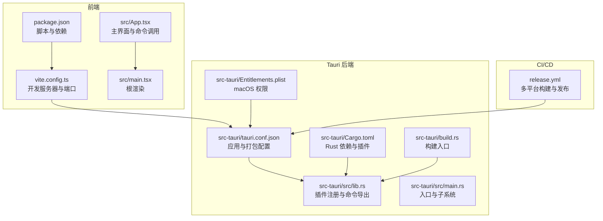
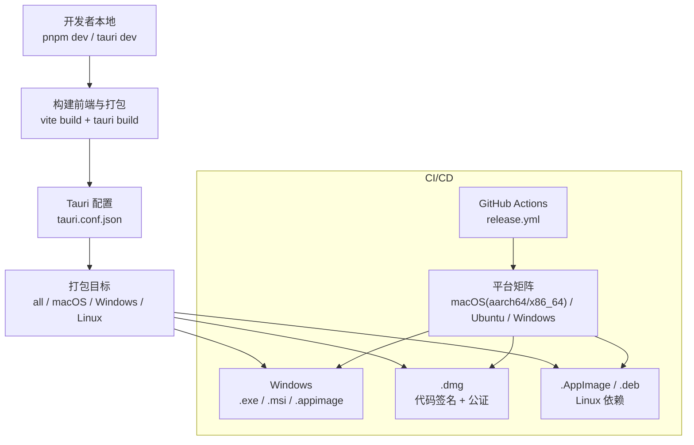
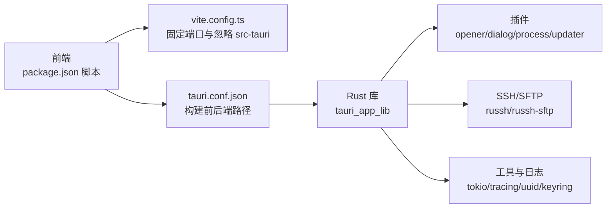

# 平台打包

<cite>
**本文引用的文件**
- [tauri.conf.json](file://src-tauri/tauri.conf.json)
- [Cargo.toml](file://src-tauri/Cargo.toml)
- [build.rs](file://src-tauri/build.rs)
- [Entitlements.plist](file://src-tauri/Entitlements.plist)
- [release.yml](file://.github/workflows/release.yml)
- [package.json](file://package.json)
- [vite.config.ts](file://vite.config.ts)
- [lib.rs](file://src-tauri/src/lib.rs)
- [main.rs](file://src-tauri/src/main.rs)
- [App.tsx](file://src/App.tsx)
- [main.tsx](file://src/main.tsx)
</cite>

## 目录
1. [简介](#简介)
2. [项目结构](#项目结构)
3. [核心组件](#核心组件)
4. [架构总览](#架构总览)
5. [详细组件分析](#详细组件分析)
6. [依赖关系分析](#依赖关系分析)
7. [性能考量](#性能考量)
8. [故障排查指南](#故障排查指南)
9. [结论](#结论)
10. [附录](#附录)

## 简介
本指南面向使用 Tauri 2 开发的跨平台桌面应用，提供 Windows、macOS、Linux 的打包与发布实践，覆盖以下要点：
- Tauri 配置文件的关键项：应用元数据、权限与图标、打包目标与更新器配置
- 平台特定要求：Windows 安装包与数字签名、macOS 代码签名与公证、Linux AppImage 与 deb
- 依赖管理与兼容性：系统依赖、运行时能力、安全策略
- CI/CD 自动化：GitHub Actions 多平台流水线与签名/公证环境变量

## 项目结构
该仓库采用“前端 + Tauri 后端”的典型组织方式，前端基于 Vite + React，后端基于 Rust + Tauri，构建产物通过 Tauri CLI 与打包工具生成。

**图表来源**
- [tauri.conf.json:1-54](file://src-tauri/tauri.conf.json#L1-L54)
- [Cargo.toml:1-50](file://src-tauri/Cargo.toml#L1-L50)
- [build.rs:1-4](file://src-tauri/build.rs#L1-L4)
- [Entitlements.plist:1-17](file://src-tauri/Entitlements.plist#L1-L17)
- [lib.rs:1-93](file://src-tauri/src/lib.rs#L1-L93)
- [main.rs:1-7](file://src-tauri/src/main.rs#L1-L7)
- [package.json:1-53](file://package.json#L1-L53)
- [vite.config.ts:1-33](file://vite.config.ts#L1-L33)
- [release.yml:1-161](file://.github/workflows/release.yml#L1-L161)

**章节来源**
- [tauri.conf.json:1-54](file://src-tauri/tauri.conf.json#L1-L54)
- [Cargo.toml:1-50](file://src-tauri/Cargo.toml#L1-L50)
- [build.rs:1-4](file://src-tauri/build.rs#L1-L4)
- [Entitlements.plist:1-17](file://src-tauri/Entitlements.plist#L1-L17)
- [lib.rs:1-93](file://src-tauri/src/lib.rs#L1-L93)
- [main.rs:1-7](file://src-tauri/src/main.rs#L1-L7)
- [package.json:1-53](file://package.json#L1-L53)
- [vite.config.ts:1-33](file://vite.config.ts#L1-L33)
- [release.yml:1-161](file://.github/workflows/release.yml#L1-L161)

## 核心组件
- Tauri 配置（tauri.conf.json）
  - 应用元数据：产品名称、版本、标识符、构建前后端路径
  - 窗口与安全：窗口尺寸、CSP 策略
  - 打包：目标平台、图标、发布者、分类、描述、版权、系统最低版本、权限清单
  - 更新器：公钥、更新源地址
- Rust 侧插件与命令
  - 插件：opener、dialog、process、updater
  - 命令：SSH 连接、会话管理、SFTP、传输、转发、监控、工作区等
- 前端集成
  - 通过 @tauri-apps/api 调用后端命令，初始化主题与设置
- CI/CD
  - 多平台矩阵：macOS（Apple Silicon 与 Intel）、Ubuntu、Windows
  - Linux 依赖：webkitGTK、build-essential、curl、wget、file、X11、SSL、指示器、SVG
  - macOS 证书与公证：支持 Apple API Key 与 Apple ID 两种方式

**章节来源**
- [tauri.conf.json:12-52](file://src-tauri/tauri.conf.json#L12-L52)
- [lib.rs:20-91](file://src-tauri/src/lib.rs#L20-L91)
- [package.json:22-27](file://package.json#L22-L27)
- [release.yml:20-27](file://.github/workflows/release.yml#L20-L27)
- [release.yml:51-56](file://.github/workflows/release.yml#L51-L56)

## 架构总览
下图展示从开发到发布的整体流程，以及平台差异点：

**图表来源**
- [tauri.conf.json:24-27](file://src-tauri/tauri.conf.json#L24-L27)
- [release.yml:14-28](file://.github/workflows/release.yml#L14-L28)
- [release.yml:51-56](file://.github/workflows/release.yml#L51-L56)

## 详细组件分析

### Tauri 配置详解（tauri.conf.json）
- 应用元数据与构建
  - 产品名、版本、标识符用于包名与更新器识别
  - 前端开发与构建命令、静态资源目录
- 窗口与安全
  - 默认窗口尺寸与标题
  - CSP 策略为 null（允许默认策略）
- 打包与发布
  - targets 设置为 all，启用所有平台
  - macOS：最低系统版本、权限清单（Entitlements.plist）
  - 发布者、分类、简短/长描述、版权信息
  - 图标清单：多分辨率 PNG 与 icns/ico
- 更新器
  - 公钥用于校验更新包签名
  - 更新源指向 GitHub Releases 的 JSON

**章节来源**
- [tauri.conf.json:3-11](file://src-tauri/tauri.conf.json#L3-L11)
- [tauri.conf.json:12-23](file://src-tauri/tauri.conf.json#L12-L23)
- [tauri.conf.json:24-44](file://src-tauri/tauri.conf.json#L24-L44)
- [tauri.conf.json:45-52](file://src-tauri/tauri.conf.json#L45-L52)

### macOS 权限与签名（Entitlements.plist）
- 关键权限
  - JIT 与可执行内存：WebView（WKWebView）运行所需
  - 动态加载环境变量：部分运行时特性需要
- 用途
  - 与 codesign 配合，确保公证后应用可正常启动

**章节来源**
- [Entitlements.plist:1-17](file://src-tauri/Entitlements.plist#L1-L17)

### Rust 插件与命令（src-tauri/src/lib.rs）
- 插件注册
  - opener、dialog、process、updater 插件按需启用
- 状态管理
  - 会话、SFTP、配置、分组、传输队列、端口转发、主机密钥验证、监控、工作区等状态
- 命令导出
  - SSH 连接、会话列表、断开
  - 终端打开、SFTP 文件操作、同步
  - 传输队列、端口转发、配置与分组 CRUD
  - 监控快照、主机密钥处理、工作区保存/加载
- 启动逻辑
  - 初始化本地 WebSocket 桥接与传输队列 worker

**章节来源**
- [lib.rs:20-42](file://src-tauri/src/lib.rs#L20-L42)
- [lib.rs:43-91](file://src-tauri/src/lib.rs#L43-L91)

### 前端命令调用与集成（src/App.tsx, src/main.tsx）
- 命令调用
  - 通过 @tauri-apps/api.invoke 调用后端命令，如 ssh_list_sessions、profile_connect、sftp_* 等
- 生命周期与事件
  - 监听 ssh://progress 与 ssh://hostkey 事件，驱动 UI 状态
- 渲染与主题
  - 根组件按顺序包裹主题与设置 Provider，渲染 App

**章节来源**
- [App.tsx:98-126](file://src/App.tsx#L98-L126)
- [App.tsx:136-160](file://src/App.tsx#L136-L160)
- [App.tsx:312-336](file://src/App.tsx#L312-L336)
- [main.tsx:10-19](file://src/main.tsx#L10-L19)

### CI/CD 多平台打包（.github/workflows/release.yml）
- 触发条件
  - 推送 v* 标签或手动触发
- 平台矩阵
  - macOS（aarch64 与 x86_64）
  - Ubuntu（AppImage/deb）
  - Windows（.exe/.msi）
- 依赖安装
  - Linux：webkitGTK、build-essential、curl、wget、file、libxdo-dev、libssl-dev、指示器、SVG 工具
- 签名与公证（macOS）
  - 导入 Apple Developer 证书至临时钥匙串
  - 支持 Apple API Key 与 Apple ID 两种公证方式
  - 未配置证书时使用 ad-hoc 签名（-），并提示移除扩展属性以规避“已损坏”
- 更新器
  - 通过环境变量注入私钥，准备更新 JSON

**章节来源**
- [release.yml:3-8](file://.github/workflows/release.yml#L3-L8)
- [release.yml:16-27](file://.github/workflows/release.yml#L16-L27)
- [release.yml:51-56](file://.github/workflows/release.yml#L51-L56)
- [release.yml:67-94](file://.github/workflows/release.yml#L67-L94)
- [release.yml:95-110](file://.github/workflows/release.yml#L95-L110)
- [release.yml:111-132](file://.github/workflows/release.yml#L111-L132)
- [release.yml:134-161](file://.github/workflows/release.yml#L134-L161)

## 依赖关系分析
- 前端依赖与脚本
  - Vite + React 生态，开发端口固定为 1420，严格端口模式
  - Tauri CLI 脚本入口
- Rust 依赖与插件
  - Tauri 2 核心、opener/dialog/process/updater 插件
  - SSH 与 SFTP：russh、russh-sftp
  - 工具与并发：tokio、futures-util、anyhow、thiserror
  - 文件系统与配置：dirs、keyring、uuid、machine-uid
  - 日志与时间：tracing、chrono
- 构建入口
  - build.rs 调用 tauri_build::build，确保生成正确绑定

**图表来源**
- [package.json:22-27](file://package.json#L22-L27)
- [vite.config.ts:16-31](file://vite.config.ts#L16-L31)
- [tauri.conf.json:6-11](file://src-tauri/tauri.conf.json#L6-L11)
- [Cargo.toml:22-49](file://src-tauri/Cargo.toml#L22-L49)
- [build.rs:1-4](file://src-tauri/build.rs#L1-L4)

**章节来源**
- [package.json:22-27](file://package.json#L22-L27)
- [vite.config.ts:16-31](file://vite.config.ts#L16-L31)
- [tauri.conf.json:6-11](file://src-tauri/tauri.conf.json#L6-L11)
- [Cargo.toml:22-49](file://src-tauri/Cargo.toml#L22-L49)
- [build.rs:1-4](file://src-tauri/build.rs#L1-L4)

## 性能考量
- 开发体验
  - 固定端口与严格端口模式避免端口冲突，提升热重载稳定性
  - 忽略 src-tauri 监视，减少不必要的文件系统扫描
- 运行时
  - 传输队列与 WebSocket 桥接串行化处理，降低并发竞争
  - 日志过滤通过环境变量控制，便于生产环境降噪

**章节来源**
- [vite.config.ts:14-31](file://vite.config.ts#L14-L31)
- [lib.rs:34-42](file://src-tauri/src/lib.rs#L34-L42)

## 故障排查指南
- Windows 启动黑屏或无控制台
  - 确认入口文件设置了正确的 subsystem（已通过编译期宏配置）
- macOS 启动崩溃或公证后无法启动
  - 检查 Entitlements.plist 是否包含 JIT/可执行内存权限
  - 若使用 ad-hoc 签名，安装后可能提示“已损坏”，可通过移除扩展属性修复
- Linux AppImage/Deb 缺少运行时依赖
  - 安装 webkitGTK、build-essential、curl、wget、file、libxdo-dev、libssl-dev、指示器、SVG 工具
- 更新器签名失败
  - 确保私钥环境变量有效，且与配置中的公钥匹配
- 端口占用导致开发失败
  - 确保 1420/1421 端口可用，或调整 Vite server 配置

**章节来源**
- [main.rs:1-7](file://src-tauri/src/main.rs#L1-L7)
- [Entitlements.plist:1-17](file://src-tauri/Entitlements.plist#L1-L17)
- [release.yml:51-56](file://.github/workflows/release.yml#L51-L56)
- [release.yml:67-94](file://.github/workflows/release.yml#L67-L94)
- [vite.config.ts:16-26](file://vite.config.ts#L16-L26)

## 结论
本项目已具备完整的多平台打包与发布基础：Tauri 配置明确、Rust 插件齐全、前端命令体系完善、CI/CD 覆盖三大平台。遵循本文档的平台特定要求与依赖管理建议，即可稳定产出 Windows 安装包、macOS DMG（含签名与公证）与 Linux AppImage/Deb。

## 附录

### 平台打包要点速查
- Windows
  - 目标：.exe / .msi（由打包工具根据配置生成）
  - 数字签名：可选，配合 CI 中证书与密码进行签名
- macOS
  - 目标：.dmg
  - 代码签名：使用 Developer ID 证书
  - 公证：支持 Apple API Key 或 Apple ID 两种方式
  - 权限：确保包含 JIT/可执行内存与动态加载环境变量
- Linux
  - 目标：.AppImage / .deb
  - 依赖：webkitGTK、build-essential、curl、wget、file、libxdo-dev、libssl-dev、指示器、SVG 工具

**章节来源**
- [tauri.conf.json:24-44](file://src-tauri/tauri.conf.json#L24-L44)
- [release.yml:16-27](file://.github/workflows/release.yml#L16-L27)
- [release.yml:51-56](file://.github/workflows/release.yml#L51-L56)
- [Entitlements.plist:1-17](file://src-tauri/Entitlements.plist#L1-L17)