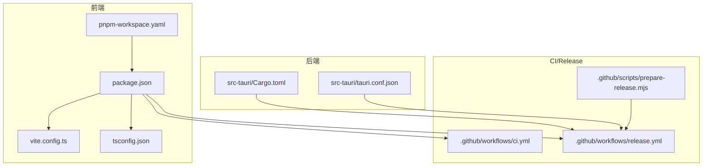
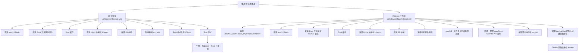
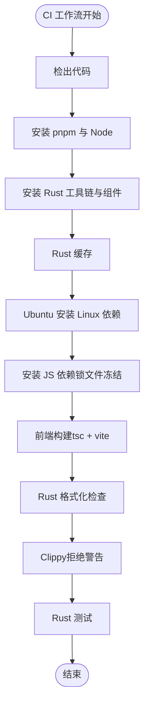
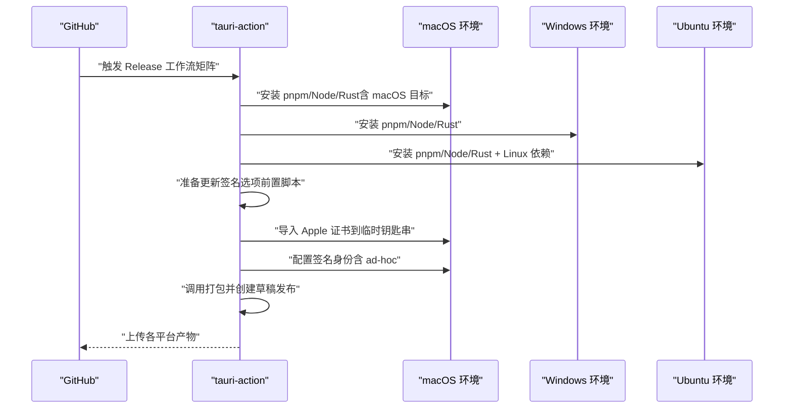
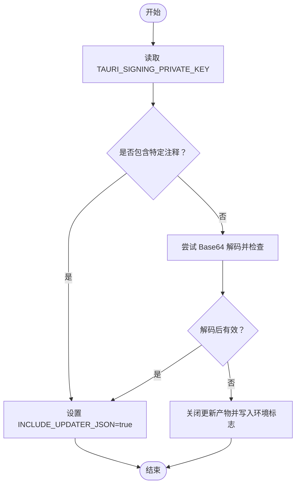
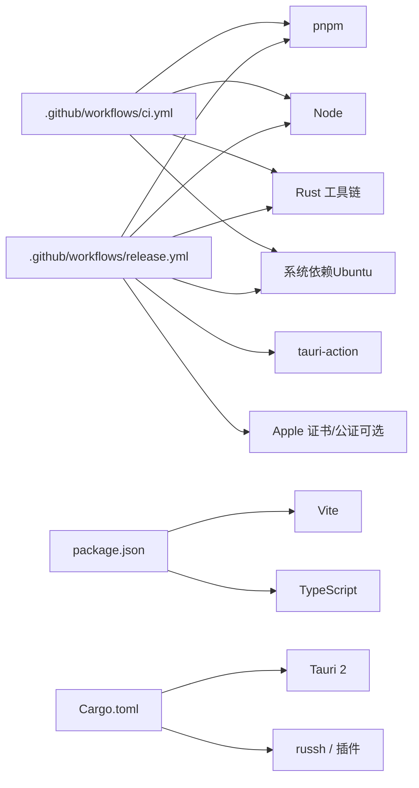

# 跨平台构建

<cite>
**本文引用的文件**
- [.github/workflows/ci.yml](file://.github/workflows/ci.yml)
- [.github/workflows/release.yml](file://.github/workflows/release.yml)
- [.github/scripts/prepare-release.mjs](file://.github/scripts/prepare-release.mjs)
- [package.json](file://package.json)
- [vite.config.ts](file://vite.config.ts)
- [tsconfig.json](file://tsconfig.json)
- [src-tauri/Cargo.toml](file://src-tauri/Cargo.toml)
- [src-tauri/tauri.conf.json](file://src-tauri/tauri.conf.json)
- [pnpm-workspace.yaml](file://pnpm-workspace.yaml)
</cite>

## 目录
1. [简介](#简介)
2. [项目结构](#项目结构)
3. [核心组件](#核心组件)
4. [架构总览](#架构总览)
5. [详细组件分析](#详细组件分析)
6. [依赖关系分析](#依赖关系分析)
7. [性能考量](#性能考量)
8. [故障排除指南](#故障排除指南)
9. [结论](#结论)
10. [附录](#附录)

## 简介
本指南面向跨平台自动化构建场景，围绕该项目的 GitHub Actions 工作流展开，系统阐述以下内容：
- CI 工作流：代码风格、静态检查与测试在单一平台上的执行。
- Release 工作流：基于矩阵的多平台并行构建与打包，覆盖 macOS（Apple Silicon 与 Intel）、Windows 与 Linux。
- 构建矩阵与一致性：通过矩阵配置与条件步骤保证各平台产物的一致性与可复现性。
- 缓存与预编译：Rust 缓存、Node 包管理器缓存与系统依赖安装策略。
- 产物校验与质量检查：格式化、静态分析、测试与签名/公证流程。
- 环境容器化与本地镜像：提供 Docker 容器化思路与本地开发镜像配置要点。
- 故障排除与日志分析：常见问题定位、密钥与签名配置、Apple 证书与公证流程排查。

## 项目结构
该仓库采用前端（React/Vite）+ 后端（Rust/Tauri）混合架构，构建与发布由 GitHub Actions 自动化完成。关键目录与文件如下：
- 前端：Vite 配置、TypeScript 配置、包管理脚本与依赖声明。
- 后端：Rust 项目与 Tauri 配置，用于打包与分发。
- CI/Release：GitHub Actions 工作流与发布前置脚本。
- 包管理：pnpm workspace 配置，支持构建工具链的快速安装与锁定。

**图表来源**
- [vite.config.ts:1-33](file://vite.config.ts#L1-L33)
- [tsconfig.json:1-26](file://tsconfig.json#L1-L26)
- [package.json:1-53](file://package.json#L1-L53)
- [pnpm-workspace.yaml:1-3](file://pnpm-workspace.yaml#L1-L3)
- [src-tauri/Cargo.toml:1-50](file://src-tauri/Cargo.toml#L1-L50)
- [src-tauri/tauri.conf.json:1-54](file://src-tauri/tauri.conf.json#L1-L54)
- [.github/workflows/ci.yml:1-56](file://.github/workflows/ci.yml#L1-L56)
- [.github/workflows/release.yml:1-161](file://.github/workflows/release.yml#L1-L161)
- [.github/scripts/prepare-release.mjs:1-37](file://.github/scripts/prepare-release.mjs#L1-L37)

**章节来源**
- [vite.config.ts:1-33](file://vite.config.ts#L1-L33)
- [tsconfig.json:1-26](file://tsconfig.json#L1-L26)
- [package.json:1-53](file://package.json#L1-L53)
- [pnpm-workspace.yaml:1-3](file://pnpm-workspace.yaml#L1-L3)
- [src-tauri/Cargo.toml:1-50](file://src-tauri/Cargo.toml#L1-L50)
- [src-tauri/tauri.conf.json:1-54](file://src-tauri/tauri.conf.json#L1-L54)
- [.github/workflows/ci.yml:1-56](file://.github/workflows/ci.yml#L1-L56)
- [.github/workflows/release.yml:1-161](file://.github/workflows/release.yml#L1-L161)
- [.github/scripts/prepare-release.mjs:1-37](file://.github/scripts/prepare-release.mjs#L1-L37)

## 核心组件
- CI 工作流（单一平台）：负责前端构建、Rust 格式化与静态检查、测试，确保主分支推送与拉取请求的质量门槛。
- Release 工作流（多平台矩阵）：在 macOS、Windows、Linux 上并行构建安装包，支持 Apple Silicon 与 Intel 的 macOS 目标，集成签名与公证流程。
- 发布前置脚本：根据密钥有效性动态调整更新产物开关，保障发布流程的健壮性。
- 前端与构建配置：Vite 固定端口与严格模式、TypeScript 严格模式、pnpm workspace 支持。
- 后端与打包配置：Rust 依赖与特性、Tauri 打包目标与图标资源、更新通道配置。

**章节来源**
- [.github/workflows/ci.yml:11-56](file://.github/workflows/ci.yml#L11-L56)
- [.github/workflows/release.yml:14-161](file://.github/workflows/release.yml#L14-L161)
- [.github/scripts/prepare-release.mjs:1-37](file://.github/scripts/prepare-release.mjs#L1-L37)
- [package.json:22-27](file://package.json#L22-L27)
- [vite.config.ts:8-32](file://vite.config.ts#L8-L32)
- [tsconfig.json:17-22](file://tsconfig.json#L17-L22)
- [src-tauri/Cargo.toml:22-49](file://src-tauri/Cargo.toml#L22-L49)
- [src-tauri/tauri.conf.json:24-52](file://src-tauri/tauri.conf.json#L24-L52)

## 架构总览
下图展示从触发到产物发布的整体流程，包括 CI 与 Release 的关键步骤与平台差异。

**图表来源**
- [.github/workflows/ci.yml:11-56](file://.github/workflows/ci.yml#L11-L56)
- [.github/workflows/release.yml:14-161](file://.github/workflows/release.yml#L14-L161)

## 详细组件分析

### CI 工作流（单一平台）
- 触发与权限：对主分支推送与拉取请求触发，赋予读取内容权限。
- 步骤概览：
  - 检出代码
  - 安装 pnpm 与 Node（版本固定）
  - 安装 Rust 工具链与 clippy、rustfmt 组件
  - Rust 缓存（工作区映射至 src-tauri 目标目录）
  - Ubuntu 平台安装 Linux 依赖
  - 安装 JS 依赖（锁文件冻结）
  - 前端构建（TypeScript 编译 + Vite 打包）
  - Rust 格式化检查
  - Clippy（拒绝警告）
  - Rust 测试

**图表来源**
- [.github/workflows/ci.yml:11-56](file://.github/workflows/ci.yml#L11-L56)

**章节来源**
- [.github/workflows/ci.yml:1-56](file://.github/workflows/ci.yml#L1-L56)

### Release 工作流（多平台矩阵）
- 触发与权限：对 v* 标签推送与手动触发，赋予写入内容权限。
- 矩阵策略：
  - macOS：两条记录分别针对 aarch64 与 x86_64 目标
  - Ubuntu：默认主机目标
  - Windows：默认主机目标
- 关键步骤：
  - 安装 pnpm 与 Node
  - 安装 Rust 工具链（macOS 目标按需添加）
  - Rust 缓存
  - Ubuntu 安装 Linux 依赖
  - 安装 JS 依赖
  - 准备更新签名选项（前置脚本）
  - macOS 证书导入与钥匙串配置
  - 可选：App Store Connect API 密钥准备
  - 配置签名身份（含 ad-hoc）
  - 调用 tauri-action 打包并创建草稿发布

**图表来源**
- [.github/workflows/release.yml:14-161](file://.github/workflows/release.yml#L14-L161)

**章节来源**
- [.github/workflows/release.yml:1-161](file://.github/workflows/release.yml#L1-L161)

### 发布前置脚本（更新签名选项）
- 功能：根据环境变量中的私钥是否有效，动态修改 Tauri 配置以禁用更新产物，并向 GITHUB_ENV 注入标志位。
- 关键逻辑：
  - 检查密钥字符串是否包含特定注释
  - 尝试 Base64 解码并再次检查
  - 若无效则关闭更新产物并写入环境标志

**图表来源**
- [.github/scripts/prepare-release.mjs:1-37](file://.github/scripts/prepare-release.mjs#L1-L37)

**章节来源**
- [.github/scripts/prepare-release.mjs:1-37](file://.github/scripts/prepare-release.mjs#L1-L37)

### 前端与构建配置
- Vite 配置要点：
  - 固定开发端口与严格端口模式，便于 Tauri 开发调试
  - 忽略监听 src-tauri 目录，避免不必要的热重载
  - HMR 配置支持远程主机
- TypeScript 严格模式：
  - 启用严格模式与未使用项检查，提升代码质量
- 包管理：
  - package.json 中定义了前端构建脚本
  - pnpm workspace 允许构建工具链快速安装与锁定

**章节来源**
- [vite.config.ts:8-32](file://vite.config.ts#L8-L32)
- [tsconfig.json:17-22](file://tsconfig.json#L17-L22)
- [package.json:22-27](file://package.json#L22-L27)
- [pnpm-workspace.yaml:1-3](file://pnpm-workspace.yaml#L1-L3)

### 后端与打包配置
- Cargo.toml：
  - 定义库类型（静态库、CDYLIB、RLIB），满足 Tauri 插件与打包需求
  - 依赖清单包含 Tauri、SSH、进程、对话框、更新等插件
- tauri.conf.json：
  - 开发命令与前端构建命令
  - 打包目标为 all，启用更新产物
  - macOS 权限与最低系统版本配置
  - 更新通道公钥与端点

**章节来源**
- [src-tauri/Cargo.toml:12-17](file://src-tauri/Cargo.toml#L12-L17)
- [src-tauri/Cargo.toml:22-49](file://src-tauri/Cargo.toml#L22-L49)
- [src-tauri/tauri.conf.json:6-11](file://src-tauri/tauri.conf.json#L6-L11)
- [src-tauri/tauri.conf.json:24-31](file://src-tauri/tauri.conf.json#L24-L31)
- [src-tauri/tauri.conf.json:45-51](file://src-tauri/tauri.conf.json#L45-L51)

## 依赖关系分析
- 工作流依赖：
  - CI 与 Release 均依赖 pnpm、Node、Rust 工具链与系统依赖
  - Release 依赖 tauri-action 与 Apple 证书/公证环境（可选）
- 前端依赖：
  - Vite、React 插件、TypeScript 类型与严格模式
  - package.json 中的脚本与依赖
- 后端依赖：
  - Tauri 2、russh、更新与进程插件等
- 包管理：
  - pnpm workspace 支持构建工具链安装

**图表来源**
- [.github/workflows/ci.yml:11-56](file://.github/workflows/ci.yml#L11-L56)
- [.github/workflows/release.yml:14-161](file://.github/workflows/release.yml#L14-L161)
- [package.json:22-51](file://package.json#L22-L51)
- [src-tauri/Cargo.toml:22-49](file://src-tauri/Cargo.toml#L22-L49)

**章节来源**
- [.github/workflows/ci.yml:11-56](file://.github/workflows/ci.yml#L11-L56)
- [.github/workflows/release.yml:14-161](file://.github/workflows/release.yml#L14-L161)
- [package.json:22-51](file://package.json#L22-L51)
- [src-tauri/Cargo.toml:22-49](file://src-tauri/Cargo.toml#L22-L49)

## 性能考量
- 缓存优化：
  - Rust 缓存命中：通过工作区映射与稳定的目标目录减少重复编译时间
  - 包管理缓存：pnpm 锁定文件与缓存机制降低依赖安装耗时
- 并行构建：
  - Release 工作流使用矩阵在多平台上并行构建，缩短整体构建周期
- 依赖预编译：
  - 在 Ubuntu 平台上提前安装系统依赖，避免运行时安装开销
- 前端构建：
  - Vite 固定端口与严格模式有助于快速反馈与稳定构建

[本节为通用性能建议，不直接分析具体文件]

## 故障排除指南
- Apple 证书与公证：
  - 未配置证书时，将使用 ad-hoc 签名并跳过公证；如遇“已损坏”提示，参考工作流注释中关于清理扩展属性的说明
  - 缺少钥匙串密码会导致证书导入失败，应检查密钥与密码配置
  - App Store Connect API 密钥缺失时，将回退到 Apple ID 方式（需配置相应凭据）
- 更新产物与签名：
  - 若私钥格式无效，前置脚本会关闭更新产物；请确认密钥格式与 Base64 编码正确
- 端口与 HMR：
  - Vite 固定端口与严格模式，若端口被占用将导致启动失败；请释放端口或调整配置
- Linux 依赖：
  - Ubuntu 平台需安装 WebKit、SSL、指示器等系统依赖；若安装失败，请检查网络与权限
- macOS 目标：
  - macOS 矩阵包含 aarch64 与 x86_64 两个目标；请确保工具链与签名配置齐全

**章节来源**
- [.github/workflows/release.yml:67-132](file://.github/workflows/release.yml#L67-L132)
- [.github/scripts/prepare-release.mjs:27-36](file://.github/scripts/prepare-release.mjs#L27-L36)
- [vite.config.ts:16-26](file://vite.config.ts#L16-L26)
- [.github/workflows/release.yml:51-57](file://.github/workflows/release.yml#L51-L57)
- [.github/workflows/release.yml:20-27](file://.github/workflows/release.yml#L20-L27)

## 结论
本项目通过 CI 与 Release 两套 GitHub Actions 工作流实现了跨平台自动化构建与发布。CI 工作流确保代码质量门槛，Release 工作流利用矩阵实现多平台并行构建，并通过前置脚本与签名/公证流程保障产物完整性与可分发性。结合缓存与依赖预编译策略，整体构建效率与一致性得到显著提升。建议在团队内明确密钥与签名配置规范，并持续监控与优化构建日志。

[本节为总结性内容，不直接分析具体文件]

## 附录

### A. 构建矩阵与平台一致性
- macOS：同时构建 aarch64 与 x86_64 目标，确保兼容性
- Ubuntu：安装 Linux 依赖，统一系统库版本
- Windows：默认主机目标，保持与前端构建一致

**章节来源**
- [.github/workflows/release.yml:16-28](file://.github/workflows/release.yml#L16-L28)

### B. 构建缓存与依赖预编译策略
- Rust 缓存：工作区映射至 src-tauri 目标目录，提升命中率
- pnpm：锁文件冻结安装，减少依赖波动
- 系统依赖：Ubuntu 平台集中安装，避免重复安装

**章节来源**
- [.github/workflows/ci.yml:31-46](file://.github/workflows/ci.yml#L31-L46)
- [.github/workflows/release.yml:46-59](file://.github/workflows/release.yml#L46-L59)

### C. 产物验证与质量检查流程
- 前端：构建产物位于 dist，配合 Tauri 配置进行打包
- 后端：格式化、静态分析与测试在 CI 中执行
- 发布：前置脚本校验签名密钥，决定是否生成更新产物

**章节来源**
- [package.json:24-26](file://package.json#L24-L26)
- [src-tauri/tauri.conf.json:6-11](file://src-tauri/tauri.conf.json#L6-L11)
- [.github/scripts/prepare-release.mjs:10-19](file://.github/scripts/prepare-release.mjs#L10-L19)

### D. 构建环境容器化与本地开发镜像配置
- 容器化思路：
  - 基于 Ubuntu 22.04，安装 Node、Rust 工具链与系统依赖
  - 使用 pnpm 作为包管理器，挂载项目目录与缓存卷
  - 在容器内执行 CI/Release 步骤，确保环境一致性
- 本地开发镜像：
  - 与 CI/Release 环境保持一致的软件版本
  - 通过 Dockerfile 或容器编排工具（如 docker-compose）管理

[本节为概念性内容，不直接分析具体文件]