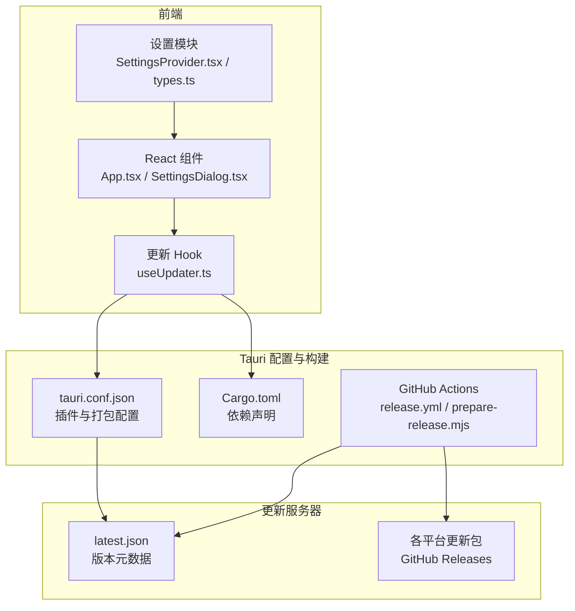
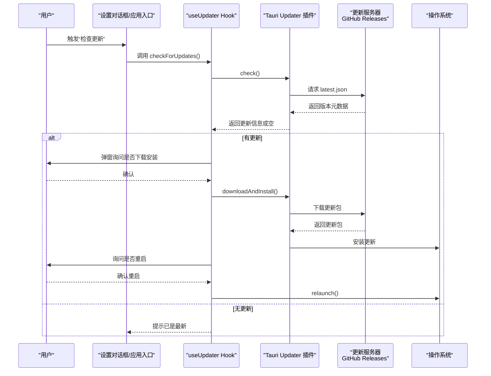
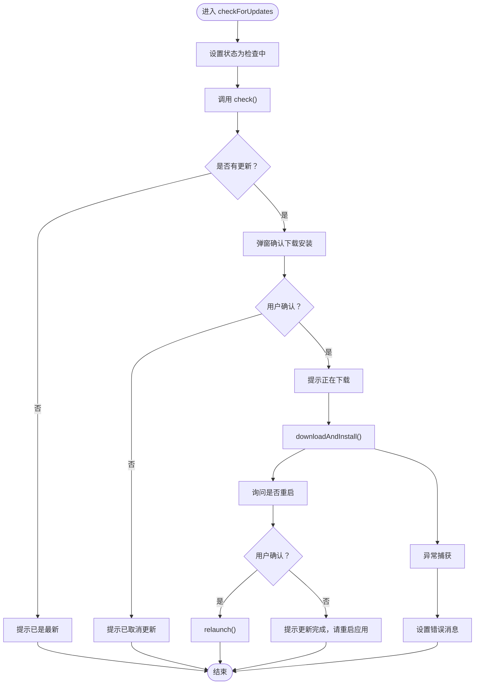
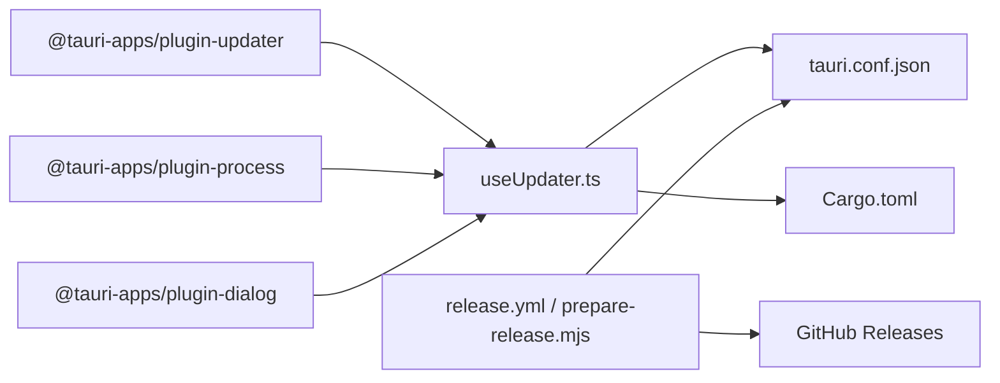

# 更新机制

<cite>
**本文引用的文件**
- [useUpdater.ts](file://src/hooks/useUpdater.ts)
- [App.tsx](file://src/App.tsx)
- [SettingsDialog.tsx](file://src/components/SettingsDialog.tsx)
- [SettingsProvider.tsx](file://src/settings/SettingsProvider.tsx)
- [types.ts](file://src/settings/types.ts)
- [tauri.conf.json](file://src-tauri/tauri.conf.json)
- [Cargo.toml](file://src-tauri/Cargo.toml)
- [prepare-release.mjs](file://.github/scripts/prepare-release.mjs)
- [release.yml](file://.github/workflows/release.yml)
- [README.md](file://README.md)
</cite>

## 目录
1. [简介](#简介)
2. [项目结构](#项目结构)
3. [核心组件](#核心组件)
4. [架构总览](#架构总览)
5. [组件详解](#组件详解)
6. [依赖关系分析](#依赖关系分析)
7. [性能与可靠性考量](#性能与可靠性考量)
8. [故障排查指南](#故障排查指南)
9. [结论](#结论)
10. [附录](#附录)

## 简介
本文件面向应用开发者与维护者，系统性阐述本项目的应用更新机制，基于 Tauri Updater 插件实现。内容涵盖：
- Tauri Updater 插件的配置与使用方式
- 自动更新工作原理、更新检查策略与增量更新支持现状
- 更新服务器配置要求、版本比较逻辑与更新包格式规范
- 更新失败、网络中断与用户取消更新的处理策略
- 更新日志记录与错误报告建议方案

## 项目结构
本项目采用前端 React + Tauri 后端的混合架构，更新能力通过前端 Hook 调用 Tauri 插件实现，并由 Tauri 配置与构建脚本驱动更新产物生成与发布。

图表来源
- [App.tsx:128-134](file://src/App.tsx#L128-L134)
- [SettingsDialog.tsx:174-197](file://src/components/SettingsDialog.tsx#L174-L197)
- [useUpdater.ts:18-52](file://src/hooks/useUpdater.ts#L18-L52)
- [tauri.conf.json:45-52](file://src-tauri/tauri.conf.json#L45-L52)
- [Cargo.toml:46](file://src-tauri/Cargo.toml#L46)
- [.github/scripts/prepare-release.mjs:1-36](file://.github/scripts/prepare-release.mjs#L1-L36)
- [.github/workflows/release.yml:15-65](file://.github/workflows/release.yml#L15-L65)

章节来源
- [App.tsx:128-134](file://src/App.tsx#L128-L134)
- [SettingsDialog.tsx:174-197](file://src/components/SettingsDialog.tsx#L174-L197)
- [useUpdater.ts:18-52](file://src/hooks/useUpdater.ts#L18-L52)
- [tauri.conf.json:45-52](file://src-tauri/tauri.conf.json#L45-L52)
- [Cargo.toml:46](file://src-tauri/Cargo.toml#L46)
- [.github/scripts/prepare-release.mjs:1-36](file://.github/scripts/prepare-release.mjs#L1-L36)
- [.github/workflows/release.yml:15-65](file://.github/workflows/release.yml#L15-L65)

## 核心组件
- 更新 Hook（useUpdater.ts）：封装检查更新、用户确认、下载安装与重启流程，统一状态管理与错误处理。
- 设置模块（SettingsProvider.tsx + types.ts）：持久化“启动时检查更新”等开关，驱动自动更新策略。
- Tauri 配置（tauri.conf.json）：启用更新器插件、配置公钥与更新端点。
- 构建与发布（release.yml + prepare-release.mjs）：根据密钥有效性动态决定是否生成更新产物与 latest.json。
- 前端入口（App.tsx）：在应用启动时按设置自动触发检查更新。
- 设置对话框（SettingsDialog.tsx）：提供手动检查更新入口与状态展示。

章节来源
- [useUpdater.ts:18-52](file://src/hooks/useUpdater.ts#L18-L52)
- [SettingsProvider.tsx:37-73](file://src/settings/SettingsProvider.tsx#L37-L73)
- [types.ts:5-24](file://src/settings/types.ts#L5-L24)
- [tauri.conf.json:45-52](file://src-tauri/tauri.conf.json#L45-L52)
- [App.tsx:128-134](file://src/App.tsx#L128-L134)
- [SettingsDialog.tsx:174-197](file://src/components/SettingsDialog.tsx#L174-L197)

## 架构总览
Tauri Updater 插件通过前端 Hook 调用，经由 Tauri 配置指向的更新服务器拉取版本元数据与更新包，完成下载与安装。构建阶段依据密钥有效性决定是否生成更新产物。

图表来源
- [useUpdater.ts:18-52](file://src/hooks/useUpdater.ts#L18-L52)
- [tauri.conf.json:45-52](file://src-tauri/tauri.conf.json#L45-L52)
- [SettingsDialog.tsx:174-197](file://src/components/SettingsDialog.tsx#L174-L197)
- [App.tsx:128-134](file://src/App.tsx#L128-L134)

## 组件详解

### 更新 Hook（useUpdater.ts）
- 职责
  - 封装检查更新、用户确认、下载安装与重启流程
  - 统一状态管理（检查中、消息提示）
  - 错误捕获与用户提示
- 关键行为
  - 调用 check() 获取更新信息
  - 通过 ask() 弹窗确认是否下载安装
  - 调用 downloadAndInstall() 执行安装
  - 询问是否重启，若确认则 relaunch()

图表来源
- [useUpdater.ts:18-52](file://src/hooks/useUpdater.ts#L18-L52)

章节来源
- [useUpdater.ts:18-52](file://src/hooks/useUpdater.ts#L18-L52)

### 设置模块（SettingsProvider.tsx + types.ts）
- 职责
  - 持久化应用设置，包括“启动时检查更新”
  - 提供设置读取、更新与重置能力
- 关键字段
  - checkUpdatesOnStart：布尔值，控制启动时是否自动检查更新
- 使用位置
  - App.tsx 在启动时按该设置调用检查更新
  - SettingsDialog.tsx 提供开关与手动检查入口

章节来源
- [SettingsProvider.tsx:37-73](file://src/settings/SettingsProvider.tsx#L37-L73)
- [types.ts:5-24](file://src/settings/types.ts#L5-L24)
- [App.tsx:128-134](file://src/App.tsx#L128-L134)
- [SettingsDialog.tsx:174-197](file://src/components/SettingsDialog.tsx#L174-L197)

### Tauri 配置（tauri.conf.json）
- 插件启用
  - plugins.updater：启用更新器插件
  - pubkey：用于验证更新包签名的公钥
  - endpoints：更新服务器端点（指向 GitHub Releases 的 latest.json）
- 打包配置
  - bundle.createUpdaterArtifacts：是否生成更新器产物
  - bundle.targets：目标平台

章节来源
- [tauri.conf.json:45-52](file://src-tauri/tauri.conf.json#L45-L52)

### 构建与发布（release.yml + prepare-release.mjs）
- 目标
  - 在 GitHub Actions 中自动构建多平台安装包
  - 根据环境变量 TAURI_SIGNING_PRIVATE_KEY 的有效性，动态决定是否生成更新产物与 latest.json
- 关键逻辑
  - prepare-release.mjs 校验密钥格式，无效则关闭 createUpdaterArtifacts 与 latest.json 输出
  - release.yml 在构建前运行 prepare-release.mjs

章节来源
- [.github/scripts/prepare-release.mjs:1-36](file://.github/scripts/prepare-release.mjs#L1-L36)
- [.github/workflows/release.yml:15-65](file://.github/workflows/release.yml#L15-L65)

### 前端入口与设置对话框（App.tsx + SettingsDialog.tsx）
- App.tsx
  - 在挂载时按设置自动触发检查更新
- SettingsDialog.tsx
  - 提供“立即检查更新”按钮
  - 显示检查状态与消息

章节来源
- [App.tsx:128-134](file://src/App.tsx#L128-L134)
- [SettingsDialog.tsx:174-197](file://src/components/SettingsDialog.tsx#L174-L197)

## 依赖关系分析
- 前端依赖
  - @tauri-apps/plugin-updater：提供 check()、downloadAndInstall() 等能力
  - @tauri-apps/plugin-process：提供 relaunch() 重启能力
  - @tauri-apps/plugin-dialog：提供 ask() 对话框能力
- Rust 依赖
  - tauri-plugin-updater：Tauri Updater 插件实现
- 配置与构建
  - tauri.conf.json：定义插件与打包参数
  - Cargo.toml：声明插件依赖
  - GitHub Actions：自动化构建与更新产物生成

图表来源
- [useUpdater.ts:2-4](file://src/hooks/useUpdater.ts#L2-L4)
- [tauri.conf.json:45-52](file://src-tauri/tauri.conf.json#L45-L52)
- [Cargo.toml:46](file://src-tauri/Cargo.toml#L46)
- [.github/scripts/prepare-release.mjs:1-36](file://.github/scripts/prepare-release.mjs#L1-L36)
- [.github/workflows/release.yml:15-65](file://.github/workflows/release.yml#L15-L65)

章节来源
- [useUpdater.ts:2-4](file://src/hooks/useUpdater.ts#L2-L4)
- [tauri.conf.json:45-52](file://src-tauri/tauri.conf.json#L45-L52)
- [Cargo.toml:46](file://src-tauri/Cargo.toml#L46)
- [.github/scripts/prepare-release.mjs:1-36](file://.github/scripts/prepare-release.mjs#L1-L36)
- [.github/workflows/release.yml:15-65](file://.github/workflows/release.yml#L15-L65)

## 性能与可靠性考量
- 更新检查策略
  - 支持静默检查（启动时）与交互式检查（手动触发）
  - 通过 ask() 弹窗减少不必要的下载与安装
- 网络与中断处理
  - 捕获异常并设置错误消息，避免 UI 卡死
  - 未见显式的重试与断点续传逻辑，建议在业务层补充
- 增量更新支持
  - 代码未体现增量更新逻辑，当前为完整包下载安装
- 用户体验
  - 下载与安装阶段提供明确状态提示
  - 安装完成后询问重启，确保新版本生效

章节来源
- [useUpdater.ts:18-52](file://src/hooks/useUpdater.ts#L18-L52)

## 故障排查指南
- 更新失败
  - 现象：状态提示“检查更新失败”
  - 排查：确认网络可达、更新端点可访问、latest.json 格式正确
  - 参考：异常捕获与错误消息设置
- 网络中断
  - 现象：下载过程中断导致安装失败
  - 建议：在业务层增加重试与断点续传（当前代码未实现）
- 用户取消更新
  - 现象：弹窗确认后取消，状态提示“已取消更新”
  - 行为：不会进行下载与安装
- 密钥与签名问题
  - 现象：构建时关闭更新产物生成
  - 排查：检查 TAURI_SIGNING_PRIVATE_KEY 是否有效且包含特定注释标识
- 更新服务器配置
  - 现象：无法拉取最新版本
  - 排查：确认 endpoints 指向的 latest.json 可达且包含版本号、下载地址等必要字段

章节来源
- [useUpdater.ts:46-51](file://src/hooks/useUpdater.ts#L46-L51)
- [.github/scripts/prepare-release.mjs:1-36](file://.github/scripts/prepare-release.mjs#L1-L36)
- [tauri.conf.json:45-52](file://src-tauri/tauri.conf.json#L45-L52)

## 结论
本项目基于 Tauri Updater 插件实现了完整的应用更新闭环：前端 Hook 负责交互与状态管理，Tauri 配置负责签名与端点，构建脚本负责产物生成。当前实现以完整包下载安装为主，未包含增量更新与断点续传等高级特性。建议在后续迭代中补充：
- 增量更新与断点续传
- 更细粒度的日志与错误上报
- 可配置的检查频率与静默更新策略

## 附录

### 更新服务器配置要求
- 端点与元数据
  - endpoints 指向的 latest.json 需包含版本号、下载地址等必要字段
  - 参考：插件配置中的 endpoints 字段
- 签名与验证
  - pubkey 与构建时的私钥需成对匹配
  - 参考：插件配置中的 pubkey 字段与构建脚本校验逻辑

章节来源
- [tauri.conf.json:45-52](file://src-tauri/tauri.conf.json#L45-L52)
- [.github/scripts/prepare-release.mjs:1-36](file://.github/scripts/prepare-release.mjs#L1-L36)

### 版本比较逻辑
- 当前实现
  - 通过 check() 返回是否存在更新，未见显式的语义化版本比较逻辑
- 建议
  - 在业务层引入 semver 比较，结合本地版本与远端版本进行判断

章节来源
- [useUpdater.ts:21](file://src/hooks/useUpdater.ts#L21)

### 更新包格式规范
- 当前实现
  - 通过 downloadAndInstall() 安装，未见显式的增量更新逻辑
- 建议
  - 采用标准的压缩包格式（如 tar.gz），并在 latest.json 中提供校验信息

章节来源
- [useUpdater.ts:39](file://src/hooks/useUpdater.ts#L39)

### 日志记录与错误报告
- 现状
  - 使用状态消息提示用户，未见专门的日志记录与上报
- 建议
  - 在 Hook 中增加日志输出（如 console 或本地存储）
  - 在构建脚本中集成错误上报（如 Sentry）

章节来源
- [useUpdater.ts:18-52](file://src/hooks/useUpdater.ts#L18-L52)