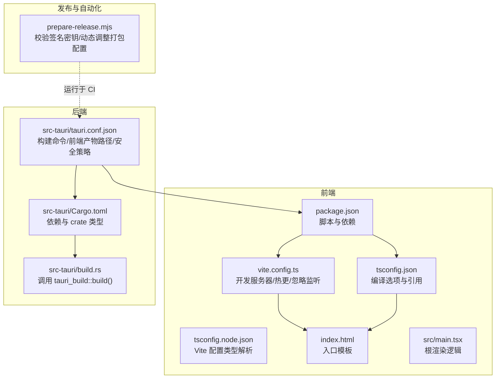
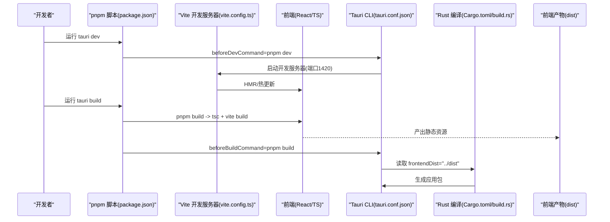
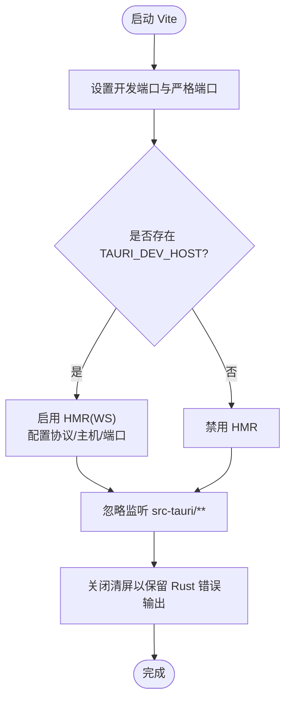
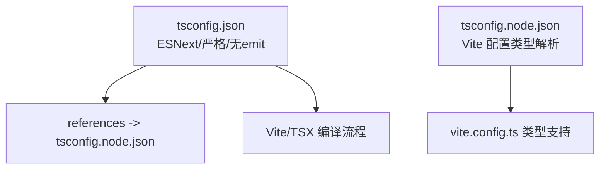
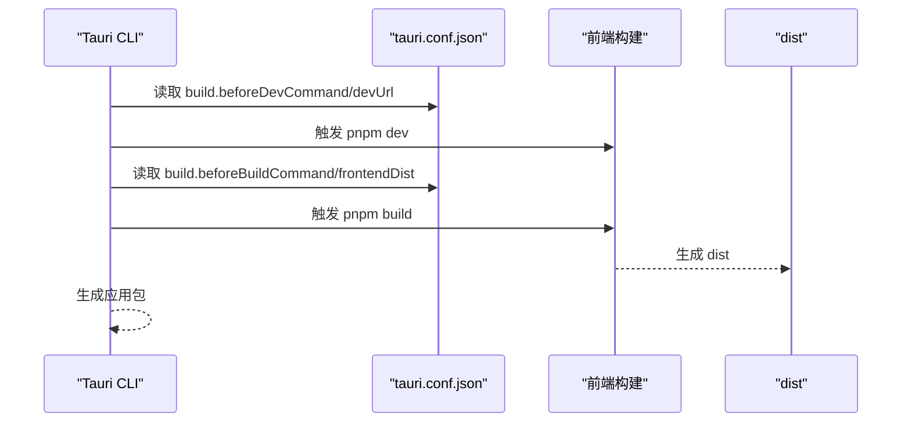
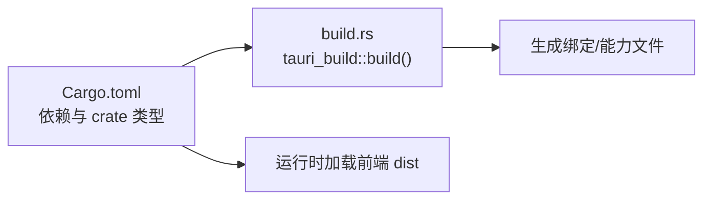
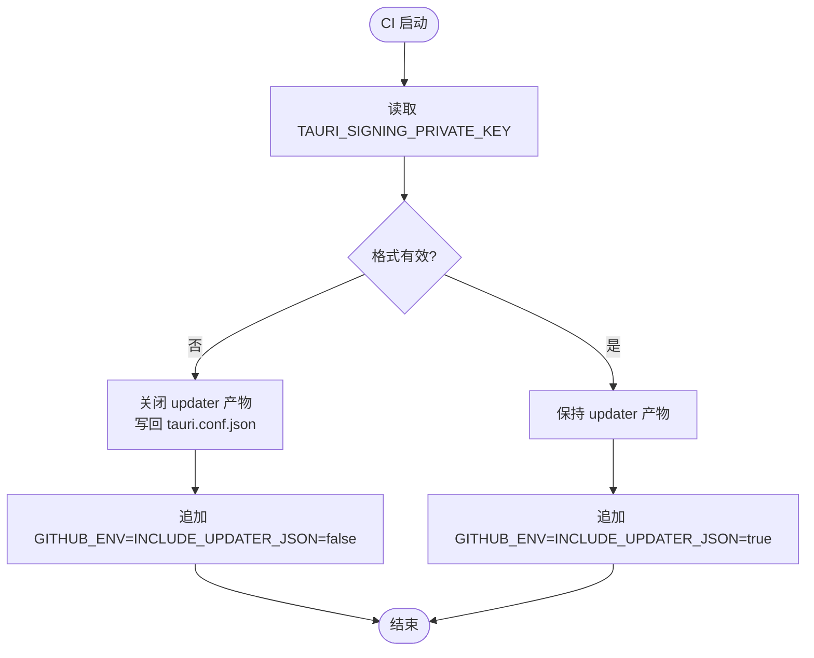
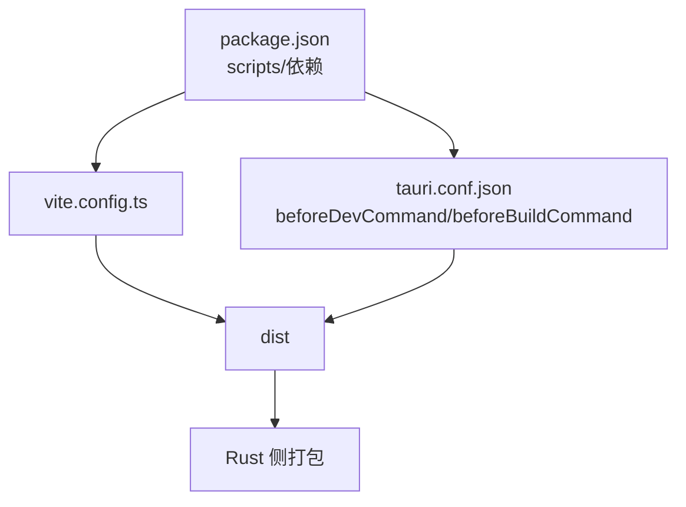

# 构建配置

<cite>
**本文引用的文件**
- [vite.config.ts](file://vite.config.ts)
- [package.json](file://package.json)
- [tsconfig.json](file://tsconfig.json)
- [tsconfig.node.json](file://tsconfig.node.json)
- [src-tauri/tauri.conf.json](file://src-tauri/tauri.conf.json)
- [src-tauri/Cargo.toml](file://src-tauri/Cargo.toml)
- [src-tauri/build.rs](file://src-tauri/build.rs)
- [index.html](file://index.html)
- [src/main.tsx](file://src/main.tsx)
- [.github/scripts/prepare-release.mjs](file://.github/scripts/prepare-release.mjs)
- [README.md](file://README.md)
</cite>

## 目录
1. [简介](#简介)
2. [项目结构](#项目结构)
3. [核心组件](#核心组件)
4. [架构总览](#架构总览)
5. [详细组件分析](#详细组件分析)
6. [依赖分析](#依赖分析)
7. [性能考虑](#性能考虑)
8. [故障排查指南](#故障排查指南)
9. [结论](#结论)
10. [附录](#附录)

## 简介
本文件系统化梳理本项目的前端与后端构建配置，重点覆盖：
- Vite 构建配置与开发服务器行为
- TypeScript 编译设置与多项目引用
- Tauri CLI 使用与打包流程
- 构建脚本执行顺序、环境变量与优化选项
- 开发模式与生产模式差异
- 性能优化建议与常见问题排查

## 项目结构
该工程采用“前端 React + TypeScript + Vite”与“后端 Rust + Tauri”的双层架构，并通过 Tauri 将前端产物嵌入为桌面应用。关键构建相关文件分布如下：
- 前端：vite.config.ts、tsconfig.json、tsconfig.node.json、package.json、index.html、src/main.tsx
- 后端：src-tauri/tauri.conf.json、src-tauri/Cargo.toml、src-tauri/build.rs
- 发布与自动化：.github/scripts/prepare-release.mjs
- 文档与脚手架：README.md

图表来源
- [package.json:1-53](file://package.json#L1-L53)
- [vite.config.ts:1-33](file://vite.config.ts#L1-L33)
- [tsconfig.json:1-26](file://tsconfig.json#L1-L26)
- [tsconfig.node.json:1-11](file://tsconfig.node.json#L1-L11)
- [index.html:1-15](file://index.html#L1-L15)
- [src/main.tsx:1-20](file://src/main.tsx#L1-L20)
- [src-tauri/tauri.conf.json:1-54](file://src-tauri/tauri.conf.json#L1-L54)
- [src-tauri/Cargo.toml:1-50](file://src-tauri/Cargo.toml#L1-L50)
- [src-tauri/build.rs:1-4](file://src-tauri/build.rs#L1-L4)
- [.github/scripts/prepare-release.mjs:1-36](file://.github/scripts/prepare-release.mjs#L1-L36)

章节来源
- [README.md:77-98](file://README.md#L77-L98)
- [package.json:22-27](file://package.json#L22-L27)

## 核心组件
- Vite 开发服务器与热更新：固定端口、严格端口、HMR 配置、忽略监听 src-tauri 目录
- TypeScript 编译：ESNext 模块、bundler 解析、严格模式、多项目引用
- Tauri 构建：beforeDevCommand、beforeBuildCommand、前端产物目录、安全策略
- Rust 侧：静态库/动态库/rlib 多类型、tauri-build、插件依赖
- 发布自动化：校验签名密钥、动态关闭自动更新产物

章节来源
- [vite.config.ts:8-32](file://vite.config.ts#L8-L32)
- [tsconfig.json:2-25](file://tsconfig.json#L2-L25)
- [tsconfig.node.json:1-11](file://tsconfig.node.json#L1-L11)
- [src-tauri/tauri.conf.json:6-11](file://src-tauri/tauri.conf.json#L6-L11)
- [src-tauri/Cargo.toml:12-17](file://src-tauri/Cargo.toml#L12-L17)
- [src-tauri/build.rs:1-4](file://src-tauri/build.rs#L1-L4)
- [.github/scripts/prepare-release.mjs:1-36](file://.github/scripts/prepare-release.mjs#L1-L36)

## 架构总览
下图展示从开发到打包的整体流程，以及各配置文件之间的协作关系。

图表来源
- [package.json:22-27](file://package.json#L22-L27)
- [vite.config.ts:16-31](file://vite.config.ts#L16-L31)
- [src-tauri/tauri.conf.json:6-11](file://src-tauri/tauri.conf.json#L6-L11)
- [src-tauri/Cargo.toml:19-20](file://src-tauri/Cargo.toml#L19-L20)
- [src-tauri/build.rs:1-4](file://src-tauri/build.rs#L1-L4)

## 详细组件分析

### Vite 构建配置
- 固定开发端口与严格端口：避免端口冲突，保证 Tauri dev 与 HMR 正常工作
- HMR 条件启用：当存在 TAURI_DEV_HOST 环境变量时，启用 WebSocket HMR 并指定 host 与端口
- 忽略监听 src-tauri：防止 Vite 监视后端代码导致不必要的重建
- 清屏关闭：保留 Rust 错误输出不被 Vite 屏蔽

图表来源
- [vite.config.ts:16-31](file://vite.config.ts#L16-L31)

章节来源
- [vite.config.ts:8-32](file://vite.config.ts#L8-L32)

### TypeScript 编译设置
- 目标与模块：ES2020、ESNext 模块、bundler 解析，适配 Vite 与 Tauri
- JSX 与类型：react-jsx、严格模式、无 emit（由 Vite 打包）
- 多项目引用：tsconfig.json 引用 tsconfig.node.json，使 Vite 配置具备类型支持
- Node 配置：允许 Vite 配置作为 ESNext 模块解析

图表来源
- [tsconfig.json:2-25](file://tsconfig.json#L2-L25)
- [tsconfig.node.json:1-11](file://tsconfig.node.json#L1-L11)

章节来源
- [tsconfig.json:2-25](file://tsconfig.json#L2-L25)
- [tsconfig.node.json:1-11](file://tsconfig.node.json#L1-L11)

### Tauri CLI 与打包配置
- beforeDevCommand：开发时先执行 pnpm dev（即 Vite 开发服务器）
- devUrl：固定前端开发地址 http://localhost:1420
- beforeBuildCommand：打包前先执行 pnpm build（TypeScript + Vite）
- frontendDist：指向 ../dist，即 Vite 输出目录
- 安全策略：csp 置空，窗口属性与图标等资源配置
- 更新器：配置公钥与发布端点

图表来源
- [src-tauri/tauri.conf.json:6-11](file://src-tauri/tauri.conf.json#L6-L11)
- [package.json:22-27](file://package.json#L22-L27)

章节来源
- [src-tauri/tauri.conf.json:1-54](file://src-tauri/tauri.conf.json#L1-L54)
- [package.json:22-27](file://package.json#L22-L27)

### Rust 侧构建与插件
- crate 类型：staticlib、cdylib、rlib，便于与 Tauri WebView 交互
- tauri-build：在构建阶段生成必要的绑定与能力文件
- 依赖：tauri、tauri 插件（dialog、opener、process、updater）、russh、tokio 生态等

图表来源
- [src-tauri/Cargo.toml:12-17](file://src-tauri/Cargo.toml#L12-L17)
- [src-tauri/build.rs:1-4](file://src-tauri/build.rs#L1-L4)

章节来源
- [src-tauri/Cargo.toml:19-20](file://src-tauri/Cargo.toml#L19-L20)
- [src-tauri/build.rs:1-4](file://src-tauri/build.rs#L1-L4)

### 发布与自动更新准备
- 校验 TAURI_SIGNING_PRIVATE_KEY：支持原始或 base64 形式
- 若无效则关闭 createUpdaterArtifacts，并向 GITHUB_ENV 注入 INCLUDE_UPDATER_JSON=false
- 有效则注入 INCLUDE_UPDATER_JSON=true，保持默认打包行为

图表来源
- [.github/scripts/prepare-release.mjs:7-36](file://.github/scripts/prepare-release.mjs#L7-L36)
- [src-tauri/tauri.conf.json:26-27](file://src-tauri/tauri.conf.json#L26-L27)

章节来源
- [.github/scripts/prepare-release.mjs:1-36](file://.github/scripts/prepare-release.mjs#L1-L36)

## 依赖分析
- 前端依赖：React 19、@xterm/*、@tauri-apps/*、lucide-react 等
- 开发依赖：Vite、TypeScript、@vitejs/plugin-react、@tauri/cli
- 构建耦合：package.json 的 scripts 与 tauri.conf.json 的 before* 命令形成闭环

图表来源
- [package.json:22-51](file://package.json#L22-L51)
- [src-tauri/tauri.conf.json:6-11](file://src-tauri/tauri.conf.json#L6-L11)

章节来源
- [package.json:22-51](file://package.json#L22-L51)
- [src-tauri/tauri.conf.json:6-11](file://src-tauri/tauri.conf.json#L6-L11)

## 性能考虑
- Vite 端口与 HMR：固定端口与条件 HMR 可减少网络与热更抖动
- 忽略监听：排除 src-tauri 避免前端无关文件变动触发重建
- TypeScript 无 emit：由 Vite 负责打包与产物生成，降低重复编译成本
- 严格模式与类型检查：提升开发期质量，减少运行时错误
- Tauri 打包：开启 createUpdaterArtifacts 仅在签名密钥有效时启用，避免无效更新产物

章节来源
- [vite.config.ts:16-31](file://vite.config.ts#L16-L31)
- [tsconfig.json:18-22](file://tsconfig.json#L18-L22)
- [.github/scripts/prepare-release.mjs:27-36](file://.github/scripts/prepare-release.mjs#L27-L36)

## 故障排查指南
- 端口占用
  - 现象：开发服务器启动失败
  - 排查：确认 1420/1421 端口未被占用；若使用外部 HMR，检查 TAURI_DEV_HOST 是否正确
  - 参考：[vite.config.ts:16-26](file://vite.config.ts#L16-L26)
- HMR 不生效
  - 现象：修改前端代码无刷新
  - 排查：若通过外部宿主访问，需设置 TAURI_DEV_HOST；否则禁用 HMR
  - 参考：[vite.config.ts:16-26](file://vite.config.ts#L16-L26)
- 构建失败（TypeScript）
  - 现象：pnpm build 报错
  - 排查：检查 tsconfig.json 的严格模式与模块解析；确认 tsconfig.node.json 引用正确
  - 参考：[tsconfig.json:2-25](file://tsconfig.json#L2-L25)，[tsconfig.node.json:1-11](file://tsconfig.node.json#L1-L11)
- 前端产物缺失
  - 现象：Tauri 打包找不到 dist
  - 排查：确认 beforeBuildCommand 与 frontendDist 设置一致；确保 pnpm build 成功
  - 参考：[src-tauri/tauri.conf.json:9-11](file://src-tauri/tauri.conf.json#L9-L11)，[package.json:24](file://package.json#L24)
- 自动更新产物异常
  - 现象：CI 中更新 JSON 未生成
  - 排查：检查 TAURI_SIGNING_PRIVATE_KEY 格式；无效时自动关闭 createUpdaterArtifacts
  - 参考：[.github/scripts/prepare-release.mjs:7-36](file://.github/scripts/prepare-release.mjs#L7-L36)，[src-tauri/tauri.conf.json:26-27](file://src-tauri/tauri.conf.json#L26-L27)

章节来源
- [vite.config.ts:16-26](file://vite.config.ts#L16-L26)
- [tsconfig.json:2-25](file://tsconfig.json#L2-L25)
- [tsconfig.node.json:1-11](file://tsconfig.node.json#L1-L11)
- [src-tauri/tauri.conf.json:9-11](file://src-tauri/tauri.conf.json#L9-L11)
- [.github/scripts/prepare-release.mjs:7-36](file://.github/scripts/prepare-release.mjs#L7-L36)

## 结论
本项目通过明确的前后端构建边界与 Tauri 的统一入口，实现了高效的开发体验与稳定的打包流程。遵循以下实践可获得最佳效果：
- 开发阶段使用 pnpm tauri dev，借助固定端口与条件 HMR 提升迭代效率
- 生产阶段使用 pnpm tauri build，确保前端产物与 Rust 打包一致
- 在 CI 中校验签名密钥，避免无效更新产物影响用户

## 附录

### 开发与生产模式差异
- 开发模式
  - 使用 Vite 开发服务器与 HMR；严格端口与固定端口保障调试稳定性
  - 忽略监听 src-tauri，避免无关重建
- 生产模式
  - 先执行 pnpm build（TypeScript + Vite），再由 Tauri 读取 dist 生成应用包
  - 自动更新产物根据签名密钥有效性动态启用

章节来源
- [vite.config.ts:16-31](file://vite.config.ts#L16-L31)
- [src-tauri/tauri.conf.json:6-11](file://src-tauri/tauri.conf.json#L6-L11)
- [.github/scripts/prepare-release.mjs:27-36](file://.github/scripts/prepare-release.mjs#L27-L36)

### 构建脚本执行顺序
- 开发：pnpm tauri dev → beforeDevCommand=pnpm dev → Vite 启动 → HMR
- 打包：pnpm tauri build → beforeBuildCommand=pnpm build → 生成 dist → Rust 打包

章节来源
- [package.json:22-27](file://package.json#L22-L27)
- [src-tauri/tauri.conf.json:6-11](file://src-tauri/tauri.conf.json#L6-L11)