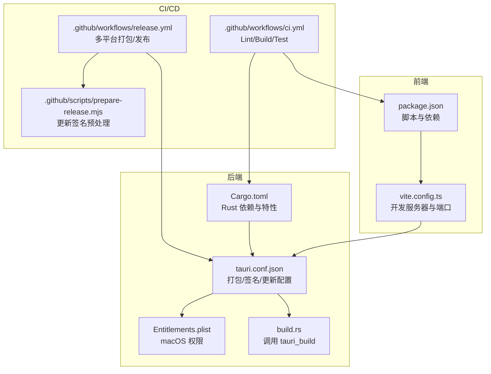
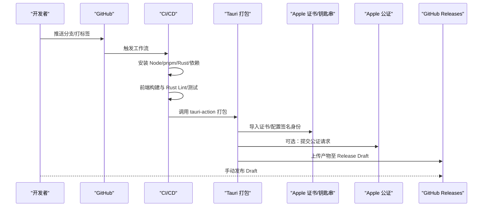
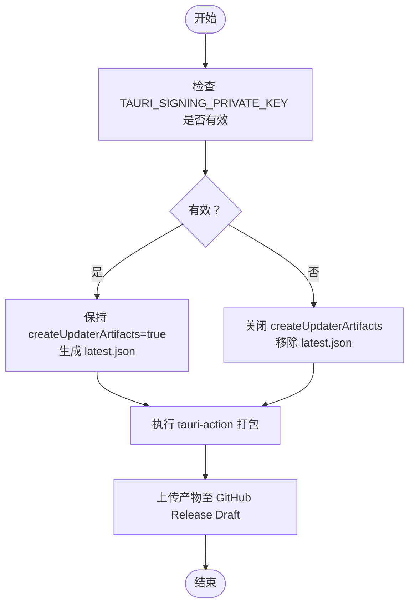
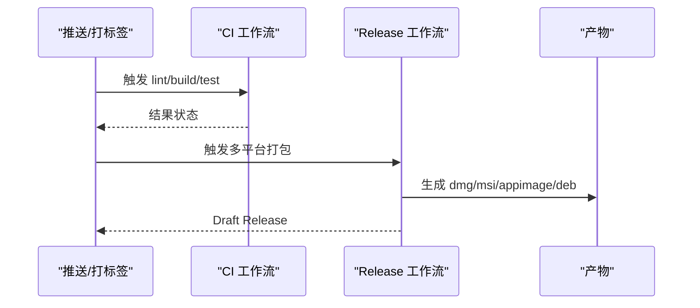
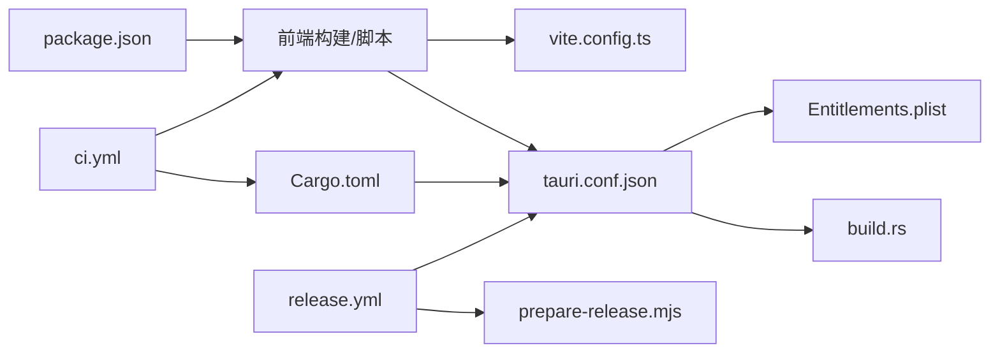

# 部署与发布

<cite>
**本文引用的文件**
- [package.json](file://package.json)
- [vite.config.ts](file://vite.config.ts)
- [Cargo.toml](file://src-tauri/Cargo.toml)
- [tauri.conf.json](file://src-tauri/tauri.conf.json)
- [Entitlements.plist](file://src-tauri/Entitlements.plist)
- [build.rs](file://src-tauri/build.rs)
- [.github/workflows/ci.yml](file://.github/workflows/ci.yml)
- [.github/workflows/release.yml](file://.github/workflows/release.yml)
- [.github/scripts/prepare-release.mjs](file://.github/scripts/prepare-release.mjs)
- [useUpdater.ts](file://src/hooks/useUpdater.ts)
- [README.md](file://README.md)
- [DESIGN.md](file://docs/DESIGN.md)
</cite>

## 目录
1. [简介](#简介)
2. [项目结构](#项目结构)
3. [核心组件](#核心组件)
4. [架构总览](#架构总览)
5. [详细组件分析](#详细组件分析)
6. [依赖关系分析](#依赖关系分析)
7. [性能考量](#性能考量)
8. [故障排查指南](#故障排查指南)
9. [结论](#结论)
10. [附录](#附录)

## 简介
本指南面向部署与发布流程，覆盖多平台构建、打包配置、发布策略、CI/CD 自动化、更新与回滚机制，以及发布后的监控与维护建议。结合项目中的 Tauri 配置、GitHub Actions 工作流与前端更新插件，帮助团队在 macOS、Windows、Linux 三大平台上稳定交付高质量应用。

## 项目结构
该仓库采用“前端 + Rust 后端 + Tauri 打包”的典型组织方式：
- 前端：React + TypeScript，使用 Vite 构建，开发服务器端口固定为 1420，严格端口模式，HMR 支持可跨主机。
- 后端：Rust + Tauri 2，通过 tauri.conf.json 配置打包、签名、公证、更新等。
- CI/CD：GitHub Actions，分别负责日常检查与发布流水线，支持多目标平台矩阵构建。

图表来源
- [package.json:1-53](file://package.json#L1-L53)
- [vite.config.ts:1-33](file://vite.config.ts#L1-L33)
- [Cargo.toml:1-50](file://src-tauri/Cargo.toml#L1-L50)
- [tauri.conf.json:1-54](file://src-tauri/tauri.conf.json#L1-L54)
- [Entitlements.plist:1-17](file://src-tauri/Entitlements.plist#L1-L17)
- [build.rs:1-4](file://src-tauri/build.rs#L1-L4)
- [.github/workflows/ci.yml:1-56](file://.github/workflows/ci.yml#L1-L56)
- [.github/workflows/release.yml:1-161](file://.github/workflows/release.yml#L1-L161)
- [.github/scripts/prepare-release.mjs:1-37](file://.github/scripts/prepare-release.mjs#L1-L37)

章节来源
- [package.json:1-53](file://package.json#L1-L53)
- [vite.config.ts:1-33](file://vite.config.ts#L1-L33)
- [Cargo.toml:1-50](file://src-tauri/Cargo.toml#L1-L50)
- [tauri.conf.json:1-54](file://src-tauri/tauri.conf.json#L1-L54)
- [Entitlements.plist:1-17](file://src-tauri/Entitlements.plist#L1-L17)
- [build.rs:1-4](file://src-tauri/build.rs#L1-L4)
- [.github/workflows/ci.yml:1-56](file://.github/workflows/ci.yml#L1-L56)
- [.github/workflows/release.yml:1-161](file://.github/workflows/release.yml#L1-L161)
- [.github/scripts/prepare-release.mjs:1-37](file://.github/scripts/prepare-release.mjs#L1-L37)

## 核心组件
- 前端构建与开发服务器
  - 固定开发端口与严格端口模式，保证 Tauri dev 与 Vite HMR 的一致性。
  - 忽略对 src-tauri 的监听，避免不必要的文件变动触发。
- Rust 与 Tauri 配置
  - tauri.conf.json 统一声明产品名称、版本、打包目标、平台特定签名与公证、更新端点与公钥。
  - Entitlements.plist 为 macOS 公证必需的 WKWebView JIT 权限。
  - build.rs 作为 tauri_build 的入口。
- 更新与回滚
  - useUpdater.ts 基于 @tauri-apps/plugin-updater 实现检查、下载、安装与重启。
  - GitHub Actions 在发布前根据签名密钥有效性动态关闭/开启更新产物生成。

章节来源
- [vite.config.ts:1-33](file://vite.config.ts#L1-L33)
- [tauri.conf.json:1-54](file://src-tauri/tauri.conf.json#L1-L54)
- [Entitlements.plist:1-17](file://src-tauri/Entitlements.plist#L1-L17)
- [build.rs:1-4](file://src-tauri/build.rs#L1-L4)
- [useUpdater.ts:1-56](file://src/hooks/useUpdater.ts#L1-L56)
- [.github/scripts/prepare-release.mjs:1-37](file://.github/scripts/prepare-release.mjs#L1-L37)

## 架构总览
下图展示从开发到发布的整体流程，包括前端构建、Rust 编译、Tauri 打包、平台签名与公证、GitHub Release Draft 以及自动更新。

图表来源
- [.github/workflows/ci.yml:1-56](file://.github/workflows/ci.yml#L1-L56)
- [.github/workflows/release.yml:1-161](file://.github/workflows/release.yml#L1-L161)
- [tauri.conf.json:1-54](file://src-tauri/tauri.conf.json#L1-L54)

## 详细组件分析

### 前端构建与开发环境
- 固定开发端口与严格端口模式，确保 Tauri dev 与 Vite HMR 的稳定联调。
- 忽略 src-tauri 的文件监听，减少无关刷新。
- 开发前命令与构建命令由 tauri.conf.json 统一委托给 pnpm 脚本。

章节来源
- [vite.config.ts:1-33](file://vite.config.ts#L1-L33)
- [tauri.conf.json:6-11](file://src-tauri/tauri.conf.json#L6-L11)
- [package.json:22-27](file://package.json#L22-L27)

### Rust 与 Tauri 配置
- 产品信息与版本：统一在 tauri.conf.json 中声明，便于跨平台一致性。
- 打包目标：targets 设置为 all，启用 createUpdaterArtifacts，生成更新所需的最新元数据。
- 平台特定配置：
  - macOS：指定 Entitlements.plist、最低系统版本、图标集。
  - Windows/Linux：由 tauri-action 自动补齐默认图标与系统依赖。
- 插件与更新：启用 @tauri-apps/plugin-updater，配置公钥与更新端点。

章节来源
- [tauri.conf.json:1-54](file://src-tauri/tauri.conf.json#L1-L54)
- [Cargo.toml:1-50](file://src-tauri/Cargo.toml#L1-L50)

### macOS 打包与公证
- 证书与钥匙串：在 CI 中导入 Apple Developer ID 证书到临时钥匙串，解锁签名与公证。
- 签名身份：优先使用仓库中配置的签名身份；若未配置则使用 ad-hoc 签名。
- 公证凭据：支持 Apple ID/App 专用密码或 App Store Connect API Key 两种方式。
- 权限清单：Entitlements.plist 必须包含 JIT/可执行内存等权限，否则公证后可能启动崩溃。

章节来源
- [.github/workflows/release.yml:67-133](file://.github/workflows/release.yml#L67-L133)
- [Entitlements.plist:1-17](file://src-tauri/Entitlements.plist#L1-L17)
- [tauri.conf.json:28-31](file://src-tauri/tauri.conf.json#L28-L31)

### Windows 打包
- 使用 tauri-action 自动生成安装包（-setup.exe 或 .msi），无需额外签名配置。
- 前端与 Rust 依赖在 Windows runner 上自动安装与编译。

章节来源
- [.github/workflows/release.yml:24-27](file://.github/workflows/release.yml#L24-L27)
- [.github/workflows/release.yml:58-60](file://..github/workflows/release.yml#L58-L60)

### Linux 打包
- Ubuntu runner 安装 WebKitGTK、AppIndicator、SVG 等系统依赖。
- 生成 AppImage 与 deb 包，满足不同发行版用户需求。

章节来源
- [.github/workflows/release.yml:51-57](file://.github/workflows/release.yml#L51-L57)
- [README.md:93-98](file://README.md#L93-L98)

### 自动更新与回滚
- 前端逻辑：useUpdater.ts 调用 @tauri-apps/plugin-updater 的 check、downloadAndInstall、relaunch。
- 发布策略：GitHub Actions 在发布前通过 prepare-release.mjs 校验签名密钥，决定是否生成更新产物与 latest.json。
- 回滚建议：更新失败时保留旧版本，必要时引导用户手动回退到上一个稳定版本。

图表来源
- [.github/scripts/prepare-release.mjs:1-37](file://.github/scripts/prepare-release.mjs#L1-L37)
- [.github/workflows/release.yml:62-65](file://.github/workflows/release.yml#L62-L65)
- [tauri.conf.json:26](file://src-tauri/tauri.conf.json#L26)

章节来源
- [useUpdater.ts:1-56](file://src/hooks/useUpdater.ts#L1-L56)
- [.github/scripts/prepare-release.mjs:1-37](file://.github/scripts/prepare-release.mjs#L1-L37)
- [.github/workflows/release.yml:62-65](file://.github/workflows/release.yml#L62-L65)
- [tauri.conf.json:46-51](file://src-tauri/tauri.conf.json#L46-L51)

### CI/CD 流程
- CI（ci.yml）：在 Ubuntu 上安装 pnpm、Node、Rust，拉取锁文件，构建前端，格式化与静态检查，运行测试。
- Release（release.yml）：按平台矩阵构建，macOS 导入证书与公证凭据，Windows/Linux 安装系统依赖，最终汇总到 GitHub Draft Release，等待人工发布。

图表来源
- [.github/workflows/ci.yml:1-56](file://.github/workflows/ci.yml#L1-L56)
- [.github/workflows/release.yml:1-161](file://.github/workflows/release.yml#L1-L161)

章节来源
- [.github/workflows/ci.yml:1-56](file://.github/workflows/ci.yml#L1-L56)
- [.github/workflows/release.yml:1-161](file://.github/workflows/release.yml#L1-L161)

## 依赖关系分析
- 前端依赖与脚本：package.json 管理 React、Vite、TypeScript、@tauri-apps/* 插件与 CLI。
- Rust 依赖：tauri、russh、russh-sftp、tokio、serde、keyring、tauri-plugin-* 等。
- 打包与签名：tauri.conf.json 与 build.rs 作为 Tauri 构建契约；Entitlements.plist 为 macOS 必需。
- CI 依赖：GitHub Actions 使用 pnpm/action-setup、actions/setup-node、dtolnay/rust-toolchain、swatinem/rust-cache、tauri-apps/tauri-action。

图表来源
- [package.json:1-53](file://package.json#L1-L53)
- [vite.config.ts:1-33](file://vite.config.ts#L1-L33)
- [Cargo.toml:1-50](file://src-tauri/Cargo.toml#L1-L50)
- [tauri.conf.json:1-54](file://src-tauri/tauri.conf.json#L1-L54)
- [Entitlements.plist:1-17](file://src-tauri/Entitlements.plist#L1-L17)
- [build.rs:1-4](file://src-tauri/build.rs#L1-L4)
- [.github/workflows/ci.yml:1-56](file://.github/workflows/ci.yml#L1-L56)
- [.github/workflows/release.yml:1-161](file://.github/workflows/release.yml#L1-L161)
- [.github/scripts/prepare-release.mjs:1-37](file://.github/scripts/prepare-release.mjs#L1-L37)

章节来源
- [package.json:1-53](file://package.json#L1-L53)
- [Cargo.toml:1-50](file://src-tauri/Cargo.toml#L1-L50)
- [tauri.conf.json:1-54](file://src-tauri/tauri.conf.json#L1-L54)
- [.github/workflows/ci.yml:1-56](file://.github/workflows/ci.yml#L1-L56)
- [.github/workflows/release.yml:1-161](file://.github/workflows/release.yml#L1-L161)

## 性能考量
- 前端构建：Vite 严格端口与忽略 src-tauri 监听，降低开发阶段的资源消耗。
- Rust 缓存：CI 使用 swatinem/rust-cache，显著缩短编译时间。
- 平台依赖：Linux 打包前安装必要系统库，避免运行时缺失导致的性能问题。
- 更新体验：自动更新采用增量下载与安装，尽量减少对用户的影响。

章节来源
- [vite.config.ts:16-31](file://vite.config.ts#L16-L31)
- [.github/workflows/ci.yml:31-34](file://.github/workflows/ci.yml#L31-L34)
- [.github/workflows/release.yml:51-57](file://.github/workflows/release.yml#L51-L57)

## 故障排查指南
- macOS “已损坏”提示
  - 若未配置 Apple Secrets，产物为 ad-hoc 签名，可按说明清除扩展属性后使用。
  - 若已配置证书但公证失败，检查 APPLE_ID/APPLE_PASSWORD/APPLE_TEAM_ID 或 APPLE_API_* 凭据。
- 更新失败
  - 检查 TAURI_SIGNING_PRIVATE_KEY 是否有效；无效时 prepare-release.mjs 会自动关闭更新产物生成。
  - 确认更新端点可达，且公钥与私钥匹配。
- Linux 依赖缺失
  - 确保安装 WebKitGTK、AppIndicator、SSL、SVG 等系统依赖。
- CI 缓存与工具链
  - 确保 pnpm 锁文件一致，Rust 工具链与组件齐全，缓存命中正常。

章节来源
- [README.md:58-76](file://README.md#L58-L76)
- [.github/workflows/release.yml:67-133](file://.github/workflows/release.yml#L67-L133)
- [.github/scripts/prepare-release.mjs:1-37](file://.github/scripts/prepare-release.mjs#L1-L37)
- [README.md:93-98](file://README.md#L93-L98)
- [.github/workflows/ci.yml:26-34](file://.github/workflows/ci.yml#L26-L34)

## 结论
本项目通过清晰的前端/后端分工、完善的 Tauri 配置与成熟的 GitHub Actions 流水线，在三大平台实现了稳定的构建与发布。配合自动更新与公证流程，能够为用户提供安全、便捷的安装与升级体验。建议在后续迭代中持续优化更新回滚策略与监控告警，提升发布质量与用户满意度。

## 附录
- 版本管理与发布节奏
  - 使用语义化版本与 Git 标签驱动发布；CI/CD 仅在打标签时触发 Release 工作流。
- 更新机制与回滚策略
  - 前端基于 @tauri-apps/plugin-updater 的检查与安装；回滚可通过重新安装上一个版本或在应用内引导用户进行。
- 发布后监控与维护
  - 建议收集应用启动失败、更新失败、网络错误等日志；对 macOS 启动崩溃与公证失败建立告警；对 Linux 用户反馈的依赖问题建立 FAQ 与安装指引。

章节来源
- [.github/workflows/release.yml:3-8](file://.github/workflows/release.yml#L3-L8)
- [useUpdater.ts:18-52](file://src/hooks/useUpdater.ts#L18-L52)
- [README.md:58-76](file://README.md#L58-L76)