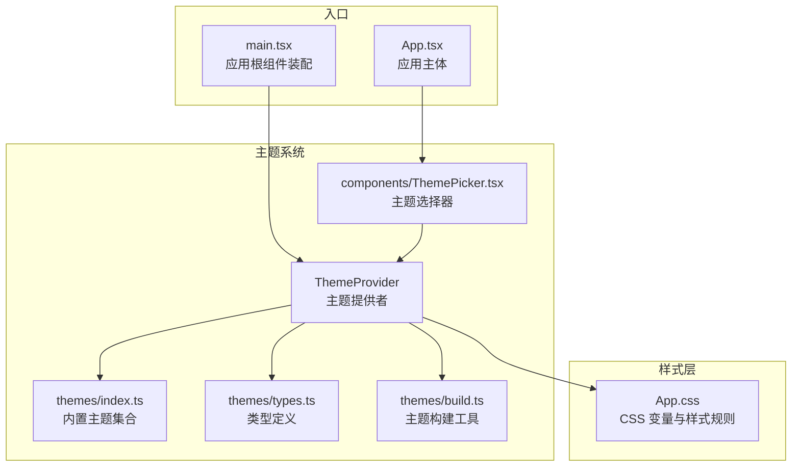
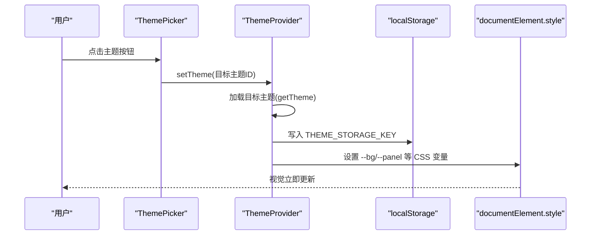
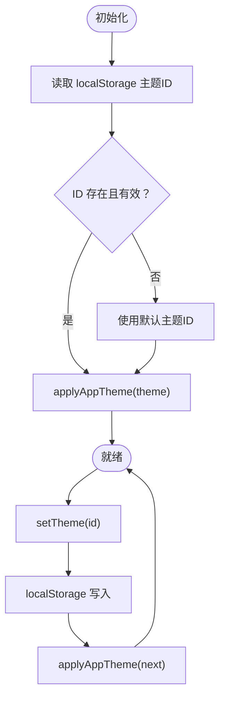
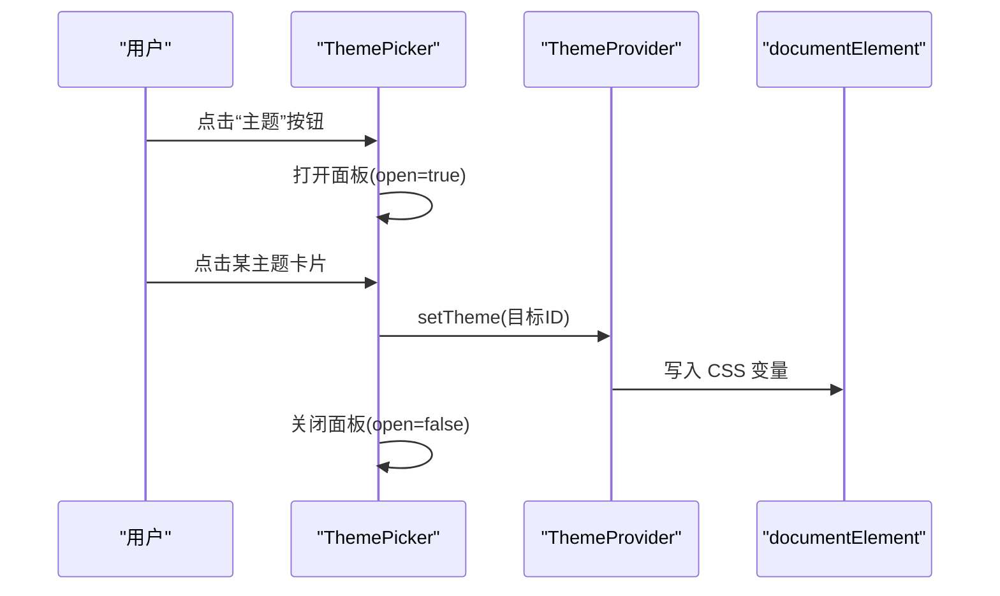
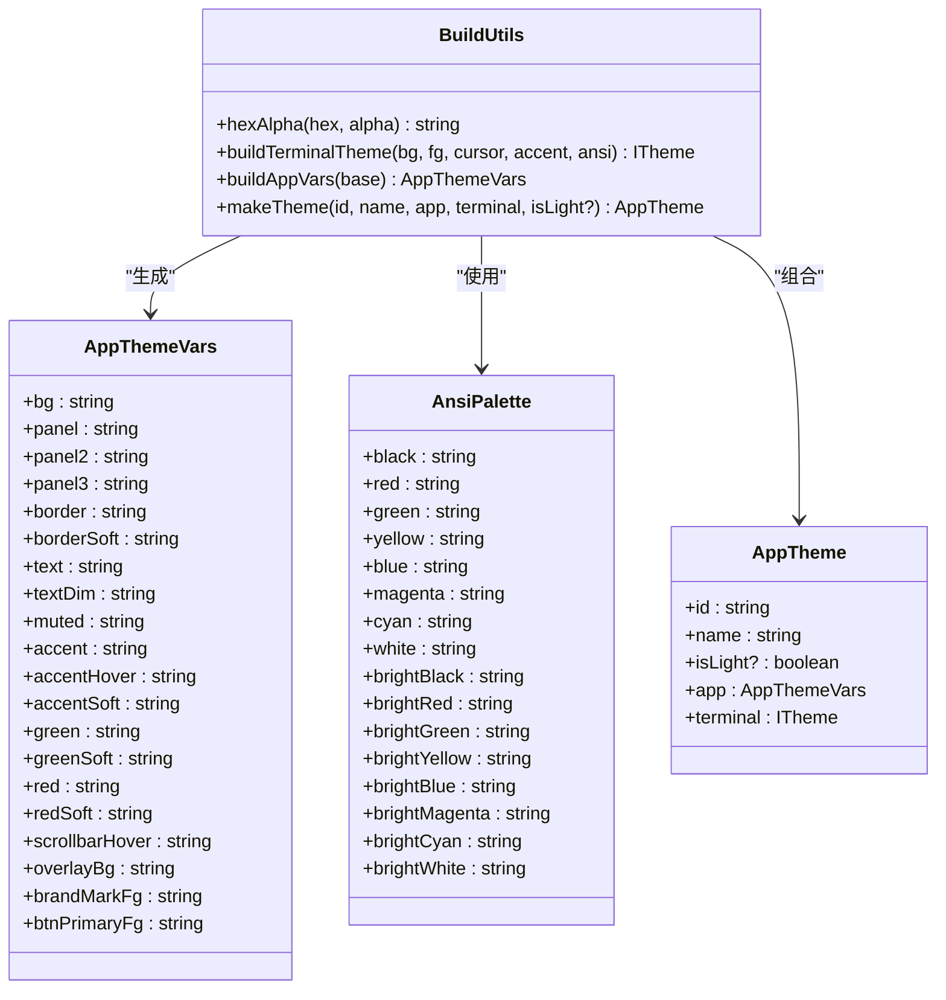
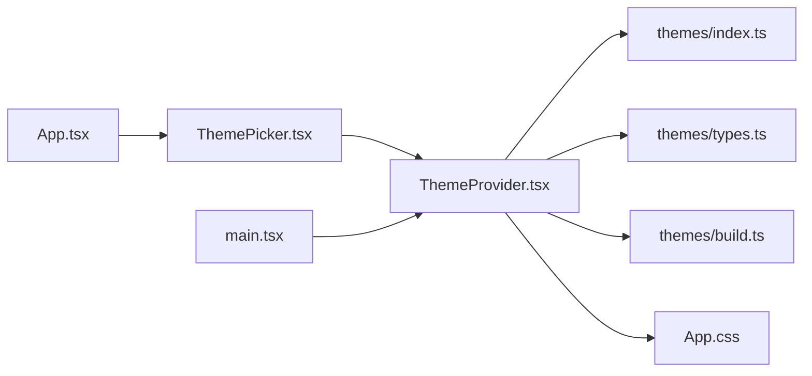

# 主题设置

<cite>
**本文档引用的文件**
- [ThemeProvider.tsx](file://src/theme/ThemeProvider.tsx)
- [index.ts](file://src/themes/index.ts)
- [types.ts](file://src/themes/types.ts)
- [build.ts](file://src/themes/build.ts)
- [ThemePicker.tsx](file://src/components/ThemePicker.tsx)
- [App.css](file://src/App.css)
- [main.tsx](file://src/main.tsx)
- [App.tsx](file://src/App.tsx)
</cite>

## 目录
1. [简介](#简介)
2. [项目结构](#项目结构)
3. [核心组件](#核心组件)
4. [架构总览](#架构总览)
5. [详细组件分析](#详细组件分析)
6. [依赖关系分析](#依赖关系分析)
7. [性能考量](#性能考量)
8. [故障排除指南](#故障排除指南)
9. [结论](#结论)
10. [附录](#附录)

## 简介
本文件系统性地介绍应用的主题系统与自定义能力，涵盖内置主题的选择与切换、主题颜色方案构成与作用、实现机制（CSS 变量、动态主题切换、主题持久化）、自定义主题创建指南（颜色定义、字体配置、组件样式覆盖），以及主题兼容性与跨平台差异处理方案。目标是帮助开发者与高级用户快速掌握主题系统的使用与扩展。

## 项目结构
主题系统围绕以下模块组织：
- 主题提供者与上下文：负责加载、切换、持久化主题，并将主题注入全局 CSS 变量。
- 主题集合与构建工具：集中管理内置主题与 ANSI 调色板，提供主题构建函数。
- 主题选择器：提供 UI 交互以选择与预览主题。
- 样式层：通过 CSS 变量驱动界面元素的颜色与外观。

图表来源
- [main.tsx:13-19](file://src/main.tsx#L13-L19)
- [ThemeProvider.tsx:70-100](file://src/theme/ThemeProvider.tsx#L70-L100)
- [index.ts:409-885](file://src/themes/index.ts#L409-L885)
- [types.ts:51-59](file://src/themes/types.ts#L51-L59)
- [build.ts:32-84](file://src/themes/build.ts#L32-L84)
- [ThemePicker.tsx:8-84](file://src/components/ThemePicker.tsx#L8-L84)
- [App.css:6-45](file://src/App.css#L6-L45)

章节来源
- [main.tsx:13-19](file://src/main.tsx#L13-L19)
- [App.tsx:609-618](file://src/App.tsx#L609-L618)

## 核心组件
- 主题提供者（ThemeProvider）：维护当前主题 ID，加载主题，写入 CSS 变量，持久化到本地存储，暴露给子组件使用。
- 主题选择器（ThemePicker）：渲染主题卡片与预览，支持点击切换与键盘/点击外部关闭。
- 主题构建工具（build.ts）：提供 ANSI 调色板映射、终端主题组装、GUI 变量生成与主题组合。
- 主题集合（index.ts）：内置 20+ 主题，包含深色与浅色风格，提供默认主题与查找函数。
- 类型定义（types.ts）：定义 AppThemeVars、AnsiPalette、AppTheme 结构及常量键名。
- 样式层（App.css）：声明 CSS 变量并以变量驱动组件样式。

章节来源
- [ThemeProvider.tsx:14-25](file://src/theme/ThemeProvider.tsx#L14-L25)
- [ThemePicker.tsx:8-84](file://src/components/ThemePicker.tsx#L8-L84)
- [build.ts:32-84](file://src/themes/build.ts#L32-L84)
- [index.ts:409-885](file://src/themes/index.ts#L409-L885)
- [types.ts:3-29](file://src/themes/types.ts#L3-L29)
- [App.css:6-45](file://src/App.css#L6-L45)

## 架构总览
主题系统采用“提供者 + 上下文 + 构建工具”的分层设计：
- 提供者层：负责状态管理与副作用（写入 CSS 变量、本地存储）。
- 构建层：负责将颜色与调色板转换为主题对象。
- 选择器层：负责用户交互与主题切换。
- 样式层：通过 CSS 变量实现主题驱动的视觉呈现。

图表来源
- [ThemePicker.tsx:56-58](file://src/components/ThemePicker.tsx#L56-L58)
- [ThemeProvider.tsx:78-86](file://src/theme/ThemeProvider.tsx#L78-L86)
- [ThemeProvider.tsx:30-57](file://src/theme/ThemeProvider.tsx#L30-L57)
- [index.ts:887-890](file://src/themes/index.ts#L887-L890)

## 详细组件分析

### 主题提供者（ThemeProvider）
职责与行为：
- 初始化：从 localStorage 读取主题 ID，若不可用则回退默认主题。
- 应用主题：将 AppThemeVars 写入 document.documentElement 的 CSS 变量，同时设置 data-theme 标记。
- 切换主题：更新主题 ID，持久化到 localStorage，并触发 CSS 变量更新。
- 终端主题：导出 ITheme（含 16 色 ANSI）供终端组件使用。

实现要点：
- 使用 React Context 暴露 themeId、theme、setTheme、themes、terminalTheme。
- 通过 useMemo 缓存上下文值，减少不必要的重渲染。
- 通过 useEffect 在主题变更时写入 CSS 变量，确保样式即时生效。

图表来源
- [ThemeProvider.tsx:60-68](file://src/theme/ThemeProvider.tsx#L60-L68)
- [ThemeProvider.tsx:70-100](file://src/theme/ThemeProvider.tsx#L70-L100)
- [ThemeProvider.tsx:30-57](file://src/theme/ThemeProvider.tsx#L30-L57)

章节来源
- [ThemeProvider.tsx:70-100](file://src/theme/ThemeProvider.tsx#L70-L100)
- [ThemeProvider.tsx:30-57](file://src/theme/ThemeProvider.tsx#L30-L57)

### 主题选择器（ThemePicker）
职责与行为：
- 渲染主题卡片：展示每个主题的色块预览（背景、面板、强调色、终端红绿青）。
- 交互控制：点击切换主题、Esc 关闭、点击外部区域关闭。
- 状态同步：根据当前主题高亮选中项。

图表来源
- [ThemePicker.tsx:8-84](file://src/components/ThemePicker.tsx#L8-L84)
- [ThemeProvider.tsx:78-86](file://src/theme/ThemeProvider.tsx#L78-L86)
- [App.css:1398-1430](file://src/App.css#L1398-L1430)

章节来源
- [ThemePicker.tsx:8-84](file://src/components/ThemePicker.tsx#L8-L84)

### 主题构建工具（build.ts）
职责与行为：
- hexAlpha：将十六进制颜色转为带透明度的 rgba 字符串，用于“soft”背景色。
- buildTerminalTheme：组装 xterm ITheme，包含背景、前景、光标、选择色与 16 色 ANSI 调色板。
- buildAppVars：基于基础色快速生成 GUI 变量集，自动派生强调色 hover 与 soft 背景等。
- makeTheme：组合 GUI 与终端主题，形成完整的 AppTheme。

图表来源
- [build.ts:32-84](file://src/themes/build.ts#L32-L84)
- [types.ts:3-29](file://src/themes/types.ts#L3-L29)
- [types.ts:31-49](file://src/themes/types.ts#L31-L49)
- [types.ts:51-59](file://src/themes/types.ts#L51-L59)

章节来源
- [build.ts:32-84](file://src/themes/build.ts#L32-L84)
- [types.ts:3-29](file://src/themes/types.ts#L3-L29)

### 主题集合（index.ts）
职责与行为：
- 定义 20+ 内置主题，覆盖深色与浅色风格，包含品牌色与终端 ANSI 调色板映射。
- 提供 getTheme(id) 查找函数，不存在时回退到默认主题。
- 暴露 DEFAULT_THEME_ID 与 THEME_STORAGE_KEY 常量。

内置主题示例（节选）：
- 深墨琥珀（默认）：深色基底，琥珀为主强调色。
- Dracula、Nord、One Dark、Gruvbox Dark、Solarized Dark/Light、Monokai、Tokyo Night、Catppuccin Mocha/Latte、Ayu Dark、Everforest、Rosé Pine、GitHub Dark、Material、Cobalt2、Snazzy、Night Owl、Palenight、高对比度（无障碍）。

章节来源
- [index.ts:409-885](file://src/themes/index.ts#L409-L885)
- [index.ts:887-890](file://src/themes/index.ts#L887-L890)

### 样式层（App.css）
职责与行为：
- 在 :root 声明所有 CSS 变量作为默认值，ThemeProvider 运行时会覆盖这些变量。
- 大量组件样式通过 var(--变量名) 使用主题变量，实现统一的主题驱动。
- 包含滚动条、按钮、对话框、状态栏等组件的样式规则。

章节来源
- [App.css:6-45](file://src/App.css#L6-L45)
- [App.css:82-96](file://src/App.css#L82-L96)

## 依赖关系分析
- ThemeProvider 依赖 themes/index.ts 提供的主题集合与查找函数，依赖 types.ts 的类型定义，依赖 build.ts 的构建工具。
- ThemePicker 依赖 ThemeProvider 的上下文，读取当前主题与主题列表，调用 setTheme 切换。
- App.css 依赖 :root 中的 CSS 变量，这些变量由 ThemeProvider 动态写入。
- main.tsx 负责将 ThemeProvider 与 SettingsProvider 组装到应用根节点。

图表来源
- [ThemeProvider.tsx:11-12](file://src/theme/ThemeProvider.tsx#L11-L12)
- [index.ts:1-4](file://src/themes/index.ts#L1-L4)
- [types.ts:1-2](file://src/themes/types.ts#L1-L2)
- [build.ts:1-2](file://src/themes/build.ts#L1-L2)
- [ThemePicker.tsx](file://src/components/ThemePicker.tsx#L3)
- [main.tsx:13-19](file://src/main.tsx#L13-L19)
- [App.tsx:609-618](file://src/App.tsx#L609-L618)

章节来源
- [main.tsx:13-19](file://src/main.tsx#L13-L19)
- [App.tsx:609-618](file://src/App.tsx#L609-L618)

## 性能考量
- 主题切换为 O(1) 操作：仅更新 documentElement 的 CSS 变量与 localStorage，避免全量重绘。
- 上下文缓存：ThemeProvider 使用 useMemo 缓存上下文值，减少子组件重渲染。
- 终端主题：通过 ITheme 对象传递，避免在 DOM 中重复计算颜色。
- 首次加载：从 localStorage 读取主题 ID，避免网络或异步 IO 开销。

[本节为通用性能讨论，无需特定文件来源]

## 故障排除指南
常见问题与排查建议：
- 主题未生效
  - 检查是否在 ThemeProvider 包裹范围内使用 useTheme。
  - 确认浏览器支持 CSS 变量，且未被其他样式覆盖。
  - 查看控制台是否有 localStorage 访问异常（隐私模式等）。
- 主题切换后样式未更新
  - 确认 setTheme 调用成功，且 ThemeProvider 的 useEffect 已执行。
  - 检查 CSS 变量是否被组件内联样式覆盖。
- 默认主题回退
  - 若传入无效主题 ID，系统将回退到 DEFAULT_THEME_ID；检查输入 ID 是否正确。

章节来源
- [ThemeProvider.tsx:60-68](file://src/theme/ThemeProvider.tsx#L60-L68)
- [ThemeProvider.tsx:78-86](file://src/theme/ThemeProvider.tsx#L78-L86)
- [index.ts:887-890](file://src/themes/index.ts#L887-L890)

## 结论
该主题系统以 CSS 变量为核心，结合 React Context 与构建工具，实现了简洁高效的动态主题切换与持久化。内置主题丰富，覆盖多种风格；UI 选择器直观易用；样式层通过变量驱动，易于扩展与维护。对于自定义需求，可通过构建工具与类型定义快速生成新的主题，并保持与终端组件的协同一致。

[本节为总结性内容，无需特定文件来源]

## 附录

### 内置主题一览（节选）
- 深墨琥珀（默认）
- Dracula、Nord、One Dark、Gruvbox Dark、Solarized Dark/Light、Monokai、Tokyo Night、Catppuccin Mocha/Latte、Ayu Dark、Everforest、Rosé Pine、GitHub Dark、Material、Cobalt2、Snazzy、Night Owl、Palenight、高对比度（无障碍）

章节来源
- [index.ts:409-885](file://src/themes/index.ts#L409-L885)

### 主题颜色方案组成与作用
- 背景与面板：bg、panel、panel2、panel3，决定整体基调与层级。
- 边框与文本：border、borderSoft、text、textDim、muted，用于边框、弱化文本与辅助信息。
- 强调与语义：accent、accentHover、accentSoft，用于主操作、悬停与软强调。
- 语义色彩：green、greenSoft、red、redSoft，用于成功/警告/错误等语义。
- 滚动条与遮罩：scrollbarHover、overlayBg，改善交互体验与浮层效果。
- 品牌与按钮：brandMarkFg、btnPrimaryFg，用于品牌标识与主按钮文字色。

章节来源
- [types.ts:3-29](file://src/themes/types.ts#L3-L29)
- [App.css:6-45](file://src/App.css#L6-L45)

### 实现机制详解
- CSS 变量：ThemeProvider 将 AppThemeVars 写入 documentElement.style，App.css 通过 var(--变量名) 使用。
- 动态切换：setTheme 更新主题 ID 并持久化，触发 CSS 变量重写，实现即时视觉更新。
- 终端主题：buildTerminalTheme 生成 ITheme，包含背景、前景、光标、选择色与 ANSI 调色板。
- 持久化：localStorage 保存 THEME_STORAGE_KEY，支持跨会话恢复。

章节来源
- [ThemeProvider.tsx:30-57](file://src/theme/ThemeProvider.tsx#L30-L57)
- [build.ts:14-30](file://src/themes/build.ts#L14-L30)
- [types.ts:61-62](file://src/themes/types.ts#L61-L62)

### 自定义主题创建指南
步骤概览：
1. 定义 AppThemeVars
   - 基础色：bg、panel、panel2、panel3、border、borderSoft、text、textDim、muted。
   - 强调色：accent（必填），可选 accentHover。
   - 语义色：green、red（可选），将自动生成 soft 背景色。
   - 其他：scrollbarHover、overlayBg、brandMarkFg、btnPrimaryFg（可选）。
2. 生成 GUI 变量
   - 使用 buildAppVars(base) 自动生成派生变量。
3. 生成终端主题
   - 准备 ANSI 调色板（AnsiPalette），使用 buildTerminalTheme(bg, fg, cursor, accent, ansi) 生成 ITheme。
4. 组合主题
   - 使用 makeTheme(id, name, app, terminal, isLight?) 组合为 AppTheme。
5. 注册与使用
   - 将新主题加入 themes 数组，或在运行时动态注册。
   - 通过 ThemePicker 或直接调用 setTheme 切换。

章节来源
- [build.ts:32-84](file://src/themes/build.ts#L32-L84)
- [index.ts:409-885](file://src/themes/index.ts#L409-L885)

### 主题兼容性与跨平台差异
- 浏览器兼容性
  - CSS 变量广泛支持，建议在较新浏览器上使用。
  - 如需兼容旧环境，可在构建阶段进行降级处理（如 polyfill）。
- 终端兼容性
  - ANSI 调色板映射遵循 xterm 协议，确保在不同终端中显示一致。
  - 若终端不支持某些颜色，建议选择更保守的调色板。
- 跨平台差异
  - 深色/浅色主题在不同系统外观下表现可能略有差异，建议提供浅色主题以适配浅色系统主题。
  - 滚动条与系统控件样式可能受平台影响，可通过 CSS 变量微调。

[本节为通用兼容性讨论，无需特定文件来源]