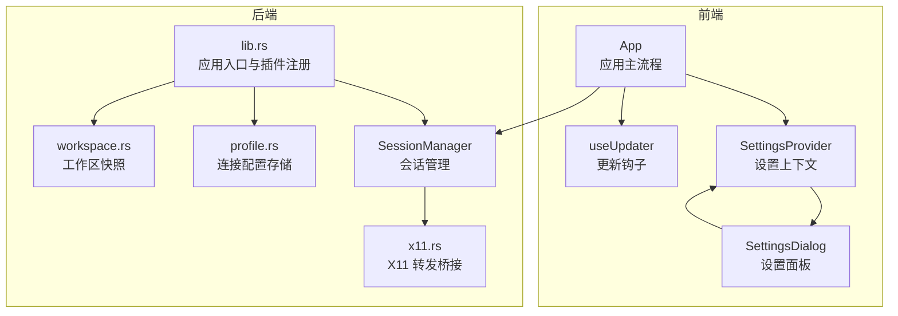
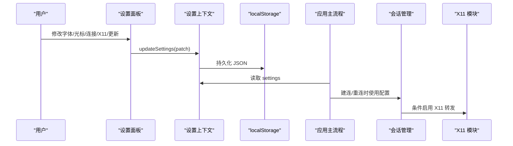
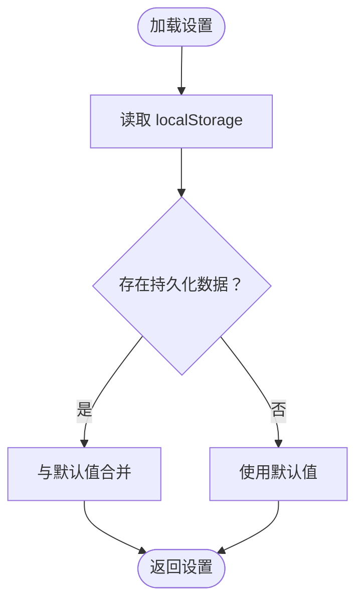
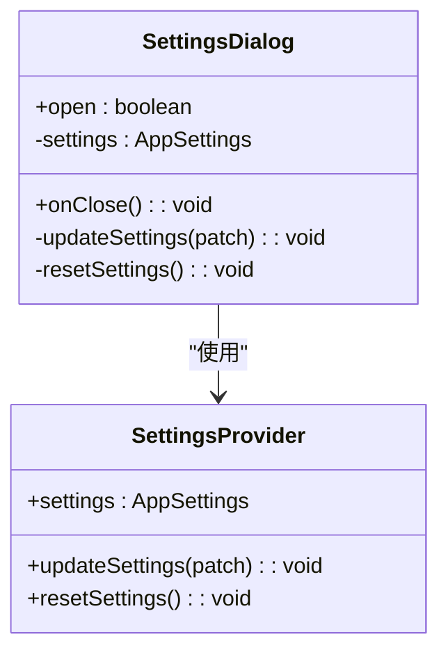
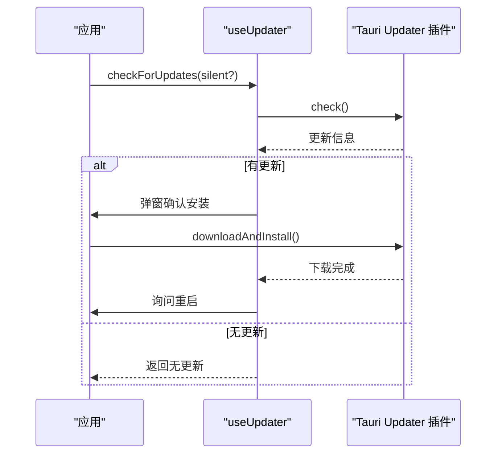
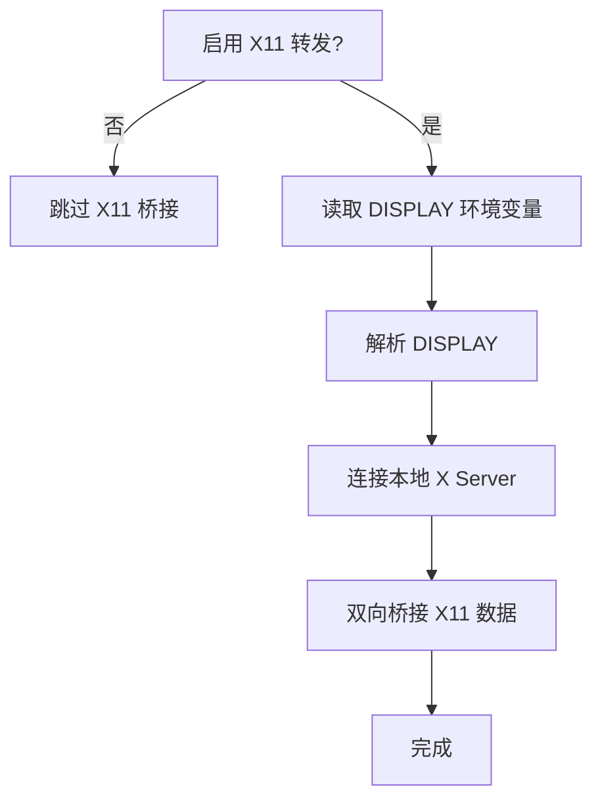
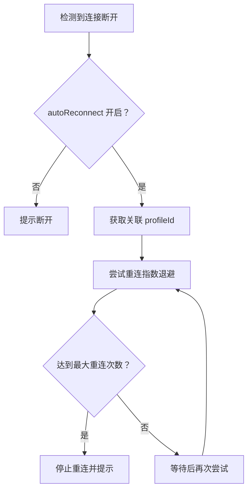
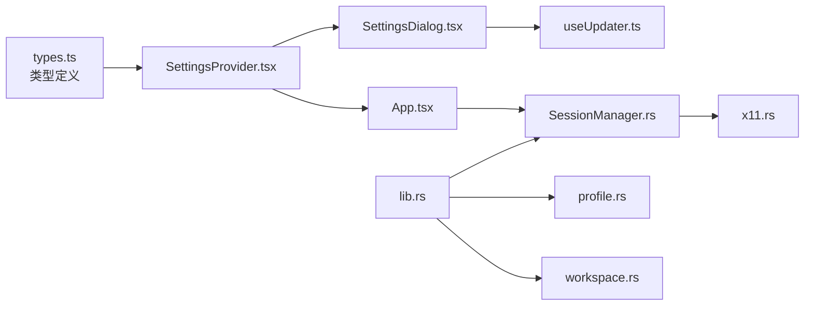

# 应用配置

<cite>
**本文档引用的文件**
- [src/settings/SettingsProvider.tsx](file://src/settings/SettingsProvider.tsx)
- [src/settings/types.ts](file://src/settings/types.ts)
- [src/components/SettingsDialog.tsx](file://src/components/SettingsDialog.tsx)
- [src/hooks/useUpdater.ts](file://src/hooks/useUpdater.ts)
- [src-tauri/src/session/x11.rs](file://src-tauri/src/session/x11.rs)
- [src-tauri/src/session/manager.rs](file://src-tauri/src/session/manager.rs)
- [src-tauri/src/session/profile.rs](file://src-tauri/src/session/profile.rs)
- [src-tauri/src/lib.rs](file://src-tauri/src/lib.rs)
- [src/App.tsx](file://src/App.tsx)
- [src/hooks/useWorkspaceRestore.ts](file://src/hooks/useWorkspaceRestore.ts)
- [src-tauri/src/session/workspace.rs](file://src-tauri/src/session/workspace.rs)
- [src/types.ts](file://src/types.ts)
</cite>

## 目录
1. [简介](#简介)
2. [项目结构](#项目结构)
3. [核心组件](#核心组件)
4. [架构总览](#架构总览)
5. [详细组件分析](#详细组件分析)
6. [依赖关系分析](#依赖关系分析)
7. [性能考量](#性能考量)
8. [故障排查指南](#故障排查指南)
9. [结论](#结论)
10. [附录](#附录)

## 简介
本文件系统性梳理应用级别的配置体系，涵盖以下方面：
- 字体配置（字体族、字号、行高）
- 光标样式设置（光标类型、闪烁效果）
- 连接行为配置（自动重连、最大重连次数）
- X11 转发功能
- 更新检查
- 配置存储机制（localStorage、Tauri 状态与文件系统）
- 默认值与优先级规则
- 配置修改最佳实践与常见场景
- 配置文件的备份与导入导出（基于现有能力的说明）

## 项目结构
应用配置主要分布在前端 React 层与后端 Tauri 层：
- 前端：设置上下文与对话框负责用户界面与持久化
- 后端：Tauri 状态与插件负责运行时行为控制与系统集成

**图表来源**
- [src/settings/SettingsProvider.tsx:1-80](file://src/settings/SettingsProvider.tsx#L1-L80)
- [src/components/SettingsDialog.tsx:1-242](file://src/components/SettingsDialog.tsx#L1-L242)
- [src/App.tsx:1-685](file://src/App.tsx#L1-L685)
- [src/hooks/useUpdater.ts:1-56](file://src/hooks/useUpdater.ts#L1-L56)
- [src-tauri/src/lib.rs:1-93](file://src-tauri/src/lib.rs#L1-L93)
- [src-tauri/src/session/manager.rs:1-317](file://src-tauri/src/session/manager.rs#L1-L317)
- [src-tauri/src/session/x11.rs:1-151](file://src-tauri/src/session/x11.rs#L1-L151)
- [src-tauri/src/session/profile.rs:1-419](file://src-tauri/src/session/profile.rs#L1-L419)
- [src-tauri/src/session/workspace.rs:1-81](file://src-tauri/src/session/workspace.rs#L1-L81)

**章节来源**
- [src/settings/SettingsProvider.tsx:1-80](file://src/settings/SettingsProvider.tsx#L1-L80)
- [src/settings/types.ts:1-48](file://src/settings/types.ts#L1-L48)
- [src/components/SettingsDialog.tsx:1-242](file://src/components/SettingsDialog.tsx#L1-L242)
- [src-tauri/src/lib.rs:1-93](file://src-tauri/src/lib.rs#L1-L93)

## 核心组件
- 设置上下文与默认值
  - 设置类型与默认值定义于前端类型文件，提供默认字体、字号、行高、光标样式与闪烁、自动重连、最大重连次数、X11 转发开关、启动时检查更新等字段。
  - 设置上下文负责从 localStorage 加载持久化设置，并提供更新与重置接口。

- 设置面板
  - 提供字体族、字号、行高、光标样式与闪烁、自动重连与最大重连次数、X11 转发开关、更新检查等 UI 控件。
  - 支持“恢复默认”按钮，一键重置为默认值。

- 更新检查
  - 使用 Tauri updater 插件进行 GitHub Release 版本检查与安装，支持静默检查与交互式确认。

- X11 转发
  - 后端根据配置决定是否启用 X11 转发，通过本地 DISPLAY 连接与 SSH X11 channel 桥接实现。

- 连接行为与自动重连
  - 应用在断线时依据配置与已保存连接进行指数退避重连，受最大重连次数限制。

**章节来源**
- [src/settings/types.ts:4-38](file://src/settings/types.ts#L4-L38)
- [src/settings/SettingsProvider.tsx:25-63](file://src/settings/SettingsProvider.tsx#L25-L63)
- [src/components/SettingsDialog.tsx:15-242](file://src/components/SettingsDialog.tsx#L15-L242)
- [src/hooks/useUpdater.ts:12-55](file://src/hooks/useUpdater.ts#L12-L55)
- [src-tauri/src/session/x11.rs:21-36](file://src-tauri/src/session/x11.rs#L21-L36)
- [src/App.tsx:338-408](file://src/App.tsx#L338-L408)

## 架构总览
应用配置贯穿前后端：
- 前端设置上下文与对话框负责用户交互与持久化（localStorage）
- 后端通过 Tauri 状态与插件管理会话、X11 转发、连接配置与工作区快照
- 更新检查通过 Tauri updater 插件实现

**图表来源**
- [src/components/SettingsDialog.tsx:47-197](file://src/components/SettingsDialog.tsx#L47-L197)
- [src/settings/SettingsProvider.tsx:37-63](file://src/settings/SettingsProvider.tsx#L37-L63)
- [src/App.tsx:338-408](file://src/App.tsx#L338-L408)
- [src-tauri/src/session/manager.rs:82-145](file://src-tauri/src/session/manager.rs#L82-L145)
- [src-tauri/src/session/x11.rs:27-36](file://src-tauri/src/session/x11.rs#L27-L36)

## 详细组件分析

### 设置上下文与默认值
- 默认值来源：前端类型文件定义了完整的默认设置集合，包括字体族、字号、行高、光标样式与闪烁、自动重连、最大重连次数、X11 转发、启动时检查更新。
- 加载逻辑：从 localStorage 读取 JSON，若存在则与默认值进行浅合并，缺失字段以默认值补齐；异常或损坏数据会被忽略并回退到默认值。
- 更新与重置：提供部分字段更新与整体重置为默认值的能力，均同步持久化到 localStorage。

**图表来源**
- [src/settings/SettingsProvider.tsx:25-35](file://src/settings/SettingsProvider.tsx#L25-L35)
- [src/settings/types.ts:28-38](file://src/settings/types.ts#L28-L38)

**章节来源**
- [src/settings/SettingsProvider.tsx:25-63](file://src/settings/SettingsProvider.tsx#L25-L63)
- [src/settings/types.ts:4-38](file://src/settings/types.ts#L4-L38)

### 设置面板与交互
- 字体配置：提供字体族选择与字号、行高的滑杆调整，实时预览效果。
- 光标配置：提供光标样式选择与闪烁开关。
- 连接行为：提供自动重连开关与最大重连次数滑杆，自动重连关闭时禁用最大重连次数滑杆。
- X11 转发：提供开关，提示需要本机 DISPLAY 环境。
- 更新检查：提供“启动时检查更新”开关与“立即检查更新”按钮，支持静默检查与交互式确认。

**图表来源**
- [src/components/SettingsDialog.tsx:15-242](file://src/components/SettingsDialog.tsx#L15-L242)
- [src/settings/SettingsProvider.tsx:15-80](file://src/settings/SettingsProvider.tsx#L15-L80)

**章节来源**
- [src/components/SettingsDialog.tsx:47-197](file://src/components/SettingsDialog.tsx#L47-L197)

### 更新检查流程
- 启动时检查：应用启动时可按配置决定是否自动检查更新。
- 交互式检查：用户可在设置面板点击“立即检查更新”，支持静默检查与交互式确认安装。
- 安装与重启：确认后下载并安装更新，询问是否重启应用。

**图表来源**
- [src/hooks/useUpdater.ts:18-52](file://src/hooks/useUpdater.ts#L18-L52)
- [src/App.tsx:128-134](file://src/App.tsx#L128-L134)

**章节来源**
- [src/hooks/useUpdater.ts:12-55](file://src/hooks/useUpdater.ts#L12-L55)
- [src/App.tsx:128-134](file://src/App.tsx#L128-L134)

### X11 转发机制
- 配置启用：前端设置面板提供“启用 X11 转发”开关。
- 后端桥接：根据本地 DISPLAY 环境变量，连接到本地 X Server 并与 SSH X11 channel 双向桥接。
- 平台适配：支持 Unix 域套接字与 TCP 方式，自动解析 DISPLAY 形态（如 :0、:0.0 或 host:display.screen）。

**图表来源**
- [src-tauri/src/session/x11.rs:21-125](file://src-tauri/src/session/x11.rs#L21-L125)
- [src-tauri/src/session/manager.rs:94-142](file://src-tauri/src/session/manager.rs#L94-L142)

**章节来源**
- [src-tauri/src/session/x11.rs:21-125](file://src-tauri/src/session/x11.rs#L21-L125)
- [src-tauri/src/session/manager.rs:94-142](file://src-tauri/src/session/manager.rs#L94-L142)

### 连接行为与自动重连
- 触发条件：断线且配置允许自动重连，且该会话由“已保存连接”建立。
- 重连策略：指数退避（最多 8 秒），最大重连次数由设置控制。
- 防重复：同一会话正在重连时不会重复触发。
- 例外处理：若断线时需要确认主机公钥，则提示用户手动重连。

**图表来源**
- [src/App.tsx:390-408](file://src/App.tsx#L390-L408)
- [src/App.tsx:338-388](file://src/App.tsx#L338-L388)

**章节来源**
- [src/App.tsx:338-408](file://src/App.tsx#L338-L408)

### 配置存储与优先级
- 前端设置存储：localStorage 键名固定，内容为 JSON；加载时与默认值合并，缺失字段以默认值补齐。
- 后端配置存储：
  - 连接配置：以 JSON 文件形式存储于配置目录，凭据存入系统钥匙串，不在文件中明文保存。
  - 工作区快照：以 JSON 文件形式存储于配置目录，用于恢复标签页与分屏布局。
- 优先级规则：
  - 运行时优先使用当前设置（localStorage 中的最新值）。
  - 若 localStorage 数据损坏或缺失，回退到默认值。
  - 连接配置与工作区快照独立存储，互不影响。

**章节来源**
- [src/settings/SettingsProvider.tsx:25-35](file://src/settings/SettingsProvider.tsx#L25-L35)
- [src-tauri/src/session/profile.rs:74-87](file://src-tauri/src/session/profile.rs#L74-L87)
- [src-tauri/src/session/workspace.rs:17-60](file://src-tauri/src/session/workspace.rs#L17-L60)

### 配置导入导出与备份建议
- 当前能力：
  - 连接配置：通过后端命令进行增删改查，未提供专用的导入导出 UI。
  - 工作区快照：提供保存与加载接口，可用于工作区层面的“备份/恢复”。
- 建议实践：
  - 连接配置：建议定期备份配置目录下的 profiles.json 与相关钥匙串凭据；迁移时复制该文件与钥匙串条目。
  - 工作区快照：可利用 workspace.json 的加载/保存机制进行工作区层面的备份与恢复。
  - 前端设置：由于存储在浏览器 localStorage，可通过浏览器开发者工具导出/导入该键值，或在不同设备间同步浏览器数据（注意隐私与安全）。

**章节来源**
- [src-tauri/src/session/profile.rs:102-128](file://src-tauri/src/session/profile.rs#L102-L128)
- [src-tauri/src/session/workspace.rs:25-60](file://src-tauri/src/session/workspace.rs#L25-L60)
- [src-tauri/src/lib.rs:27-33](file://src-tauri/src/lib.rs#L27-L33)

## 依赖关系分析
- 前端依赖
  - 设置上下文依赖类型定义与默认值
  - 设置面板依赖设置上下文与更新钩子
  - 应用主流程依赖设置上下文与会话管理
- 后端依赖
  - 应用入口注册插件与状态管理
  - 会话管理依赖 X11 模块与连接配置存储
  - 连接配置存储依赖系统钥匙串与文件系统

**图表来源**
- [src/settings/types.ts:1-48](file://src/settings/types.ts#L1-L48)
- [src/settings/SettingsProvider.tsx:1-80](file://src/settings/SettingsProvider.tsx#L1-L80)
- [src/components/SettingsDialog.tsx:1-242](file://src/components/SettingsDialog.tsx#L1-L242)
- [src/hooks/useUpdater.ts:1-56](file://src/hooks/useUpdater.ts#L1-L56)
- [src/App.tsx:1-685](file://src/App.tsx#L1-L685)
- [src-tauri/src/lib.rs:1-93](file://src-tauri/src/lib.rs#L1-L93)
- [src-tauri/src/session/manager.rs:1-317](file://src-tauri/src/session/manager.rs#L1-L317)
- [src-tauri/src/session/x11.rs:1-151](file://src-tauri/src/session/x11.rs#L1-L151)
- [src-tauri/src/session/profile.rs:1-419](file://src-tauri/src/session/profile.rs#L1-L419)
- [src-tauri/src/session/workspace.rs:1-81](file://src-tauri/src/session/workspace.rs#L1-L81)

**章节来源**
- [src-tauri/src/lib.rs:20-42](file://src-tauri/src/lib.rs#L20-L42)
- [src-tauri/src/session/manager.rs:76-80](file://src-tauri/src/session/manager.rs#L76-L80)

## 性能考量
- 设置加载：localStorage 读取与 JSON 解析成本极低，合并默认值为浅合并，性能开销可忽略。
- 更新检查：网络请求与弹窗交互可能阻塞 UI，建议在后台线程执行并提供静默模式。
- X11 转发：桥接为纯内存拷贝与少量异步 IO，性能瓶颈通常在网络与 X Server 延迟。
- 自动重连：指数退避可避免频繁重试导致的资源浪费，最大重连次数限制可防止无限重试。

## 故障排查指南
- 设置未生效
  - 检查 localStorage 中的设置键值是否存在且格式正确。
  - 若损坏，重置为默认值后重新设置。
- 更新检查失败
  - 确认网络可达与 GitHub Release 可访问。
  - 查看错误消息并重试。
- X11 转发失败
  - 检查 DISPLAY 环境变量是否正确。
  - 确认本地 X Server 可用（Unix 域套接字或 TCP 端口）。
- 自动重连无效
  - 确认“自动重连”已开启且会话由“已保存连接”建立。
  - 检查最大重连次数是否已达到上限。
  - 若断线时需要确认主机公钥，需手动确认后重连。

**章节来源**
- [src/settings/SettingsProvider.tsx:25-35](file://src/settings/SettingsProvider.tsx#L25-L35)
- [src/hooks/useUpdater.ts:46-51](file://src/hooks/useUpdater.ts#L46-L51)
- [src-tauri/src/session/x11.rs:21-36](file://src-tauri/src/session/x11.rs#L21-L36)
- [src/App.tsx:390-408](file://src/App.tsx#L390-L408)

## 结论
本应用配置体系以前端设置上下文为核心，结合后端 Tauri 状态与插件，实现了从 UI 到运行时的完整闭环。默认值与持久化策略清晰，扩展性强。建议在生产环境中：
- 定期备份连接配置与工作区快照
- 合理设置自动重连策略与最大重连次数
- 在需要时启用 X11 转发并确保 DISPLAY 正确
- 使用更新检查功能保持应用版本最新

## 附录
- 配置项一览
  - 字体：fontFamily、fontSize、lineHeight
  - 光标：cursorStyle、cursorBlink
  - 连接：autoReconnect、maxReconnectAttempts
  - X11：enableX11
  - 更新：checkUpdatesOnStart
- 存储位置
  - 前端设置：localStorage
  - 连接配置：配置目录下的 profiles.json（凭据存系统钥匙串）
  - 工作区快照：配置目录下的 workspace.json
- 相关类型定义参考
  - [AppSettings 类型:4-24](file://src/settings/types.ts#L4-L24)
  - [WorkspaceSnapshot 类型:203-209](file://src/types.ts#L203-L209)