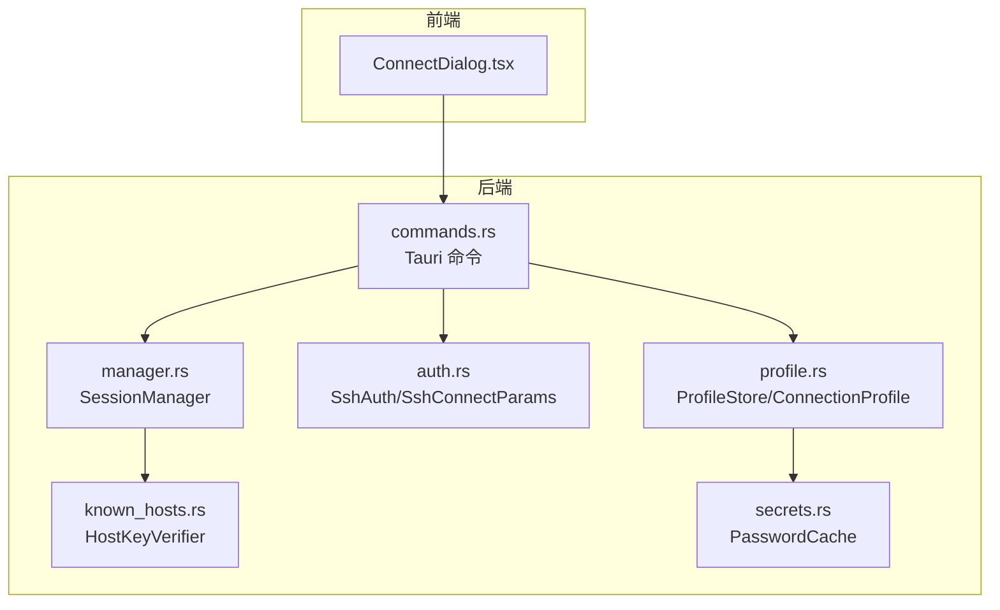
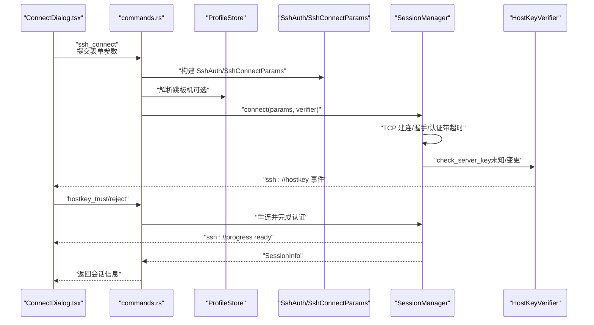
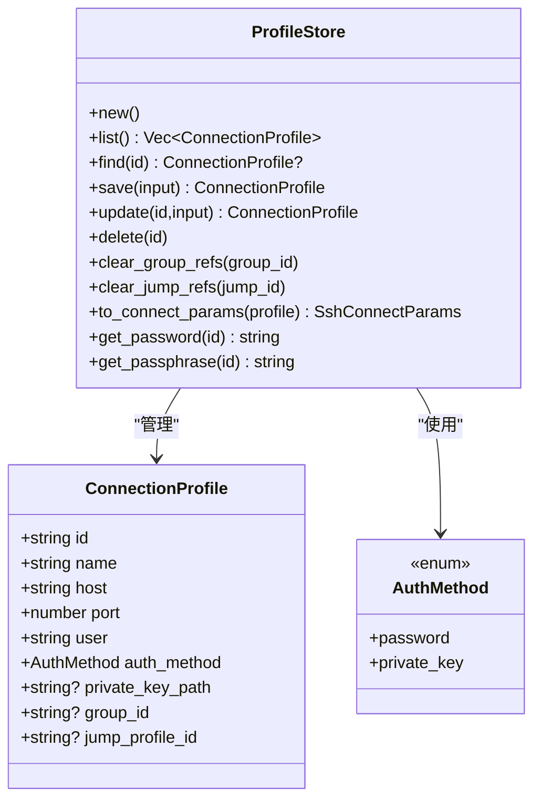
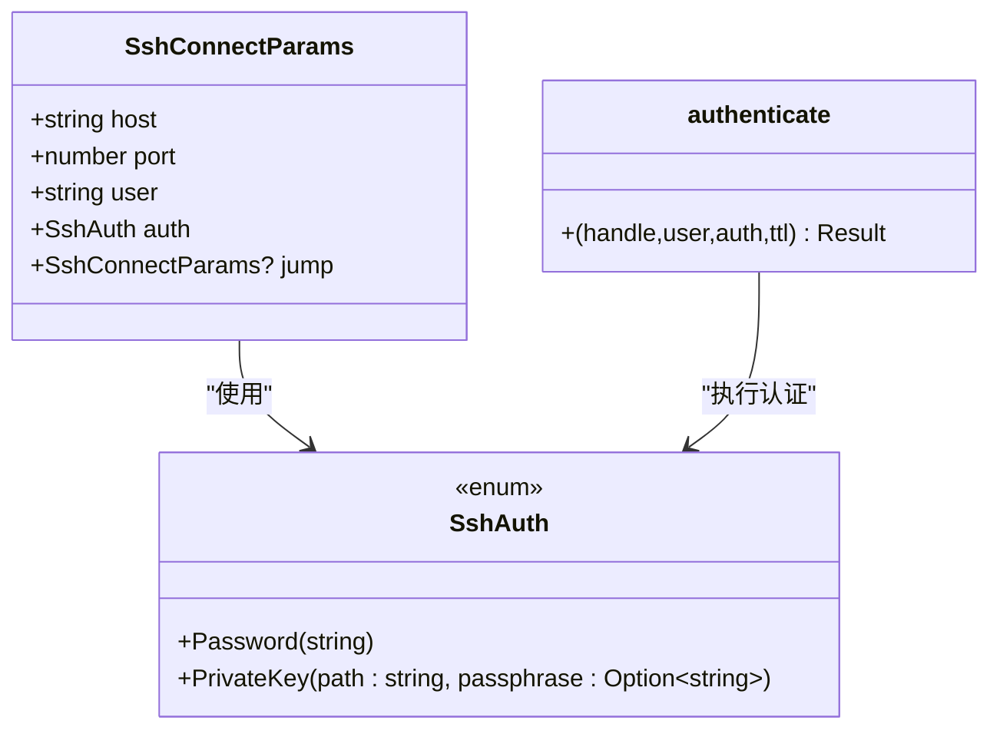
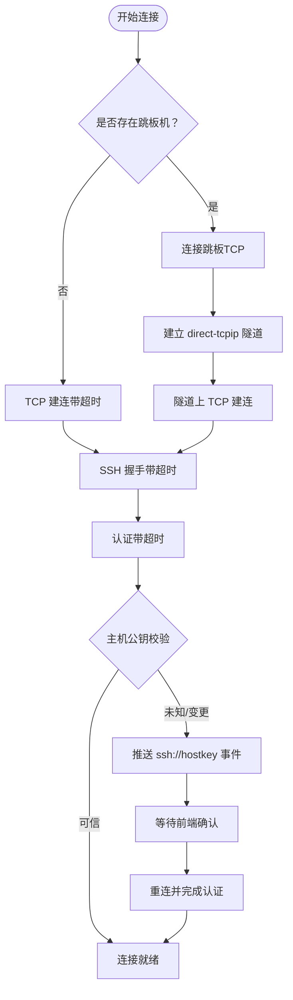
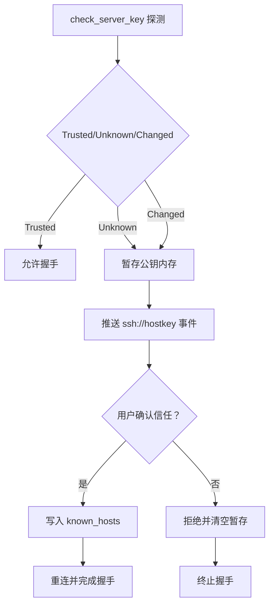
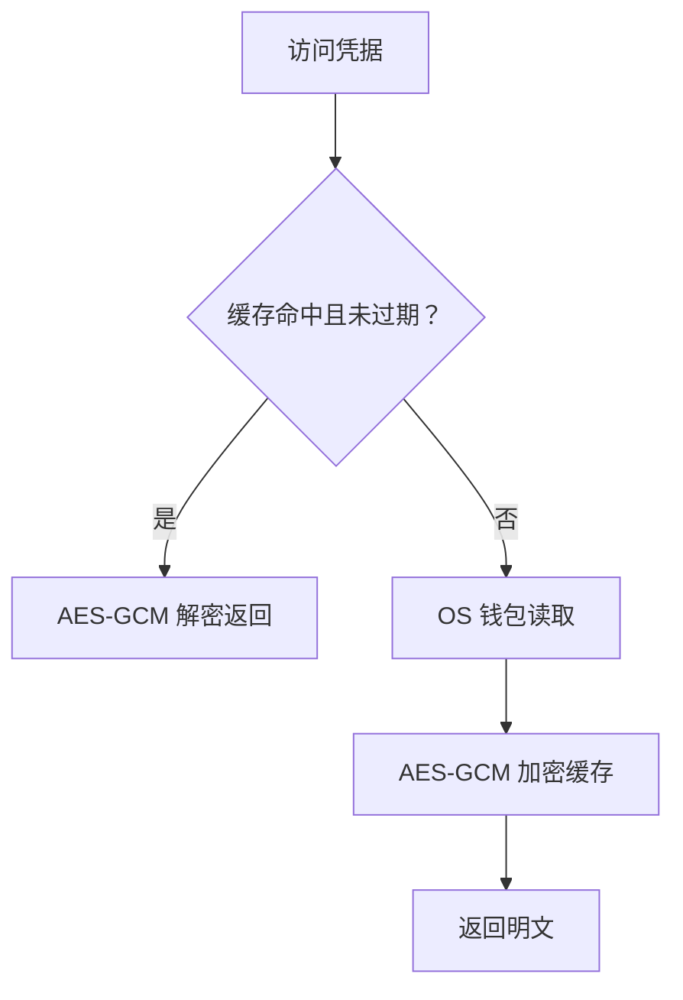
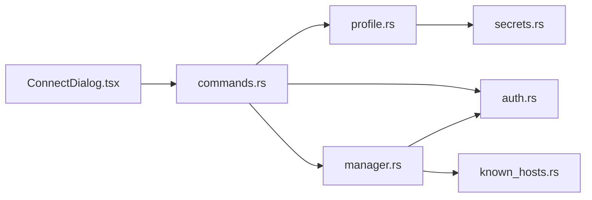

# 连接配置

<cite>
**本文档引用的文件**
- [src-tauri/src/session/profile.rs](file://src-tauri/src/session/profile.rs)
- [src-tauri/src/session/groups.rs](file://src-tauri/src/session/groups.rs)
- [src-tauri/src/session/auth.rs](file://src-tauri/src/session/auth.rs)
- [src-tauri/src/session/manager.rs](file://src-tauri/src/session/manager.rs)
- [src-tauri/src/session/ssh.rs](file://src-tauri/src/session/ssh.rs)
- [src-tauri/src/session/mod.rs](file://src-tauri/src/session/mod.rs)
- [src-tauri/src/session/known_hosts.rs](file://src-tauri/src/session/known_hosts.rs)
- [src-tauri/src/session/secrets.rs](file://src-tauri/src/session/secrets.rs)
- [src-tauri/src/commands.rs](file://src-tauri/src/commands.rs)
- [src-tauri/src/lib.rs](file://src-tauri/src/lib.rs)
- [src/components/ConnectDialog.tsx](file://src/components/ConnectDialog.tsx)
- [src/types.ts](file://src/types.ts)
- [src-tauri/Cargo.toml](file://src-tauri/Cargo.toml)
</cite>

## 目录
1. [简介](#简介)
2. [项目结构](#项目结构)
3. [核心组件](#核心组件)
4. [架构总览](#架构总览)
5. [详细组件分析](#详细组件分析)
6. [依赖关系分析](#依赖关系分析)
7. [性能考量](#性能考量)
8. [故障排除指南](#故障排除指南)
9. [结论](#结论)
10. [附录](#附录)

## 简介
本指南围绕 SSH 连接配置展开，系统性介绍如何在本项目中进行连接配置的创建、管理与使用。内容涵盖：
- 基本连接参数（主机地址、端口、用户名等）
- 认证方式（密码认证、私钥认证、跳板机设置）
- 连接分组管理与配置模板思路
- 配置验证、测试连接与常见问题排查
- 不同使用场景下的配置建议（开发、生产、多用户）

## 项目结构
后端采用 Rust + Tauri 架构，前端为 React。连接配置主要由后端模块负责：
- 连接配置与凭据存储：ProfileStore（JSON + OS 钥匙串）
- 连接分组：GroupStore（独立持久化）
- 认证与连接参数：SshAuth、SshConnectParams
- 会话管理：SessionManager（持久连接池）
- 前端对话框：ConnectDialog（表单、进度、主机公钥确认）

图表来源
- [src-tauri/src/commands.rs](file://src-tauri/src/commands.rs)
- [src-tauri/src/session/profile.rs](file://src-tauri/src/session/profile.rs)
- [src-tauri/src/session/auth.rs](file://src-tauri/src/session/auth.rs)
- [src-tauri/src/session/manager.rs](file://src-tauri/src/session/manager.rs)
- [src-tauri/src/session/known_hosts.rs](file://src-tauri/src/session/known_hosts.rs)
- [src-tauri/src/session/secrets.rs](file://src-tauri/src/session/secrets.rs)
- [src/components/ConnectDialog.tsx](file://src/components/ConnectDialog.tsx)

章节来源
- [src-tauri/src/lib.rs](file://src-tauri/src/lib.rs)
- [src-tauri/Cargo.toml](file://src-tauri/Cargo.toml)

## 核心组件
- 连接配置模型与存储
  - ConnectionProfile：保存连接元数据（名称、主机、端口、用户、认证方式、分组、跳板机等）
  - ProfileStore：提供增删改查、凭据存取、跳板机解析、持久化
- 认证参数与流程
  - SshAuth：密码或私钥（含可选 passphrase）
  - SshConnectParams：连接参数（主机、端口、用户、认证、跳板）
  - authenticate：带超时的认证流程
- 会话管理
  - SessionManager：建立持久连接、进度事件、代理跳板、断开
- 主机公钥校验
  - HostKeyVerifier：探测未知/变更公钥并暂存，前端确认后落盘
- 凭据缓存
  - PasswordCache：内存加密缓存，减少钥匙串频繁访问

章节来源
- [src-tauri/src/session/profile.rs](file://src-tauri/src/session/profile.rs)
- [src-tauri/src/session/auth.rs](file://src-tauri/src/session/auth.rs)
- [src-tauri/src/session/manager.rs](file://src-tauri/src/session/manager.rs)
- [src-tauri/src/session/known_hosts.rs](file://src-tauri/src/session/known_hosts.rs)
- [src-tauri/src/session/secrets.rs](file://src-tauri/src/session/secrets.rs)

## 架构总览
下图展示了从前端表单到后端认证与会话建立的关键交互。

图表来源
- [src/components/ConnectDialog.tsx](file://src/components/ConnectDialog.tsx)
- [src-tauri/src/commands.rs](file://src-tauri/src/commands.rs)
- [src-tauri/src/session/profile.rs](file://src-tauri/src/session/profile.rs)
- [src-tauri/src/session/auth.rs](file://src-tauri/src/session/auth.rs)
- [src-tauri/src/session/manager.rs](file://src-tauri/src/session/manager.rs)
- [src-tauri/src/session/known_hosts.rs](file://src-tauri/src/session/known_hosts.rs)

## 详细组件分析

### 连接配置模型与存储（ProfileStore）
- 数据模型
  - ConnectionProfile：包含 id、name、host、port、user、auth_method、private_key_path、group_id、jump_profile_id
  - ProfileInput：保存/更新时的输入封装
- 凭据存储策略
  - 元数据：保存到本地 JSON（用户可编辑）
  - 凭据：密码与私钥 passphrase 存入 OS 钥匙串（不落明文）
- 跳板机支持
  - 单跳 ProxyJump：引用另一条已保存配置的 id
  - 自检：禁止自引用与嵌套跳板
- 更新与迁移
  - 切换认证方式时清理旧凭据并写入新凭据
  - 删除配置时清理钥匙串与缓存

图表来源
- [src-tauri/src/session/profile.rs](file://src-tauri/src/session/profile.rs)

章节来源
- [src-tauri/src/session/profile.rs](file://src-tauri/src/session/profile.rs)

### 认证方式与连接参数（SshAuth/SshConnectParams）
- 认证方式
  - Password：基于密码认证
  - PrivateKey：基于本地私钥文件，可选 passphrase
- 连接参数
  - 包含 host、port、user、auth、jump（可选）
- 认证流程
  - authenticate：统一认证入口，带超时控制
  - 支持 RSA 哈希算法协商与公钥认证

图表来源
- [src-tauri/src/session/auth.rs](file://src-tauri/src/session/auth.rs)

章节来源
- [src-tauri/src/session/auth.rs](file://src-tauri/src/session/auth.rs)

### 会话管理与跳板机（SessionManager）
- 功能要点
  - 建连与认证：统一超时控制（TCP、握手、认证）
  - 进度事件：ssh://progress（resolve/handshake/auth/jump/ready）
  - 跳板机：先连跳板，再通过 direct-tcpip 隧道连接目标
  - 会话池：多组件共享同一连接句柄
- 超时与错误
  - TCP 建连超时、握手超时、认证超时
  - 主机公钥未知/变更时中断握手并推送前端确认

图表来源
- [src-tauri/src/session/manager.rs](file://src-tauri/src/session/manager.rs)
- [src-tauri/src/session/known_hosts.rs](file://src-tauri/src/session/known_hosts.rs)

章节来源
- [src-tauri/src/session/manager.rs](file://src-tauri/src/session/manager.rs)

### 主机公钥校验与确认（HostKeyVerifier）
- 校验三态
  - Trusted：已记录且匹配
  - Unknown：首次连接（TOFU，需用户确认）
  - Changed：公钥变更或解析失败（疑似中间人攻击）
- 流程
  - 探测到非 Trusted 时暂存于内存，返回握手失败
  - 前端弹窗显示指纹与算法，用户确认后落盘 known_hosts
  - 支持删除特定主机记录

图表来源
- [src-tauri/src/session/known_hosts.rs](file://src-tauri/src/session/known_hosts.rs)
- [src-tauri/src/session/mod.rs](file://src-tauri/src/session/mod.rs)

章节来源
- [src-tauri/src/session/known_hosts.rs](file://src-tauri/src/session/known_hosts.rs)

### 凭据缓存与安全（PasswordCache/keyring）
- 安全策略
  - 凭据不落盘明文，仅存 OS 钥匙串
  - 首次读取后加密缓存于进程内存（24h 有效）
  - 机器绑定密钥派生，提升抗转储能力
- 使用场景
  - 重复连接同一配置时命中缓存，避免频繁钥匙串访问
  - 应用退出即清空，满足“关闭即清空”的安全要求

图表来源
- [src-tauri/src/session/secrets.rs](file://src-tauri/src/session/secrets.rs)
- [src-tauri/src/session/profile.rs](file://src-tauri/src/session/profile.rs)

章节来源
- [src-tauri/src/session/secrets.rs](file://src-tauri/src/session/secrets.rs)
- [src-tauri/src/session/profile.rs](file://src-tauri/src/session/profile.rs)

### 前端连接对话框（ConnectDialog）
- 表单字段
  - 主机、端口、用户、认证方式（密码/私钥）、私钥口令、分组、跳板机、保存为配置
- 连接流程
  - 提交后触发 ssh_connect，监听 ssh://progress 事件展示阶段
  - 首次连接或公钥变更时弹出 ssh://hostkey 确认
- 保存行为
  - 可选保存为配置（凭据写入 OS 钱包，元数据写入 JSON）

章节来源
- [src/components/ConnectDialog.tsx](file://src/components/ConnectDialog.tsx)
- [src/types.ts](file://src/types.ts)

## 依赖关系分析
- 模块耦合
  - commands.rs 作为薄封装，协调 ProfileStore、SessionManager、HostKeyVerifier
  - ProfileStore 依赖 keyring 与内存缓存，解析跳板机与认证参数
  - SessionManager 依赖 russh 客户端、HostKeyVerifier、ForwardRegistry
- 外部依赖
  - russh、russh-sftp、keyring、dirs、tokio、uuid、serde 等

图表来源
- [src-tauri/src/commands.rs](file://src-tauri/src/commands.rs)
- [src-tauri/src/session/profile.rs](file://src-tauri/src/session/profile.rs)
- [src-tauri/src/session/auth.rs](file://src-tauri/src/session/auth.rs)
- [src-tauri/src/session/manager.rs](file://src-tauri/src/session/manager.rs)
- [src-tauri/src/session/known_hosts.rs](file://src-tauri/src/session/known_hosts.rs)
- [src-tauri/src/session/secrets.rs](file://src-tauri/src/session/secrets.rs)
- [src/components/ConnectDialog.tsx](file://src/components/ConnectDialog.tsx)

章节来源
- [src-tauri/Cargo.toml](file://src-tauri/Cargo.toml)

## 性能考量
- 连接超时
  - TCP 建连、SSH 握手、认证均设置合理超时，避免长时间阻塞
- 凭据访问优化
  - 内存加密缓存减少钥匙串访问频率，降低交互延迟
- 会话复用
  - 终端、SFTP、端口转发共享同一连接句柄，降低资源消耗

## 故障排除指南
- 连接超时
  - TCP 建连超时：检查网络连通性与防火墙
  - 握手/认证超时：检查服务器负载与网络质量
- 主机公钥问题
  - 未知公钥：首次连接正常，确认指纹后信任
  - 公钥变更：疑似中间人攻击，确认服务器变更后再信任
- 认证失败
  - 密码认证：检查用户名与密码
  - 私钥认证：确认私钥路径与口令正确，必要时重新生成公钥
- 跳板机错误
  - 自引用或嵌套跳板：修正为单跳引用
- 前端提示
  - 监听 ssh://progress 与 ssh://hostkey 事件，按提示操作

章节来源
- [src-tauri/src/session/manager.rs](file://src-tauri/src/session/manager.rs)
- [src-tauri/src/session/known_hosts.rs](file://src-tauri/src/session/known_hosts.rs)
- [src-tauri/src/session/auth.rs](file://src-tauri/src/session/auth.rs)

## 结论
本项目提供了完整的 SSH 连接配置与管理能力：安全的凭据存储、灵活的认证方式、可靠的会话复用与完善的主机公钥校验。通过 ProfileStore 与 GroupStore 实现配置与分组管理，结合前端 ConnectDialog 提供直观的配置与连接体验。建议在不同场景下遵循安全最佳实践，并利用内置的验证与故障排除机制保障稳定性。

## 附录

### 基本参数与认证配置清单
- 基本参数
  - 主机地址、端口、用户名
- 认证方式
  - 密码认证：填写密码
  - 私钥认证：选择私钥文件，可选 passphrase
- 跳板机设置
  - 选择另一条已保存配置作为跳板（单跳）
- 分组管理
  - 为配置设置分组以便组织与查找

章节来源
- [src-tauri/src/session/profile.rs](file://src-tauri/src/session/profile.rs)
- [src-tauri/src/session/groups.rs](file://src-tauri/src/session/groups.rs)
- [src/components/ConnectDialog.tsx](file://src/components/ConnectDialog.tsx)

### 配置模板与继承机制
- 模板思路
  - 使用分组与跳板机实现“模板化”复用：将通用配置放入分组，通过跳板机统一出口
- 继承机制
  - 更新配置时可选择保留凭据（密码/私钥口令留空），实现“部分覆盖”
- 注意事项
  - 跳板机必须为单跳，避免循环与嵌套

章节来源
- [src-tauri/src/session/profile.rs](file://src-tauri/src/session/profile.rs)
- [src-tauri/src/commands.rs](file://src-tauri/src/commands.rs)

### 使用场景示例
- 开发环境
  - 使用密码认证或本地私钥认证；可设置跳板机统一出口
- 生产环境
  - 优先使用私钥认证与强口令；严格校验主机公钥；最小权限与审计
- 多用户环境
  - 为不同用户分别保存配置；利用分组隔离；谨慎共享凭据

章节来源
- [src-tauri/src/session/profile.rs](file://src-tauri/src/session/profile.rs)
- [src-tauri/src/session/known_hosts.rs](file://src-tauri/src/session/known_hosts.rs)

### 验证与测试连接
- 一次性命令执行
  - 使用 connect_and_exec 执行单条命令，验证连通性与认证
- 进度与事件
  - 监听 ssh://progress 与 ssh://hostkey，观察连接阶段与公钥状态
- 会话复用
  - 建立持久会话后，终端、SFTP、转发等功能复用同一连接

章节来源
- [src-tauri/src/session/ssh.rs](file://src-tauri/src/session/ssh.rs)
- [src-tauri/src/commands.rs](file://src-tauri/src/commands.rs)
- [src/components/ConnectDialog.tsx](file://src/components/ConnectDialog.tsx)