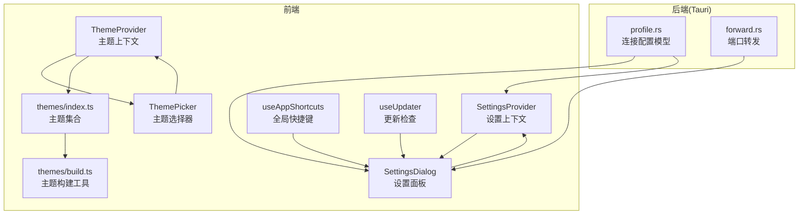
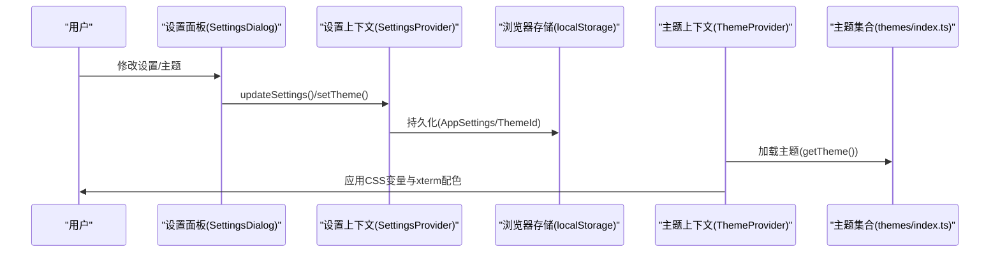
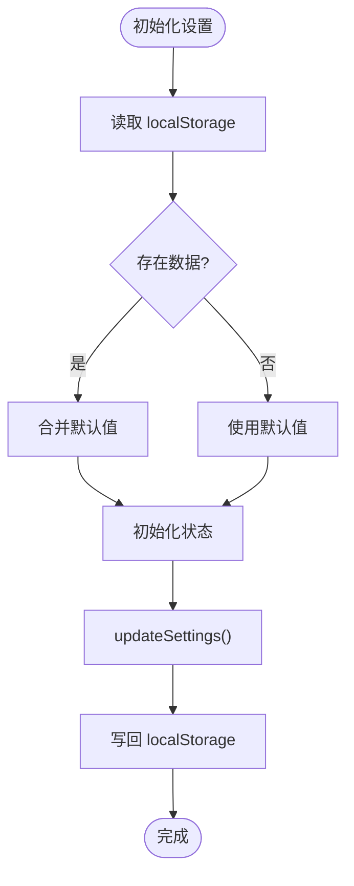
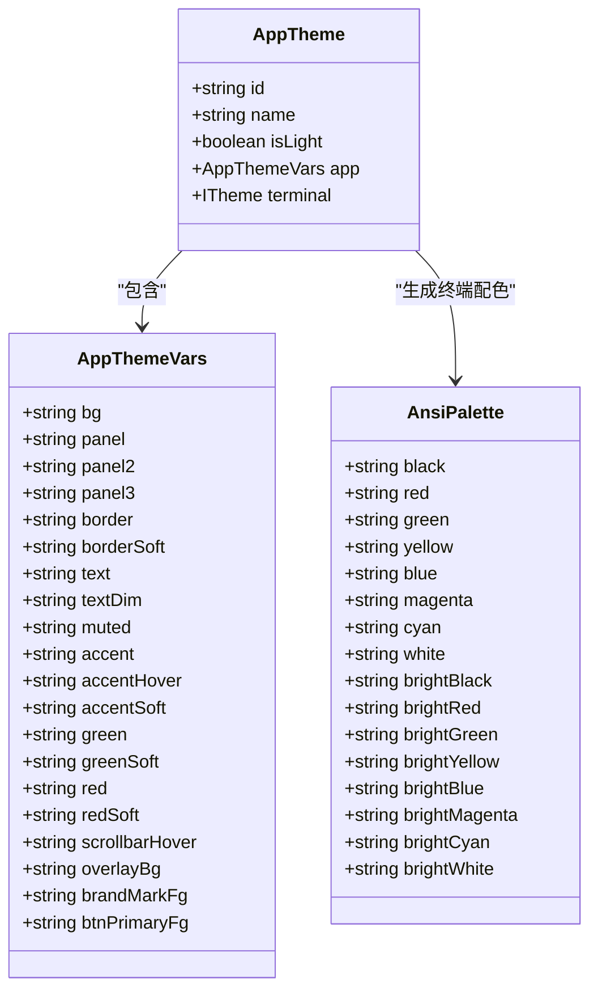
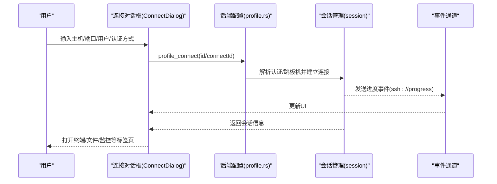
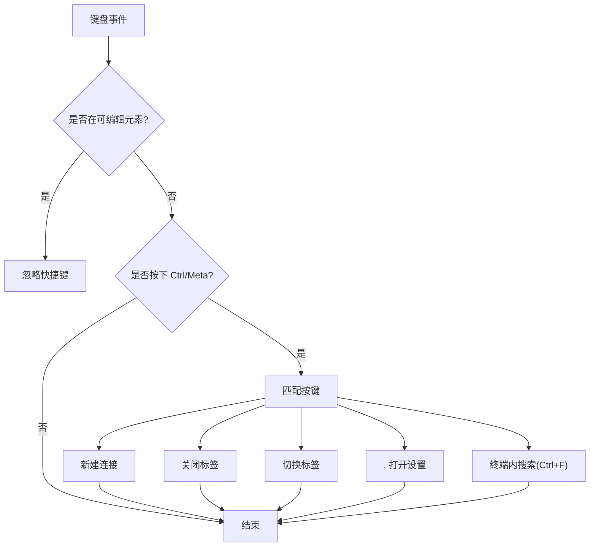
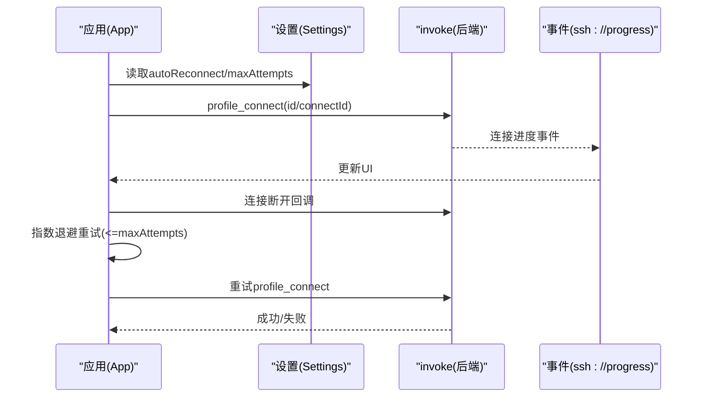
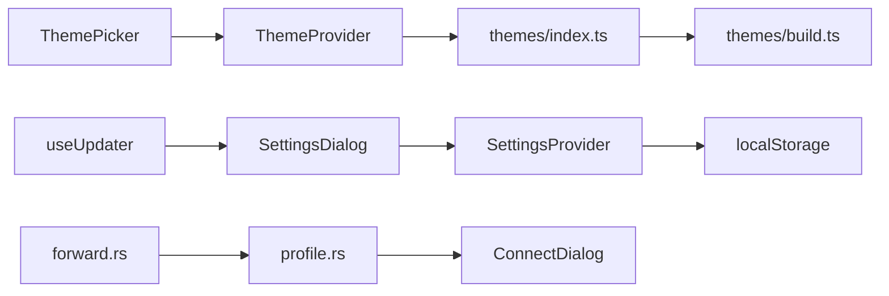

# 配置与设置

<cite>
**本文档引用的文件**
- [SettingsProvider.tsx](file://src/settings/SettingsProvider.tsx)
- [types.ts](file://src/settings/types.ts)
- [SettingsDialog.tsx](file://src/components/SettingsDialog.tsx)
- [ThemeProvider.tsx](file://src/theme/ThemeProvider.tsx)
- [themes/index.ts](file://src/themes/index.ts)
- [themes/types.ts](file://src/themes/types.ts)
- [themes/build.ts](file://src/themes/build.ts)
- [ThemePicker.tsx](file://src/components/ThemePicker.tsx)
- [useAppShortcuts.ts](file://src/hooks/useAppShortcuts.ts)
- [useUpdater.ts](file://src/hooks/useUpdater.ts)
- [tauri.conf.json](file://src-tauri/tauri.conf.json)
- [profile.rs](file://src-tauri/src/session/profile.rs)
- [forward.rs](file://src-tauri/src/session/forward.rs)
- [useWorkspaceRestore.ts](file://src/hooks/useWorkspaceRestore.ts)
- [ConnectDialog.tsx](file://src/components/ConnectDialog.tsx)
- [App.tsx](file://src/App.tsx)
</cite>

## 目录
1. [简介](#简介)
2. [项目结构](#项目结构)
3. [核心组件](#核心组件)
4. [架构总览](#架构总览)
5. [详细组件分析](#详细组件分析)
6. [依赖关系分析](#依赖关系分析)
7. [性能考量](#性能考量)
8. [故障排除指南](#故障排除指南)
9. [结论](#结论)
10. [附录](#附录)

## 简介
本指南系统性介绍应用的配置与设置体系，覆盖以下方面：
- 应用设置（终端字体、字号、行高、光标样式、自动重连、X11 转发、更新检查等）
- 连接配置（主机、端口、认证方式、跳板机等）
- 主题系统（内置主题、CSS 变量注入、xterm 终端配色）
- 快捷键配置（全局快捷键与终端内搜索）
- 配置存储位置、格式与优先级规则
- 配置迁移、备份与恢复
- 故障排除与最佳实践

## 项目结构
配置与设置相关代码主要分布在前端 React 层与 Tauri 后端层：
- 前端设置与主题：SettingsProvider、SettingsDialog、ThemeProvider、ThemePicker、useAppShortcuts、useUpdater
- 主题资源：themes/index.ts、themes/types.ts、themes/build.ts
- 连接配置：ConnectDialog、profile.rs（后端）
- 工作区与配置持久化：useWorkspaceRestore、localStorage（前端）、Tauri 命令（后端）

图表来源
- [SettingsProvider.tsx:1-80](file://src/settings/SettingsProvider.tsx#L1-80)
- [SettingsDialog.tsx:1-242](file://src/components/SettingsDialog.tsx#L1-242)
- [ThemeProvider.tsx:1-108](file://src/theme/ThemeProvider.tsx#L1-108)
- [themes/index.ts:1-800](file://src/themes/index.ts#L1-800)
- [themes/build.ts:1-85](file://src/themes/build.ts#L1-85)
- [ThemePicker.tsx:1-85](file://src/components/ThemePicker.tsx#L1-85)
- [useAppShortcuts.ts:1-61](file://src/hooks/useAppShortcuts.ts#L1-61)
- [useUpdater.ts:1-56](file://src/hooks/useUpdater.ts#L1-56)
- [profile.rs:1-45](file://src-tauri/src/session/profile.rs#L1-45)
- [forward.rs:70-213](file://src-tauri/src/session/forward.rs#L70-213)

章节来源
- [SettingsProvider.tsx:1-80](file://src/settings/SettingsProvider.tsx#L1-80)
- [SettingsDialog.tsx:1-242](file://src/components/SettingsDialog.tsx#L1-242)
- [ThemeProvider.tsx:1-108](file://src/theme/ThemeProvider.tsx#L1-108)
- [themes/index.ts:1-800](file://src/themes/index.ts#L1-800)
- [themes/build.ts:1-85](file://src/themes/build.ts#L1-85)
- [ThemePicker.tsx:1-85](file://src/components/ThemePicker.tsx#L1-85)
- [useAppShortcuts.ts:1-61](file://src/hooks/useAppShortcuts.ts#L1-61)
- [useUpdater.ts:1-56](file://src/hooks/useUpdater.ts#L1-56)
- [profile.rs:1-45](file://src-tauri/src/session/profile.rs#L1-45)
- [forward.rs:70-213](file://src-tauri/src/session/forward.rs#L70-213)

## 核心组件
- 应用设置（localStorage 持久化）
  - 存储键名：simpl-ssh-settings
  - 默认值：包含字体、字号、行高、光标样式、自动重连、最大重连次数、X11 转发、更新检查等
  - 提供更新与重置接口
- 主题系统（localStorage 持久化）
  - 存储键名：simpl-ssh-theme
  - 默认主题：深墨琥珀（ink-amber）
  - 支持 20+ 内置主题，含 ANSI 调色板与 xterm 终端配色
- 连接配置（后端模型）
  - 认证方式：密码、私钥
  - 跳板机：单跳限制，禁止自引用与嵌套
  - 凭据安全：密码与私钥口令存储于系统钥匙串，不落盘
- 快捷键
  - 全局快捷键：新建连接、关闭标签、切换标签、打开设置、命令面板
  - 终端内搜索：Ctrl+F（终端焦点时拦截）
- 更新检查
  - 启动时可静默检查，或手动检查
  - 支持下载安装与重启

章节来源
- [types.ts:1-48](file://src/settings/types.ts#L1-48)
- [SettingsProvider.tsx:1-80](file://src/settings/SettingsProvider.tsx#L1-80)
- [ThemeProvider.tsx:1-108](file://src/theme/ThemeProvider.tsx#L1-108)
- [themes/types.ts:1-63](file://src/themes/types.ts#L1-63)
- [themes/index.ts:409-805](file://src/themes/index.ts#L409-805)
- [profile.rs:21-45](file://src-tauri/src/session/profile.rs#L21-45)
- [useAppShortcuts.ts:1-61](file://src/hooks/useAppShortcuts.ts#L1-61)
- [useUpdater.ts:1-56](file://src/hooks/useUpdater.ts#L1-56)

## 架构总览
应用设置与主题通过 React Context 注入到 UI；连接配置由前端表单收集并通过 Tauri 命令传递给后端；后端负责安全存储凭据、解析跳板机、执行连接与转发。

图表来源
- [SettingsDialog.tsx:1-242](file://src/components/SettingsDialog.tsx#L1-242)
- [SettingsProvider.tsx:1-80](file://src/settings/SettingsProvider.tsx#L1-80)
- [ThemeProvider.tsx:1-108](file://src/theme/ThemeProvider.tsx#L1-108)
- [themes/index.ts:409-805](file://src/themes/index.ts#L409-805)

## 详细组件分析

### 应用设置与持久化
- 数据结构
  - 终端字体、字号(px)、行高、光标样式(bar/block/underline)、光标闪烁
  - 自动重连、最大重连次数、启用 X11 转发、启动时检查更新
- 存储与加载
  - 读取顺序：localStorage -> 合并默认值 -> 初始化状态
  - 更新策略：局部 patch 合并后写回 localStorage
  - 错误处理：异常时忽略，保持默认值
- 使用方式
  - SettingsProvider 提供上下文，SettingsDialog 渲染并提交修改
  - App 在启动时根据设置决定是否检查更新

图表来源
- [SettingsProvider.tsx:25-35](file://src/settings/SettingsProvider.tsx#L25-35)
- [SettingsProvider.tsx:49-59](file://src/settings/SettingsProvider.tsx#L49-59)
- [types.ts:28-38](file://src/settings/types.ts#L28-38)

章节来源
- [types.ts:1-48](file://src/settings/types.ts#L1-48)
- [SettingsProvider.tsx:1-80](file://src/settings/SettingsProvider.tsx#L1-80)
- [SettingsDialog.tsx:1-242](file://src/components/SettingsDialog.tsx#L1-242)
- [App.tsx:128-134](file://src/App.tsx#L128-134)

### 主题系统与自定义
- 主题结构
  - AppTheme 包含 GUI CSS 变量与 xterm ITheme
  - ANSI 调色板与 16 色映射
- 主题构建
  - buildTerminalTheme：基于背景、前景、游标、强调色与 ANSI 调色板生成 xterm 配色
  - buildAppVars：从基础色派生 accent、soft 色、overlay、滚动条 hover 等
  - makeTheme：组合 GUI 与终端主题
- 主题应用
  - ThemeProvider 将主题 CSS 变量写入 document.documentElement
  - ThemePicker 展示主题网格，点击切换并持久化
- 内置主题
  - 默认深墨琥珀，另有 Dracula、Nord、One Dark、Gruvbox、Solarized、Monokai、Tokyo Night、Catppuccin、Ayu、Everforest、Rosé Pine、GitHub、Material、Cobalt2、Snazzy、High Contrast 等

图表来源
- [themes/types.ts:4-59](file://src/themes/types.ts#L4-59)
- [themes/build.ts:13-84](file://src/themes/build.ts#L13-84)
- [themes/index.ts:409-805](file://src/themes/index.ts#L409-805)

章节来源
- [ThemeProvider.tsx:1-108](file://src/theme/ThemeProvider.tsx#L1-108)
- [ThemePicker.tsx:1-85](file://src/components/ThemePicker.tsx#L1-85)
- [themes/types.ts:1-63](file://src/themes/types.ts#L1-63)
- [themes/build.ts:1-85](file://src/themes/build.ts#L1-85)
- [themes/index.ts:1-800](file://src/themes/index.ts#L1-800)

### 连接配置与认证
- 前端表单字段
  - 主机、端口、用户、认证方式（密码/私钥）、跳板机（可选）
  - 保存为配置项时，密码与私钥口令进入系统钥匙串
- 后端模型
  - AuthMethod：password/private_key
  - ProfileInput：封装名称、主机、端口、用户、认证方式、可选密码、私钥路径、口令、分组、跳板机 ID
  - 跳板机解析：单跳限制，禁止自引用与嵌套
- 安全性
  - 密码与私钥口令不落盘，仅在内存缓存中短期持有
- 连接流程
  - ConnectDialog 校验表单，调用 ssh_connect 或 profile_connect
  - 进度事件通过事件通道推送，主机密钥确认对话框处理

图表来源
- [ConnectDialog.tsx:147-312](file://src/components/ConnectDialog.tsx#L147-312)
- [profile.rs:21-45](file://src-tauri/src/session/profile.rs#L21-45)
- [profile.rs:287-314](file://src-tauri/src/session/profile.rs#L287-314)
- [App.tsx:136-149](file://src/App.tsx#L136-149)

章节来源
- [ConnectDialog.tsx:263-312](file://src/components/ConnectDialog.tsx#L263-312)
- [profile.rs:1-45](file://src-tauri/src/session/profile.rs#L1-45)
- [profile.rs:201-314](file://src-tauri/src/session/profile.rs#L201-314)
- [App.tsx:136-160](file://src/App.tsx#L136-160)

### 快捷键与命令面板
- 全局快捷键（终端外）
  - Ctrl+N：新建连接
  - Ctrl+W：关闭当前标签
  - Ctrl+Tab：下一个标签（Shift+Ctrl+Tab：上一个）
  - Ctrl+,：打开设置
  - Ctrl+F：终端内搜索（终端焦点时拦截）
- 命令面板
  - Ctrl+K/P 打开命令面板，支持连接、标签、内置命令等

图表来源
- [useAppShortcuts.ts:20-60](file://src/hooks/useAppShortcuts.ts#L20-60)
- [SettingsDialog.tsx:200-223](file://src/components/SettingsDialog.tsx#L200-223)

章节来源
- [useAppShortcuts.ts:1-61](file://src/hooks/useAppShortcuts.ts#L1-61)
- [SettingsDialog.tsx:1-242](file://src/components/SettingsDialog.tsx#L1-242)

### 更新检查与自动重连
- 更新检查
  - 启动时可静默检查，或手动点击“立即检查更新”
  - 下载安装后可选择重启
- 自动重连
  - 断线后按已保存连接的 profile 自动重连，指数退避，最多尝试 settings.maxReconnectAttempts 次
  - 主机密钥变更导致的错误需要手动确认

图表来源
- [useUpdater.ts:12-55](file://src/hooks/useUpdater.ts#L12-55)
- [App.tsx:338-408](file://src/App.tsx#L338-408)
- [App.tsx:128-134](file://src/App.tsx#L128-134)

章节来源
- [useUpdater.ts:1-56](file://src/hooks/useUpdater.ts#L1-56)
- [App.tsx:338-408](file://src/App.tsx#L338-408)
- [App.tsx:128-134](file://src/App.tsx#L128-134)

## 依赖关系分析
- 前端依赖
  - SettingsProvider 依赖 localStorage 与 DEFAULT_SETTINGS
  - ThemeProvider 依赖 themes/index.ts 与 localStorage
  - SettingsDialog 依赖 useSettings 与 useUpdater
  - ThemePicker 依赖 useTheme
  - useAppShortcuts 依赖全局键盘事件
- 后端依赖
  - profile.rs 定义连接配置模型与跳板机解析
  - forward.rs 管理端口转发注册与状态
- 配置存储
  - 前端：localStorage（设置、主题、工作区快照）
  - 后端：JSON 文件（连接配置元数据），系统钥匙串（密码/口令）

图表来源
- [SettingsDialog.tsx:1-242](file://src/components/SettingsDialog.tsx#L1-242)
- [SettingsProvider.tsx:1-80](file://src/settings/SettingsProvider.tsx#L1-80)
- [ThemeProvider.tsx:1-108](file://src/theme/ThemeProvider.tsx#L1-108)
- [themes/index.ts:1-800](file://src/themes/index.ts#L1-800)
- [themes/build.ts:1-85](file://src/themes/build.ts#L1-85)
- [ThemePicker.tsx:1-85](file://src/components/ThemePicker.tsx#L1-85)
- [useUpdater.ts:1-56](file://src/hooks/useUpdater.ts#L1-56)
- [profile.rs:1-45](file://src-tauri/src/session/profile.rs#L1-45)
- [forward.rs:70-213](file://src-tauri/src/session/forward.rs#L70-213)

章节来源
- [SettingsDialog.tsx:1-242](file://src/components/SettingsDialog.tsx#L1-242)
- [SettingsProvider.tsx:1-80](file://src/settings/SettingsProvider.tsx#L1-80)
- [ThemeProvider.tsx:1-108](file://src/theme/ThemeProvider.tsx#L1-108)
- [themes/index.ts:1-800](file://src/themes/index.ts#L1-800)
- [themes/build.ts:1-85](file://src/themes/build.ts#L1-85)
- [ThemePicker.tsx:1-85](file://src/components/ThemePicker.tsx#L1-85)
- [useUpdater.ts:1-56](file://src/hooks/useUpdater.ts#L1-56)
- [profile.rs:1-45](file://src-tauri/src/session/profile.rs#L1-45)
- [forward.rs:70-213](file://src-tauri/src/session/forward.rs#L70-213)

## 性能考量
- 设置与主题更新
  - 采用局部 patch 合并，减少不必要的重渲染
  - 主题切换仅写入 CSS 变量，避免全量重绘
- 自动重连
  - 指数退避上限控制重试频率，避免频繁连接
- 工作区快照
  - tabs 变化后 500ms 防抖保存，降低 I/O 压力

## 故障排除指南
- 设置/主题未生效
  - 检查 localStorage 是否可用（隐私模式可能禁用）
  - 确认 DEFAULT_SETTINGS 与合并逻辑未被破坏
- 连接失败
  - 核对主机、端口、用户与认证方式
  - 若提示主机密钥变更，需在 HostKeyDialog 中确认信任
  - 检查跳板机配置是否有效且非自引用/嵌套
- 自动重连无效
  - 确认已通过“已保存连接”建立会话
  - 检查 maxReconnectAttempts 与网络稳定性
- 更新检查失败
  - 检查网络与 GitHub Release 链接可达性
  - 查看返回的错误信息并重试

章节来源
- [SettingsProvider.tsx:25-35](file://src/settings/SettingsProvider.tsx#L25-35)
- [App.tsx:390-408](file://src/App.tsx#L390-408)
- [profile.rs:287-314](file://src-tauri/src/session/profile.rs#L287-314)
- [useUpdater.ts:18-51](file://src/hooks/useUpdater.ts#L18-51)

## 结论
本应用通过 React Context 与 localStorage 实现轻量级配置持久化，结合 Tauri 后端的安全凭据存储与连接管理，提供了完整的配置与设置体验。主题系统支持丰富的内置主题与终端配色，连接配置覆盖常用认证方式与跳板机场景，快捷键与更新检查进一步提升效率。遵循本文的最佳实践与故障排除建议，可获得稳定可靠的使用体验。

## 附录

### 配置文件存储位置与格式
- 前端配置
  - 应用设置：localStorage，键名 simpl-ssh-settings，JSON 格式
  - 主题：localStorage，键名 simpl-ssh-theme，字符串主题 ID
  - 工作区快照：通过 Tauri 命令保存，JSON 格式
- 后端配置
  - 连接配置元数据：JSON 文件（名称、主机、端口、用户、认证方式、分组、跳板机 ID 等）
  - 凭据：系统钥匙串（密码、私钥口令），不在磁盘明文存储

章节来源
- [SettingsProvider.tsx:25-35](file://src/settings/SettingsProvider.tsx#L25-35)
- [ThemeProvider.tsx:59-68](file://src/theme/ThemeProvider.tsx#L59-68)
- [useWorkspaceRestore.ts:128-151](file://src/hooks/useWorkspaceRestore.ts#L128-151)
- [profile.rs:1-45](file://src-tauri/src/session/profile.rs#L1-45)

### 配置迁移、备份与恢复
- 备份
  - 应用设置与主题：导出 localStorage 中的键值
  - 连接配置：导出后端 JSON 文件
  - 工作区快照：导出 Tauri 命令返回的快照内容
- 恢复
  - 应用设置与主题：导入对应键值
  - 连接配置：将 JSON 文件内容还原到原位置
  - 工作区快照：调用 workspace_load 并按需重连
- 注意事项
  - 恢复前确保系统钥匙串中的凭据可用
  - 跳板机配置变更可能导致旧快照无法恢复

章节来源
- [useWorkspaceRestore.ts:40-117](file://src/hooks/useWorkspaceRestore.ts#L40-117)
- [profile.rs:201-219](file://src-tauri/src/session/profile.rs#L201-219)

### 最佳实践建议
- 设置
  - 合理设置自动重连次数，避免网络波动导致频繁重试
  - 启用启动时检查更新以及时获取修复与改进
- 连接
  - 优先使用私钥认证并妥善保管口令
  - 跳板机仅使用单跳，避免复杂拓扑带来的风险
- 主题
  - 根据环境光线选择合适主题，减少视觉疲劳
  - 如需自定义，可参考 themes/build.ts 的构建方法扩展主题

章节来源
- [SettingsDialog.tsx:134-172](file://src/components/SettingsDialog.tsx#L134-172)
- [profile.rs:287-314](file://src-tauri/src/session/profile.rs#L287-314)
- [themes/build.ts:13-84](file://src/themes/build.ts#L13-84)