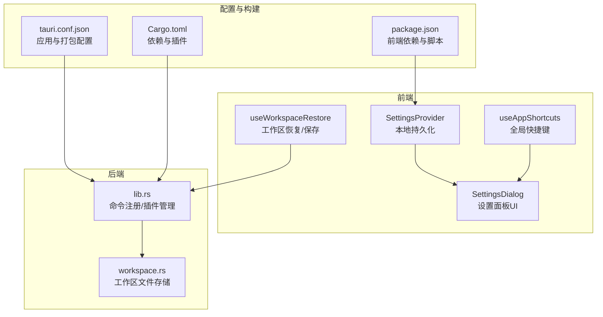
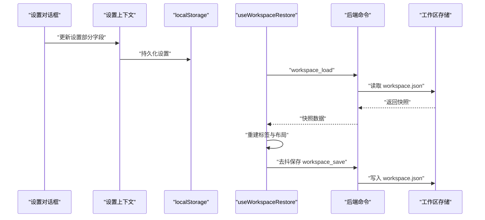
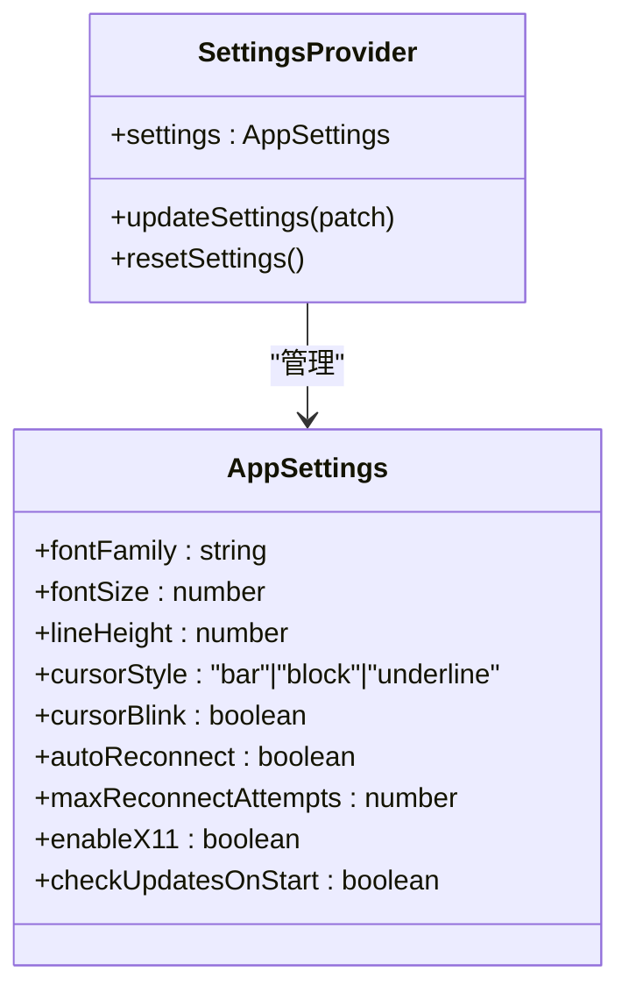
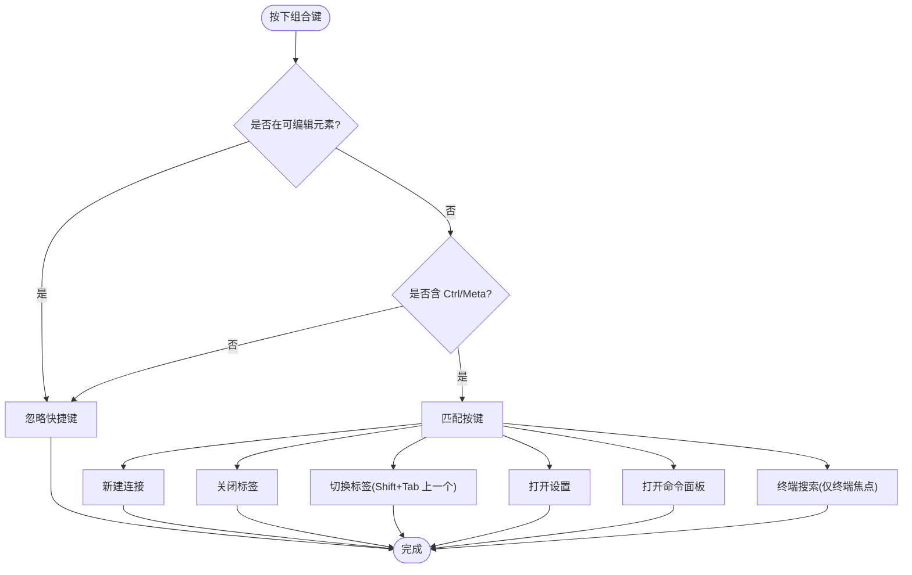
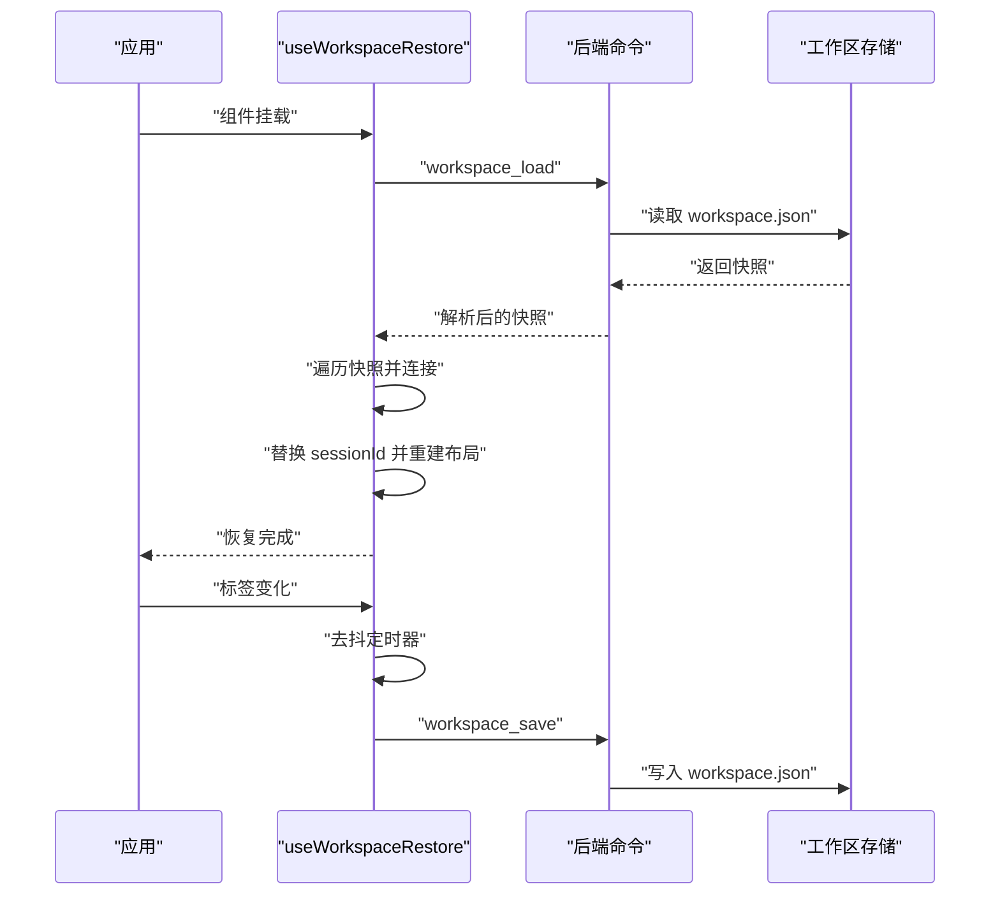
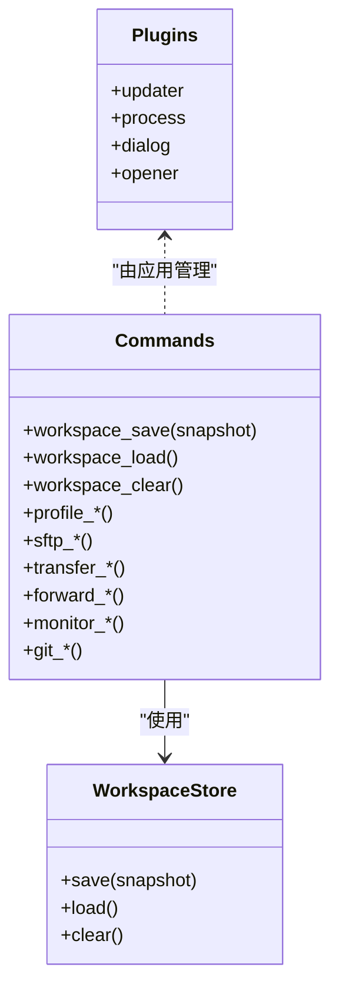
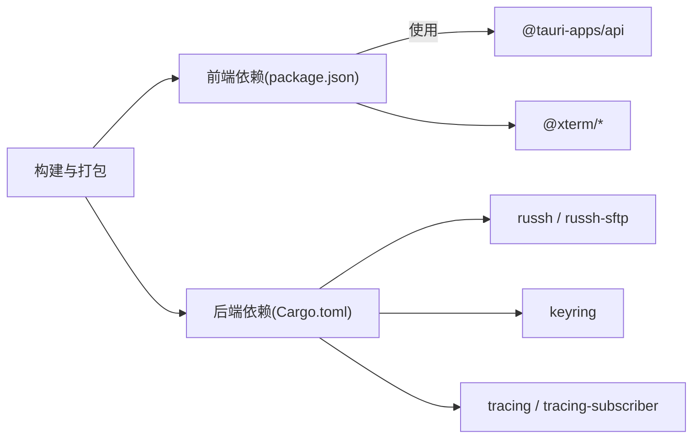

# 高级配置

<cite>
**本文档引用的文件**
- [src/settings/SettingsProvider.tsx](file://src/settings/SettingsProvider.tsx)
- [src/settings/types.ts](file://src/settings/types.ts)
- [src/components/SettingsDialog.tsx](file://src/components/SettingsDialog.tsx)
- [src/hooks/useAppShortcuts.ts](file://src/hooks/useAppShortcuts.ts)
- [src/hooks/useWorkspaceRestore.ts](file://src/hooks/useWorkspaceRestore.ts)
- [src-tauri/src/session/workspace.rs](file://src-tauri/src/session/workspace.rs)
- [src-tauri/src/lib.rs](file://src-tauri/src/lib.rs)
- [src-tauri/tauri.conf.json](file://src-tauri/tauri.conf.json)
- [src-tauri/Cargo.toml](file://src-tauri/Cargo.toml)
- [src/main.tsx](file://src/main.tsx)
- [src/types.ts](file://src/types.ts)
- [package.json](file://package.json)
</cite>

## 目录
1. [简介](#简介)
2. [项目结构](#项目结构)
3. [核心组件](#核心组件)
4. [架构总览](#架构总览)
5. [详细组件分析](#详细组件分析)
6. [依赖关系分析](#依赖关系分析)
7. [性能考量](#性能考量)
8. [故障排查指南](#故障排查指南)
9. [结论](#结论)
10. [附录](#附录)

## 简介
本指南聚焦于应用的高级配置能力，涵盖以下主题：
- 快捷键配置与行为
- 工作区管理与持久化
- 性能调优选项（终端渲染、分屏布局、重连策略）
- 日志与调试（基于环境过滤器）
- 配置文件的高级编辑方法、环境变量与命令行参数
- 批量配置管理、配置模板与同步思路
- 安全性考虑（凭据存储、权限控制、隐私保护）

目标是帮助具备一定技术背景的用户深入掌握应用的可定制性与扩展点。

## 项目结构
应用采用前端（React + Tauri Web）与后端（Rust + Tauri）分层设计，配置相关的关键模块包括：
- 前端设置上下文与对话框：负责用户界面与本地持久化
- 快捷键钩子：全局键盘事件处理
- 工作区持久化：前后端协作保存/恢复标签页与分屏布局
- 后端命令与插件：暴露配置相关的命令与系统能力
- 配置与打包：Tauri 配置、包管理脚本与依赖声明

**图表来源**
- [src/settings/SettingsProvider.tsx:1-80](file://src/settings/SettingsProvider.tsx#L1-L80)
- [src/components/SettingsDialog.tsx:1-242](file://src/components/SettingsDialog.tsx#L1-L242)
- [src/hooks/useAppShortcuts.ts:1-61](file://src/hooks/useAppShortcuts.ts#L1-L61)
- [src/hooks/useWorkspaceRestore.ts:1-178](file://src/hooks/useWorkspaceRestore.ts#L1-L178)
- [src-tauri/src/lib.rs:1-93](file://src-tauri/src/lib.rs#L1-L93)
- [src-tauri/src/session/workspace.rs:1-82](file://src-tauri/src/session/workspace.rs#L1-L82)
- [src-tauri/tauri.conf.json:1-54](file://src-tauri/tauri.conf.json#L1-L54)
- [src-tauri/Cargo.toml:1-50](file://src-tauri/Cargo.toml#L1-L50)
- [package.json:1-53](file://package.json#L1-L53)

**章节来源**
- [src/settings/SettingsProvider.tsx:1-80](file://src/settings/SettingsProvider.tsx#L1-L80)
- [src/components/SettingsDialog.tsx:1-242](file://src/components/SettingsDialog.tsx#L1-L242)
- [src/hooks/useAppShortcuts.ts:1-61](file://src/hooks/useAppShortcuts.ts#L1-L61)
- [src/hooks/useWorkspaceRestore.ts:1-178](file://src/hooks/useWorkspaceRestore.ts#L1-L178)
- [src-tauri/src/lib.rs:1-93](file://src-tauri/src/lib.rs#L1-L93)
- [src-tauri/src/session/workspace.rs:1-82](file://src-tauri/src/session/workspace.rs#L1-L82)
- [src-tauri/tauri.conf.json:1-54](file://src-tauri/tauri.conf.json#L1-L54)
- [src-tauri/Cargo.toml:1-50](file://src-tauri/Cargo.toml#L1-L50)
- [package.json:1-53](file://package.json#L1-L53)

## 核心组件
- 设置上下文与默认值：前端通过上下文提供者集中管理应用设置，并以 localStorage 作为持久化介质；默认值集中定义，便于统一升级与迁移。
- 设置对话框：提供终端外观、连接策略、更新检查等高级选项的可视化配置入口。
- 全局快捷键：在非编辑输入场景下拦截组合键，实现快速操作。
- 工作区持久化：在应用启动时加载快照并尝试恢复会话，在标签变化时去抖保存，确保多标签与分屏布局的连续性。
- 后端命令与插件：暴露工作区保存/加载、连接管理、文件传输、端口转发、系统监控等命令，并集成更新、进程、对话框等插件。

**章节来源**
- [src/settings/SettingsProvider.tsx:1-80](file://src/settings/SettingsProvider.tsx#L1-L80)
- [src/settings/types.ts:1-48](file://src/settings/types.ts#L1-L48)
- [src/components/SettingsDialog.tsx:1-242](file://src/components/SettingsDialog.tsx#L1-L242)
- [src/hooks/useAppShortcuts.ts:1-61](file://src/hooks/useAppShortcuts.ts#L1-L61)
- [src/hooks/useWorkspaceRestore.ts:1-178](file://src/hooks/useWorkspaceRestore.ts#L1-L178)
- [src-tauri/src/lib.rs:1-93](file://src-tauri/src/lib.rs#L1-L93)

## 架构总览
应用的配置与运行时交互如下：

**图表来源**
- [src/components/SettingsDialog.tsx:1-242](file://src/components/SettingsDialog.tsx#L1-L242)
- [src/settings/SettingsProvider.tsx:1-80](file://src/settings/SettingsProvider.tsx#L1-L80)
- [src/hooks/useWorkspaceRestore.ts:1-178](file://src/hooks/useWorkspaceRestore.ts#L1-L178)
- [src-tauri/src/session/workspace.rs:1-82](file://src-tauri/src/session/workspace.rs#L1-L82)

## 详细组件分析

### 组件一：设置上下文与默认值
- 设计要点
  - 使用 React Context 提供设置状态与更新函数
  - 默认值集中定义，初始化时与本地存储合并
  - 更新策略为“部分更新 + 持久化”，保证最小变更
- 数据模型
  - 字体族、字号、行高、光标样式与闪烁、自动重连、最大重连次数、X11 转发、启动时检查更新
- 性能与可靠性
  - 本地存储异常时静默忽略，避免阻塞启动
  - 合并默认值确保新增字段的向后兼容

**图表来源**
- [src/settings/SettingsProvider.tsx:1-80](file://src/settings/SettingsProvider.tsx#L1-L80)
- [src/settings/types.ts:1-48](file://src/settings/types.ts#L1-L48)

**章节来源**
- [src/settings/SettingsProvider.tsx:1-80](file://src/settings/SettingsProvider.tsx#L1-L80)
- [src/settings/types.ts:1-48](file://src/settings/types.ts#L1-L48)

### 组件二：设置对话框与快捷键
- 设置对话框
  - 终端外观：字体选择、字号滑杆、行高滑杆、光标样式与闪烁预览
  - 连接策略：自动重连开关与最大重连次数滑杆（受控禁用）
  - 更新检查：启动时检查开关与手动检查按钮
  - 快捷键提示：列出常用组合键及其用途
- 全局快捷键
  - 在非可编辑元素中拦截组合键，避免与终端内部快捷键冲突
  - 支持新建连接、关闭标签、切换标签、打开设置、打开命令面板等

**图表来源**
- [src/hooks/useAppShortcuts.ts:1-61](file://src/hooks/useAppShortcuts.ts#L1-L61)
- [src/components/SettingsDialog.tsx:1-242](file://src/components/SettingsDialog.tsx#L1-L242)

**章节来源**
- [src/components/SettingsDialog.tsx:1-242](file://src/components/SettingsDialog.tsx#L1-L242)
- [src/hooks/useAppShortcuts.ts:1-61](file://src/hooks/useAppShortcuts.ts#L1-L61)

### 组件三：工作区持久化与恢复
- 启动时恢复
  - 调用后端命令加载快照，解析为标签与布局
  - 校验配置是否存在，逐个发起连接并映射 session
  - 将旧 sessionId 替换为新 session，重建布局树
- 变化时保存
  - 标签变化触发去抖保存，避免频繁 IO
  - 保存内容包含版本、活动标签、每个标签的布局与附加信息

**图表来源**
- [src/hooks/useWorkspaceRestore.ts:1-178](file://src/hooks/useWorkspaceRestore.ts#L1-L178)
- [src-tauri/src/session/workspace.rs:1-82](file://src-tauri/src/session/workspace.rs#L1-L82)

**章节来源**
- [src/hooks/useWorkspaceRestore.ts:1-178](file://src/hooks/useWorkspaceRestore.ts#L1-L178)
- [src-tauri/src/session/workspace.rs:1-82](file://src-tauri/src/session/workspace.rs#L1-L82)

### 组件四：后端命令与插件集成
- 命令清单（与工作区相关）
  - workspace_save：保存工作区快照
  - workspace_load：加载工作区快照
  - workspace_clear：清空工作区快照
- 插件与能力
  - 更新器插件：用于启动时检查更新
  - 进程与对话框插件：系统级能力
- 日志与调试
  - 初始化时启用 tracing_subscriber，并通过环境过滤器控制日志级别

**图表来源**
- [src-tauri/src/lib.rs:1-93](file://src-tauri/src/lib.rs#L1-L93)
- [src-tauri/src/session/workspace.rs:1-82](file://src-tauri/src/session/workspace.rs#L1-L82)

**章节来源**
- [src-tauri/src/lib.rs:1-93](file://src-tauri/src/lib.rs#L1-L93)
- [src-tauri/src/session/workspace.rs:1-82](file://src-tauri/src/session/workspace.rs#L1-L82)

## 依赖关系分析
- 前端依赖
  - React 生态与 Tauri API，终端渲染与搜索插件
  - 字体资源与图标库
- 后端依赖
  - Tauri 核心、russh（SSH）、russh-sftp（文件传输）、keyring（凭据存储）、dirs（配置目录）、tracing（日志）
- 构建与打包
  - Vite + TypeScript 前端构建；Tauri CLI 管理原生打包与签名

**图表来源**
- [package.json:1-53](file://package.json#L1-L53)
- [src-tauri/Cargo.toml:1-50](file://src-tauri/Cargo.toml#L1-L50)

**章节来源**
- [package.json:1-53](file://package.json#L1-L53)
- [src-tauri/Cargo.toml:1-50](file://src-tauri/Cargo.toml#L1-L50)

## 性能考量
- 终端渲染优化
  - 通过字体族、字号与行高的合理设置，平衡可读性与渲染性能
  - WebGL 插件可用于加速终端渲染（已在依赖中声明）
- 工作区保存去抖
  - 标签变化时 500ms 去抖，减少频繁磁盘 IO
- 自动重连策略
  - 启用自动重连并限制最大重连次数，避免无限循环
- 日志级别控制
  - 通过环境过滤器降低开发阶段日志噪声，生产环境可进一步收紧

**章节来源**
- [src/components/SettingsDialog.tsx:1-242](file://src/components/SettingsDialog.tsx#L1-L242)
- [src/hooks/useWorkspaceRestore.ts:1-178](file://src/hooks/useWorkspaceRestore.ts#L1-L178)
- [src-tauri/src/lib.rs:1-93](file://src-tauri/src/lib.rs#L1-L93)

## 故障排查指南
- 设置无法持久化
  - 检查浏览器/系统对 localStorage 的限制与配额
  - 若本地存储损坏，重置设置将回退到默认值
- 工作区恢复失败
  - 确认 workspace.json 存在且可读
  - 若配置已被删除，恢复时会跳过对应标签并提示
- 快捷键无效
  - 确认当前焦点不在可编辑输入元素
  - 检查组合键是否与浏览器/系统快捷键冲突
- 日志与调试
  - 通过环境变量设置日志过滤器，定位问题
  - 使用更新器插件检查更新状态

**章节来源**
- [src/settings/SettingsProvider.tsx:1-80](file://src/settings/SettingsProvider.tsx#L1-L80)
- [src/hooks/useWorkspaceRestore.ts:1-178](file://src/hooks/useWorkspaceRestore.ts#L1-L178)
- [src/hooks/useAppShortcuts.ts:1-61](file://src/hooks/useAppShortcuts.ts#L1-L61)
- [src-tauri/src/lib.rs:1-93](file://src-tauri/src/lib.rs#L1-L93)

## 结论
本应用提供了完善的高级配置能力：从终端外观、连接策略到工作区持久化与快捷键，均以清晰的上下文与命令体系呈现。结合后端的日志与插件机制，用户可在保证安全与性能的前提下，灵活定制使用体验。建议在团队环境中配合“配置模板”与“批量导入/导出”的方式，统一配置标准并提升运维效率。

## 附录

### 高级配置清单与说明
- 终端外观
  - 字体族：支持多种等宽字体，便于不同平台一致性
  - 字号与行高：通过滑杆微调，兼顾可读性与窗口利用率
  - 光标样式与闪烁：提升输入反馈
- 连接策略
  - 自动重连：在网络波动时保持会话可用
  - 最大重连次数：防止无限重试造成资源浪费
  - X11 转发：启用远程 GUI 显示（需本机 DISPLAY）
- 工作区管理
  - 启动恢复：自动恢复上次的标签与分屏布局
  - 变化保存：去抖保存，避免频繁写入
- 快捷键
  - 全局组合键：在合适时机拦截，避免与终端内部快捷键冲突
- 日志与调试
  - 环境过滤器：通过环境变量控制日志级别
  - 插件集成：更新器、进程与对话框插件增强用户体验

**章节来源**
- [src/components/SettingsDialog.tsx:1-242](file://src/components/SettingsDialog.tsx#L1-L242)
- [src/hooks/useWorkspaceRestore.ts:1-178](file://src/hooks/useWorkspaceRestore.ts#L1-L178)
- [src/hooks/useAppShortcuts.ts:1-61](file://src/hooks/useAppShortcuts.ts#L1-L61)
- [src-tauri/src/lib.rs:1-93](file://src-tauri/src/lib.rs#L1-L93)

### 配置文件与环境变量
- 配置文件
  - 设置：localStorage 中的键值对，合并默认值
  - 工作区：后端工作区存储文件，位于配置目录下的固定路径
- 环境变量
  - 日志：通过环境过滤器控制日志输出
- 命令行参数
  - 开发与构建：前端与后端脚本由包管理器统一调度

**章节来源**
- [src/settings/SettingsProvider.tsx:1-80](file://src/settings/SettingsProvider.tsx#L1-L80)
- [src-tauri/src/session/workspace.rs:1-82](file://src-tauri/src/session/workspace.rs#L1-L82)
- [src-tauri/src/lib.rs:1-93](file://src-tauri/src/lib.rs#L1-L93)
- [package.json:1-53](file://package.json#L1-L53)

### 批量配置管理与同步
- 批量导入/导出
  - 建议通过后端命令与配置文件进行批量导入/导出（当前仓库中连接配置与分组管理命令已就绪）
- 配置模板
  - 基于默认设置与常用组合，形成模板以便团队共享
- 同步策略
  - 工作区快照仅在本地生效；如需跨设备同步，建议通过外部配置管理工具或自定义后端命令实现

**章节来源**
- [src-tauri/src/lib.rs:1-93](file://src-tauri/src/lib.rs#L1-L93)
- [src-tauri/src/session/workspace.rs:1-82](file://src-tauri/src/session/workspace.rs#L1-L82)

### 安全性与隐私保护
- 凭据存储
  - 连接配置中的敏感信息（如密码、私钥）通过系统钥匙串存储，避免明文落盘
- 权限控制
  - Tauri 权限模型明确授予所需能力，避免过度授权
- 隐私保护
  - 本地化配置与工作区快照，不涉及默认上传
  - 如需网络功能，应明确最小权限原则并审慎配置

**章节来源**
- [src-tauri/src/lib.rs:1-93](file://src-tauri/src/lib.rs#L1-L93)
- [src-tauri/Cargo.toml:1-50](file://src-tauri/Cargo.toml#L1-L50)