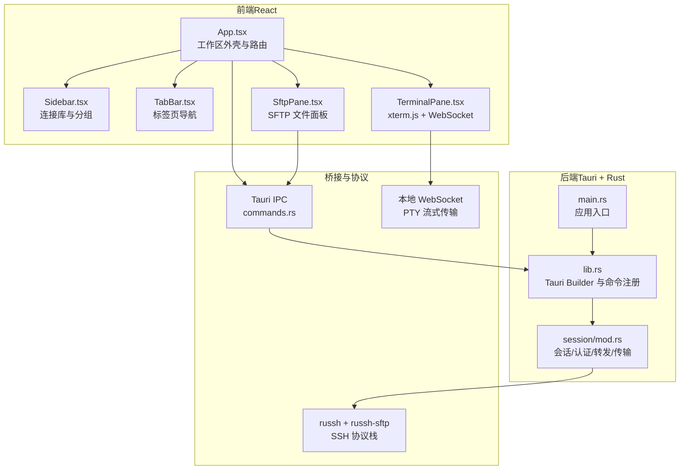
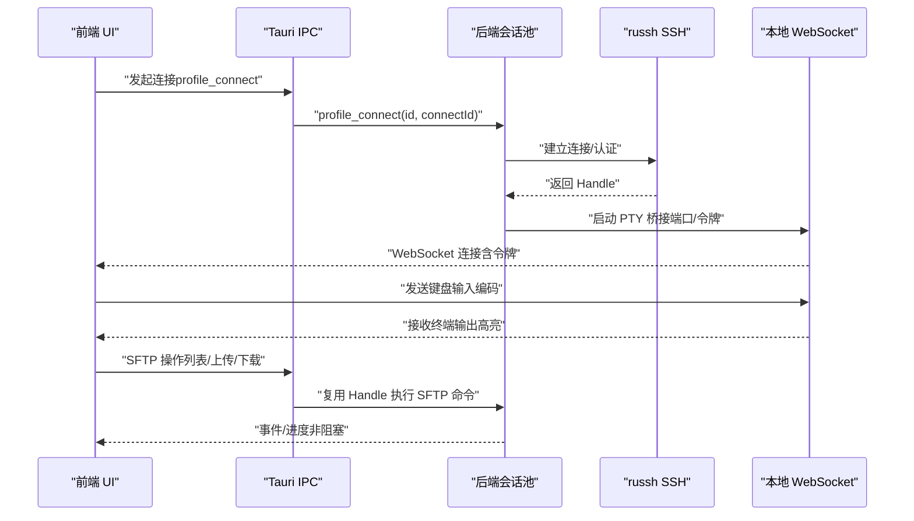
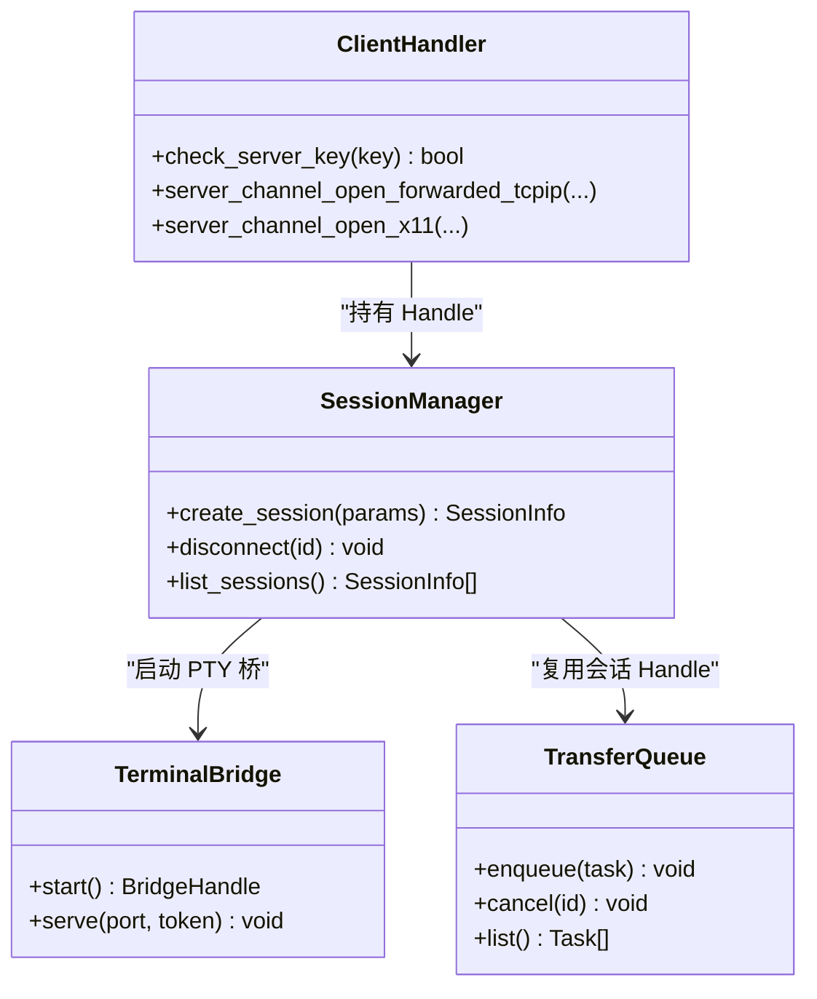
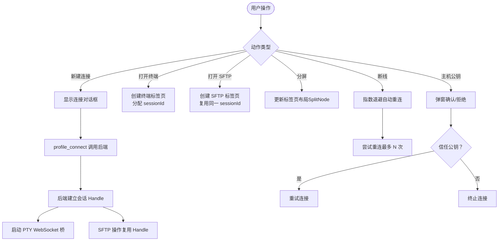
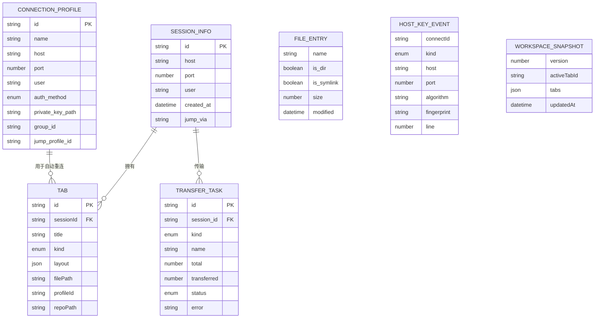
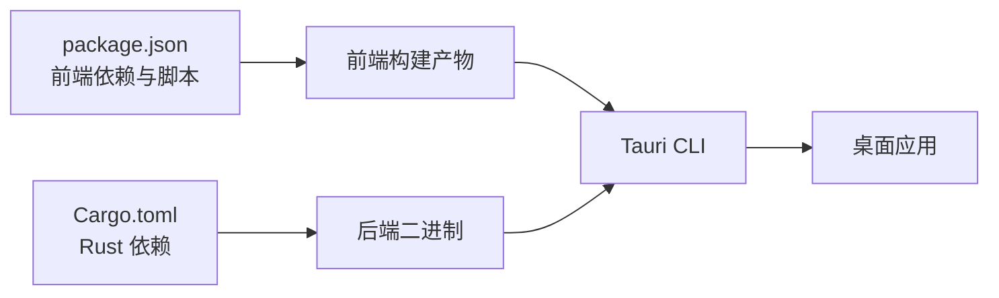

# 项目概述

<cite>
**本文档引用的文件**
- [README.md](file://README.md)
- [CONTRIBUTING.md](file://CONTRIBUTING.md)
- [docs/DESIGN.md](file://docs/DESIGN.md)
- [src-tauri/Cargo.toml](file://src-tauri/Cargo.toml)
- [package.json](file://package.json)
- [src-tauri/src/main.rs](file://src-tauri/src/main.rs)
- [src-tauri/src/lib.rs](file://src-tauri/src/lib.rs)
- [src-tauri/src/session/mod.rs](file://src-tauri/src/session/mod.rs)
- [src/App.tsx](file://src/App.tsx)
- [src/types.ts](file://src/types.ts)
- [src/settings/types.ts](file://src/settings/types.ts)
- [src/components/Sidebar.tsx](file://src/components/Sidebar.tsx)
- [src/components/TabBar.tsx](file://src/components/TabBar.tsx)
- [src/components/SftpPane.tsx](file://src/components/SftpPane.tsx)
- [src/components/TerminalPane.tsx](file://src/components/TerminalPane.tsx)
</cite>

## 目录
1. [引言](#引言)
2. [项目结构](#项目结构)
3. [核心组件](#核心组件)
4. [架构总览](#架构总览)
5. [详细组件分析](#详细组件分析)
6. [依赖关系分析](#依赖关系分析)
7. [性能考量](#性能考量)
8. [故障排查指南](#故障排查指南)
9. [结论](#结论)
10. [附录](#附录)

## 引言
simpl-ssh 是一款“把 Xshell 和 Xftp 合二为一”的轻量级 SSH 客户端，核心目标是在同一窗口内整合“终端 + 文件管理器”，并共享同一条 SSH 连接，从而消除传统方案中“两个软件来回切换”带来的割裂体验。项目坚持“轻量、跨平台、开源免费”的理念，采用 Rust + Tauri + React 技术栈，实现内存占用约 34MB、安装包小于 10MB 的高性能桌面应用。

项目旨在解决以下痛点：
- 市面上多数 SSH 客户端要么过于臃肿（如部分 Electron 应用占用 1.7GB 内存），要么功能割裂（终端与文件管理器分开），要么收费或闭源。
- 通过“合体设计”与“连接复用”，用户在同一会话中即可完成终端交互与文件传输，减少二次认证与窗口切换成本。

**章节来源**
- [README.md:19-40](file://README.md#L19-L40)

## 项目结构
项目采用前后端分离的桌面应用架构：
- 前端（React + TypeScript）负责 UI、工作区布局、事件交互与状态管理。
- 后端（Rust + Tauri）负责 SSH 连接、会话管理、SFTP 文件传输、端口转发、主机公钥校验、传输队列等核心能力。
- 通过 Tauri 的 IPC 机制与本地 WebSocket 桥接，实现前端与后端的高效通信。

**图表来源**
- [src-tauri/src/lib.rs:14-92](file://src-tauri/src/lib.rs#L14-L92)
- [src-tauri/src/main.rs:4-6](file://src-tauri/src/main.rs#L4-L6)
- [src-tauri/src/session/mod.rs:1-26](file://src-tauri/src/session/mod.rs#L1-L26)
- [src/App.tsx:530-681](file://src/App.tsx#L530-L681)

**章节来源**
- [README.md:111-135](file://README.md#L111-L135)
- [src-tauri/Cargo.toml:1-50](file://src-tauri/Cargo.toml#L1-L50)
- [package.json:1-53](file://package.json#L1-L53)

## 核心组件
- 会话与连接管理：统一的会话池负责持久连接的生命周期管理，终端与 SFTP 共享同一 russh Handle，避免重复认证与资源浪费。
- 终端与分屏：基于 xterm.js v6（WebGL 加速）的交互式终端，支持分屏布局（左右/上下递归切分），同会话下多个独立终端并排。
- SFTP 文件面板：与终端共享同一条 SSH 连接，提供浏览、上传、下载、目录递归传输与进度跟踪。
- 传输队列：SFTP 传输排队串行、可取消、不阻塞文件浏览，全局面板查看进度。
- 端口转发：支持本地 -L、远程 -R、动态 SOCKS5 -D，断开会话自动停止。
- 主机公钥校验：与 OpenSSH 兼容的 known_hosts 校验，首次连接 TOFU、公钥变更拦截警示，防中间人攻击。
- 设置与工作区：应用设置（字体、光标、自动重连等）持久化；工作区快照支持启动恢复与标签页布局持久化。

**章节来源**
- [README.md:27-40](file://README.md#L27-L40)
- [src-tauri/src/lib.rs:25-34](file://src-tauri/src/lib.rs#L25-L34)
- [src/App.tsx:175-229](file://src/App.tsx#L175-L229)
- [src/components/SftpPane.tsx:25-29](file://src/components/SftpPane.tsx#L25-L29)

## 架构总览
simpl-ssh 的整体架构围绕“前端工作区 + 后端会话池 + 本地 WebSocket 桥接”的模式展开。前端通过 Tauri IPC 调用后端命令，后端通过 russh 建立 SSH 会话，将 PTY 数据通过本地 WebSocket 传输到前端 xterm.js，同时 SFTP 使用同一会话句柄进行文件操作。

**图表来源**
- [src-tauri/src/lib.rs:43-89](file://src-tauri/src/lib.rs#L43-L89)
- [src-tauri/src/session/mod.rs:52-113](file://src-tauri/src/session/mod.rs#L52-L113)
- [src/components/TerminalPane.tsx:103-135](file://src/components/TerminalPane.tsx#L103-L135)
- [src/App.tsx:312-336](file://src/App.tsx#L312-L336)

## 详细组件分析

### 组件 A：会话与连接管理（Rust 后端）
- 角色与职责：统一管理 SSH 会话生命周期，提供认证、主机公钥校验、端口转发、X11 转发、传输队列、工作区持久化等能力。
- 关键实现：
  - ClientHandler：实现 russh 的 check_server_key 与远程转发回调，支持交互式公钥确认与通道桥接。
  - SessionManager：会话池，负责连接建立、状态维护与断线处理。
  - TerminalBridge：本地 WebSocket 服务，承载 PTY 数据流。
  - TransferQueue：SFTP 传输队列，串行执行、可取消。
- 安全与兼容：与 OpenSSH 兼容的 known_hosts 校验，首次连接 TOFU，公钥变更拦截警示。

**图表来源**
- [src-tauri/src/session/mod.rs:59-113](file://src-tauri/src/session/mod.rs#L59-L113)
- [src-tauri/src/lib.rs:25-42](file://src-tauri/src/lib.rs#L25-L42)

**章节来源**
- [src-tauri/src/session/mod.rs:52-160](file://src-tauri/src/session/mod.rs#L52-L160)
- [src-tauri/src/lib.rs:14-92](file://src-tauri/src/lib.rs#L14-L92)

### 组件 B：前端工作区与交互（React）
- 角色与职责：负责工作区布局（侧栏 + 标签页 + 主体区域）、连接对话框、设置面板、状态栏、命令面板等。
- 关键实现：
  - App.tsx：工作区外壳，管理会话、标签页、分屏布局、连接进度与主机公钥确认流程；内置断线重连与工作区恢复。
  - Sidebar.tsx：连接库与分组树形展示，支持新建/重命名/删除分组与连接项。
  - TabBar.tsx：标签页导航，支持新建连接、关闭标签与切换。
  - TerminalPane.tsx：xterm.js 终端实例，通过本地 WebSocket 接收/发送 PTY 数据，支持搜索、主题与日志高亮。
  - SftpPane.tsx：SFTP 文件面板，提供浏览、上传/下载、目录同步、重命名/删除等操作，所有传输进入队列非阻塞执行。

**图表来源**
- [src/App.tsx:512-528](file://src/App.tsx#L512-L528)
- [src/App.tsx:339-388](file://src/App.tsx#L339-L388)
- [src/components/SftpPane.tsx:40-62](file://src/components/SftpPane.tsx#L40-L62)

**章节来源**
- [src/App.tsx:60-126](file://src/App.tsx#L60-L126)
- [src/components/Sidebar.tsx:26-212](file://src/components/Sidebar.tsx#L26-L212)
- [src/components/TabBar.tsx:12-59](file://src/components/TabBar.tsx#L12-L59)
- [src/components/TerminalPane.tsx:19-149](file://src/components/TerminalPane.tsx#L19-L149)
- [src/components/SftpPane.tsx:25-194](file://src/components/SftpPane.tsx#L25-L194)

### 组件 C：数据模型与类型定义
- 关键类型：
  - SessionInfo：会话标识、主机、端口、用户与跳板信息。
  - ConnectionProfile：连接配置（名称、主机、端口、用户、认证方式、分组、跳板机等）。
  - SplitNode：终端分屏布局树（叶子为终端面板，split 为两个子布局按比例切分）。
  - Tab：标签页类型（terminal/sftp/monitor/editor/git）与布局信息。
  - FileEntry/TransferTask/ForwardEntry：文件列表、传输任务、端口转发条目。
  - HostKeyEvent/MonitorSnapshot：主机公钥事件与远程系统监控快照。
  - WorkspaceSnapshot：工作区快照（版本、活动标签、标签页集合与时间戳）。
- 设置类型：AppSettings（字体、字号、行高、光标样式/闪烁、自动重连、X11、启动检查更新等）。

**图表来源**
- [src/types.ts:1-209](file://src/types.ts#L1-L209)

**章节来源**
- [src/types.ts:1-209](file://src/types.ts#L1-L209)
- [src/settings/types.ts:4-48](file://src/settings/types.ts#L4-L48)

## 依赖关系分析
- 技术栈与版本：
  - 前端：React 19、TypeScript、xterm.js v6（WebGL）、Lucide React、Vite/TS。
  - 后端：Tauri 2、russh 0.61.2 + russh-sftp 2.3.0、tokio（full）、tokio-tungstenite、keyring、aes-gcm、sha2、uuid、serde 等。
- 包管理与脚本：
  - package.json：定义前端依赖与脚本（dev/build/tauri）。
  - Cargo.toml：定义 Rust 依赖与构建配置。
- 构建与运行：
  - main.rs：应用入口，调用 lib.rs 的 run。
  - lib.rs：注册 Tauri 插件与命令，初始化会话池、传输队列、本地 WebSocket 桥等。

**图表来源**
- [package.json:22-27](file://package.json#L22-L27)
- [src-tauri/Cargo.toml:22-49](file://src-tauri/Cargo.toml#L22-L49)
- [src-tauri/src/main.rs:4-6](file://src-tauri/src/main.rs#L4-L6)
- [src-tauri/src/lib.rs:14-92](file://src-tauri/src/lib.rs#L14-L92)

**章节来源**
- [package.json:1-53](file://package.json#L1-53)
- [src-tauri/Cargo.toml:1-50](file://src-tauri/Cargo.toml#L1-L50)
- [src-tauri/src/main.rs:1-7](file://src-tauri/src/main.rs#L1-L7)
- [src-tauri/src/lib.rs:14-92](file://src-tauri/src/lib.rs#L14-L92)

## 性能考量
- 轻量化设计：Rust 后端 + Tauri（系统 WebView，不打包 Chromium），目标内存约 34MB、安装包小于 10MB。
- 低延迟传输：终端 PTY 通过本地 WebSocket 流式传输，避免 Electron 应用常见的高内存占用与卡顿。
- 并发与队列：SFTP 传输采用串行队列与可取消机制，避免 UI 阻塞与资源竞争。
- 跨平台优化：针对 macOS/Windows/Linux 的系统依赖与构建流程已明确，保证一致的用户体验与性能表现。

**章节来源**
- [README.md:24](file://README.md#L24)
- [README.md:93-98](file://README.md#L93-L98)
- [docs/DESIGN.md:12-25](file://docs/DESIGN.md#L12-L25)

## 故障排查指南
- 连接问题：
  - 连接进度可见：解析 → 握手 → 认证 分段超时与阶段反馈，便于定位问题。
  - 主机公钥校验：首次连接 TOFU、公钥变更拦截警示；若提示“已损坏，无法打开”（macOS），可按说明清除属性后重试。
- 断线与重连：
  - 自动重连：指数退避策略，支持最大重连次数限制；用户主动断开不会触发自动重连。
  - 分屏场景：避免重复触发重连，确保每个会话只在一次重连中进行。
- 文件传输：
  - 传输队列：支持取消与非阻塞操作；如遇异常，可在全局传输面板查看状态与错误信息。
- 开发与构建：
  - 提交前自查：前端构建、Rust 类型检查、Clippy 与格式化；遵循 Conventional Commits 规范。

**章节来源**
- [README.md:37](file://README.md#L37)
- [README.md:58-64](file://README.md#L58-L64)
- [src/App.tsx:339-408](file://src/App.tsx#L339-L408)
- [src/components/SftpPane.tsx:81-134](file://src/components/SftpPane.tsx#L81-L134)
- [CONTRIBUTING.md:17-26](file://CONTRIBUTING.md#L17-L26)

## 结论
simpl-ssh 通过 Rust + Tauri + React 的组合，实现了“终端 + 文件管理器”的合体设计与连接复用，兼顾性能、安全与易用性。其路线图覆盖从 MVP 到 v2 的多项关键能力，包括系统监控、端口转发、跳板机/X11、目录同步与自动更新。对于初学者，项目提供了清晰的 UI 与工作区组织；对于有经验的开发者，其模块化的后端架构、严格的类型定义与完善的 IPC/WS 桥接，便于扩展与定制。

**章节来源**
- [README.md:137-154](file://README.md#L137-L154)
- [docs/DESIGN.md:73-79](file://docs/DESIGN.md#L73-L79)

## 附录
- 路线图与里程碑：
  - SSH 连接（密码认证）+ 交互式 PTY 终端
  - 多会话、多 Tab 终端管理
  - SFTP 文件面板（浏览/上传/下载/目录递归传输）
  - 保存的连接 + 凭据加密存储（OS 钥匙串 + 内存 AES-256-GCM 缓存）
  - 连接过程分段超时 + 阶段进度反馈
  - 终端分屏（树形布局、拖拽、同会话多 PTY）
  - SFTP 传输队列（排队/取消/非阻塞）
  - 端口转发（本地 -L / 远程 -R / 动态 SOCKS5 -D）
  - 主机公钥校验（known_hosts：TOFU + 变更检测，兼容 OpenSSH）
  - macOS 公证（Release CI：codesign + notarize）
  - 连接分组树、断线重连、全局快捷键、设置面板
  - 跳板机（ProxyJump）、系统监控面板
  - X11 转发、目录同步、自动更新

**章节来源**
- [README.md:137-154](file://README.md#L137-L154)